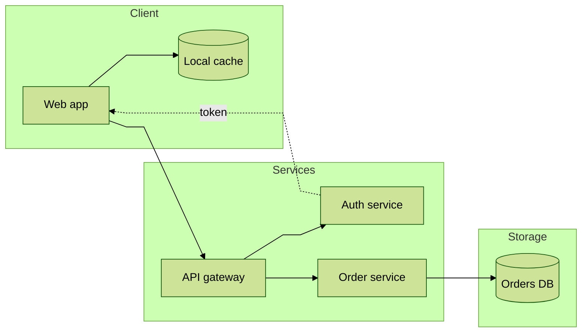
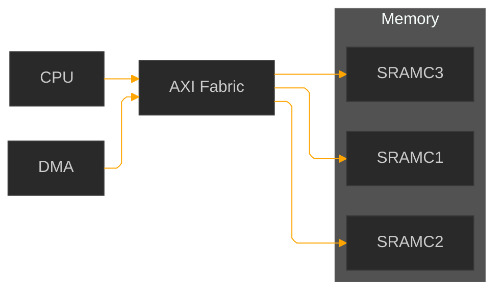
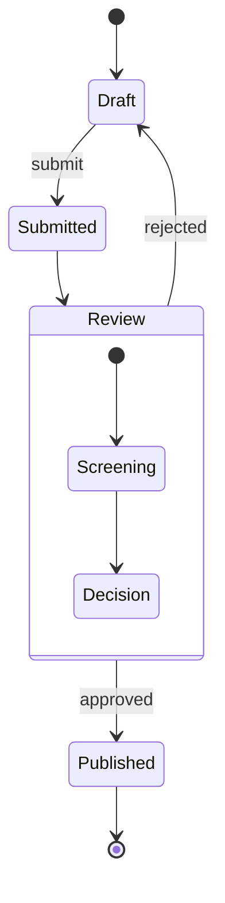
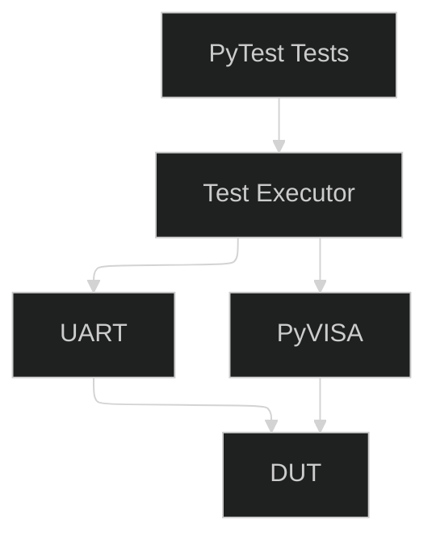
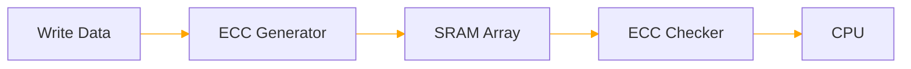

## Generate quarto file

- Generate qarto *.qmd file for this markdown document
- Quarto is to deliver in all three formats docx, pdf, html
- For qmd, in header keep format configurations for pdf, docx, html. Also add configuration for mermaid diagrams that are going to be generated
- reference-doc: my_template.docx
- use codeblock where possible
- Im especially interested in codeblock implementation in docx
- Code block formatting:
    - for simple code use indentation of 4 spaces
    - for json indentation of 4 spaces
    - for yaml indentation of 2 spaces
    - use moderate color scheme in syntax highligting
    - use moderate syntax highlighting where possible
    - all code samples have tipical/standard codeblock grey background
- do not use jupiter
- use Mermaid diagrams
    - do not show diagrams in raw format, and also do not show raw code for the diagram
    - show diagrams in rendered format where possible 
    - Where not possible to rendered diagrams show them as pictures in document
    - Important - all diagrams must fit in A4 page. Avoid "big diagrams" or separate them in two diagrams
-Allowed types of mermaid diagrams:
    - pie
    - sequenceDiagrams
    - stateDiagrams
    - graph LR
    - graph TB
    - flow chart TD
    - gitGraph
    - class diagram
    - treeView-beta

=========================================================

## Combine md files

Files: 
1. cpl_result.md = CPL
2. gtp_result.md = GTP
3. cg_results.md => this would be ourput file = OUTPUT
4. Loging logic, loging design, loging plan => LL
5. Diagrams, tables, Graphs => VISUALS

Both file contains elaborate "Test execution logging design"

Aim is to come up with logic related to Logging process.
This document will be used as a guidline for other activities that include logging steps.

Generated documents are quite elaborate in describing LL, especially CPL.
I need OUTPUT be be more consise, something like GTP.
Take the best from both doc.
Use diagrams and visual explanations (the ones that are needed)
VISUALS in document can not exceed a4 format.
Better to split VISUALS if size is more than 60% of the a4 page.
Make the doc a bit flexibile, having in mind that other teams are going to rely on it.

================================================

## Consolidate Logging Documentation

INPUT FILES

1. cpl_result.md = CPL
2. gtp_result.md = GTP
3. cg_results.md = OUTPUT (generated document)
4. Logging Logic, Logging Design, Logging Plan sections = LL
5. Diagrams, Tables, Graphs = VISUALS

OBJECTIVE

Both CPL and GTP contain detailed content related to Test Execution Logging Design.

Create a consolidated document (cg_results.md) that defines a clear, reusable, and maintainable Logging Logic Guideline.

The resulting document will serve as a reference for future projects and teams implementing test execution logging.

CONTENT STRATEGY

Logging Logic (LL)

- Merge and consolidate the Logging Logic content from CPL and GTP.
- Use GTP as the primary technical source because it contains more comprehensive logging concepts.
- Use CPL as the reference for additional detail that could be added.
- Remove duplicated information, repetitive explanations, and implementation-specific details.
- Preserve only information that contributes to a reusable logging guideline.

Focus on the following topics:
- Logging objectives
- Logging architecture
- Logging workflow and execution flow
- Logging categories and severity levels
- Data captured during test execution
- Traceability principles
- Error and failure logging concepts
- Log storage and reporting concepts

FLEXIBILITY REQUIREMENTS

The generated document must:

- Be generic enough for adoption by multiple teams.
- Avoid project-specific, IP-specific, or environment-specific details.
- Remain flexible enough to support different logging implementations.
- Define best practices and guidance without being overly restrictive.
- Focus on principles rather than implementation details whenever possible.

VISUAL CONTENT (VISUALS)

Use diagrams, tables, and flowcharts only when they improve understanding.

Visual Rules:
- Every visual must fit within a single A4 page.
- If a visual exceeds approximately 60% of an A4 page, split it into multiple visuals.
- Prefer simple and easy-to-understand diagrams over complex architectural drawings.
- Remove decorative, redundant, or low-value graphics.
- Use visuals only when they add clarity.

Recommended visuals:
- Logging architecture overview
- Test execution logging flow
- Log generation and storage flow
- Logging category/severity hierarchy
- Logging artifact relationships

OUTPUT CHARACTERISTICS

The generated cg_results.md should:

- Be more concise than GTP.
- Follow the readability and simplicity style of GTP.
- Preserve all important logging concepts.
- Be suitable as a standalone guideline document.
- Be easily maintainable and reviewable.
- Be suitable for cross-team usage.
- Explain not only what should be logged, but also why logging requirements exist.

DOCUMENT PRIORITIES

1. Clarity
2. Reusability
3. Simplicity
4. Consistency
5. Visual Effectiveness
6. Technical Completeness

When multiple explanations describe the same concept, choose the shortest, clearest, and most generic version.

The final document should represent the best combination of CPL and GTP.