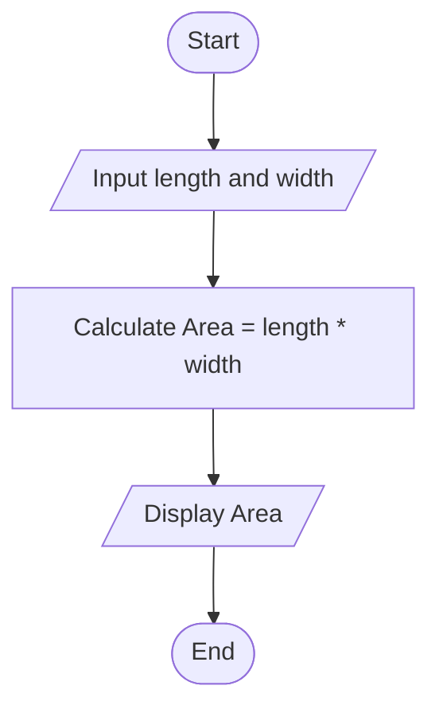

## 7. Calculate Area of a Rectangle

Create an algorithm and flowchart to input length and width, calculate the area (**Area = Length × Width**), and display the result.

---

### ✔ Pseudocode

```text

START

        INPUT Length, Width

        Area = Length * Width

        PRINT Area

End

```

### ✔ Flowchart



