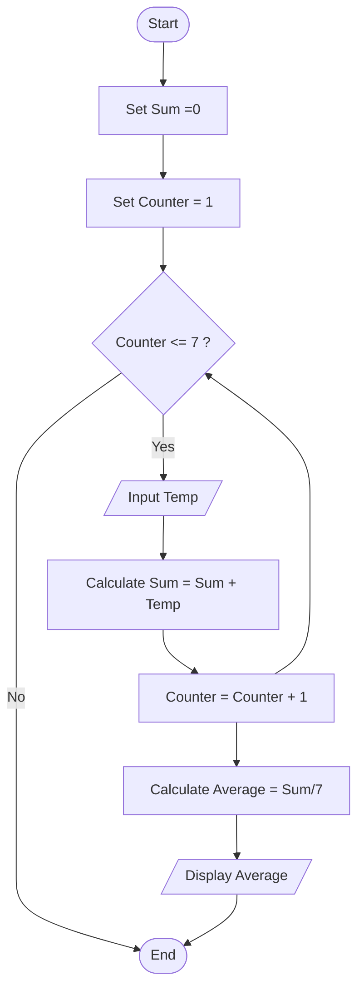

## 6. Average Temperature Calculation

Write the algorithm and draw the flowchart for a program that takes the temperature of 7 days, finds the average temperature, and displays it.

---
### ✔ Pseudocode

```text

START

    SET Sum = 0
    
    For counter = 1 TO 7

        INPUT Temp

        Sum = Sum  + Temp

    ENDFOR

    Average = Sum / 7

    PRINT Average

END

```

### ✔ Flowchart




    
