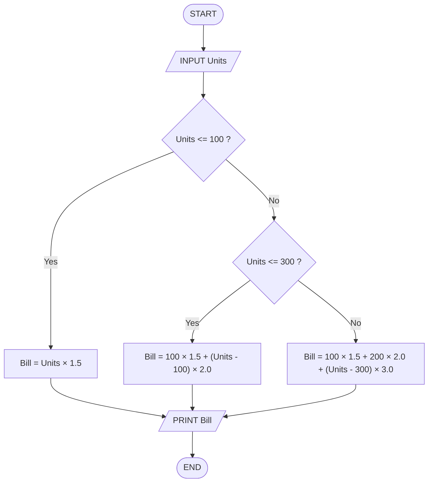

## 16. Electricity Bill Calculator

Write the algorithm and draw the flowchart for a program that inputs the number of electricity units consumed and calculates the total bill using the following rates: first 100 units at 1.5 SEK per unit, next 200 units at 2.0 SEK per unit, and all remaining units at 3.0 SEK per unit.

---

### ✔ Pseudocode

```text

START

    INPUT Units

    IF Units <= 100

        Total_Bill = Units * 1.5

    ELSE IF Units <= 300

        Total_Bill = (100 * 1.5) + ( (Units - 100) * 2.0)

    Else

        Total_Bill = (!00 * 1.5) + (200 * 2.0) + ( (Units - 300) * 3.0 )

    ENDIF

    PRINT Total_Bill

END

```

### ✔ Flowchart

