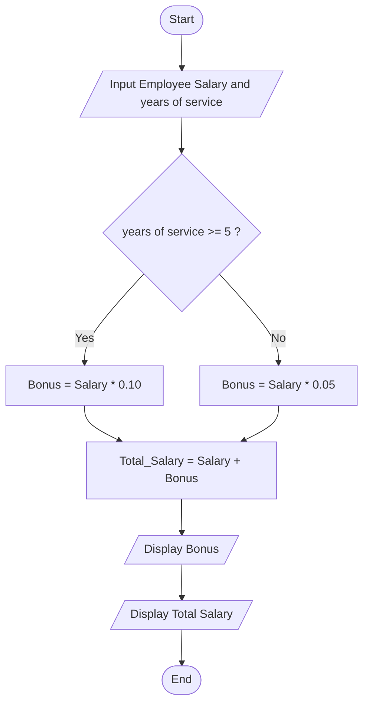

## 12. Employee Salary and Bonus Calculator

Write the algorithm and draw the flowchart for a program that inputs an employee's monthly salary and years of service, calculates a bonus of **10%** for employees with 5 or more years of service and **5%** for others, then displays the bonus and total salary.

---

### ✔ Pseudocode

```text

START

    INPUT Salary, Service_Year

    IF Service_Year >= 5

        Bonus = Salary * 0.1

        Total_Salary = Salary + Bonus

    ELSE

        Bonus = Salary * 0.05

        Total_Salary = Salary + Bonus

    ENDIF

    PRINT Bonus

    PRINT Total_Salary

END

```

### ✔ Flowchart




