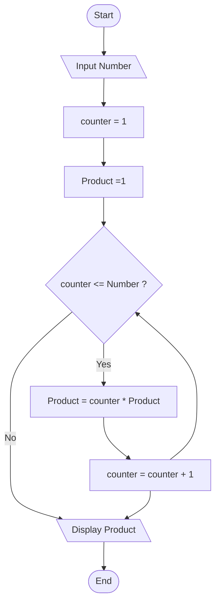

## 9. Calculate Factorial of a Number

Write the algorithm and draw the flowchart that input a number and
calculate its factorial using a loop.

---

### ✔ Pseudocode

```text

START

    INPUT Number

    SET counter = 1

    SET Product = 1

    WHILE counter <= Number

        Product = counter * Product

        counter = counter + 1

    ENDWHILE

    PRINT Product

End

```

### ✔ Flowchart


