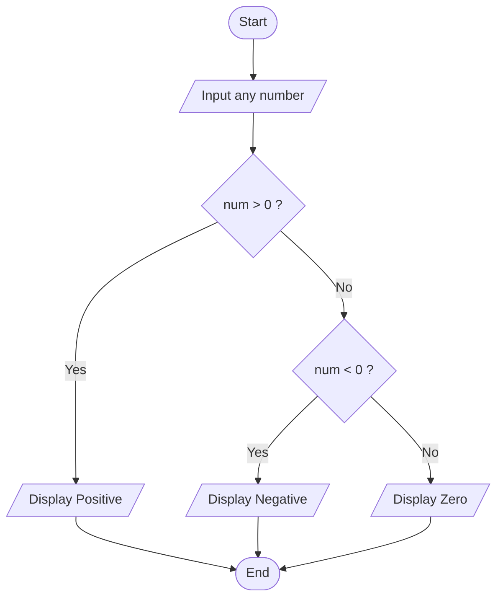

## 4. Positive, Negative, or Zero Check

Write the algorithm and flowchart to input a number and display whether  it is positive, negative, or zero.

---

### ✔ Pseudocode

```text
START

    INPUT num

    IF num > 0

        PRINT Positive

    ELSE IF num < 0

        PRINT Negative

    ELSE

        PRINT Zero

    ENDIF

END
```

### ✔ Flowchart

