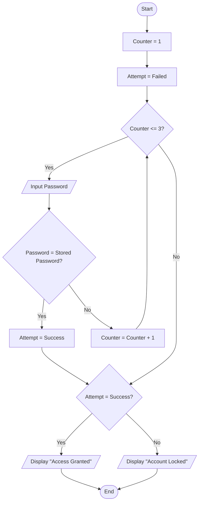

## 14. Login System (Maximum 3 Attempts)

Create an algorithm and flowchart for a login system that allows a user up to 3 attempts to enter the correct password. Display **"Access Granted"** if the password is correct; otherwise display **"Account Locked"** after 3 failed attempts.

---

### ✔ Pseudocode

```text

START

    SET Counter = 1

    SET Attempt = Failed

    WHILE Counter <= 3

        INPUT Password

        IF Password = StoredPassword

            Attempt = Success

            BREAK

        ENDIF

        Counter = counter + 1

    ENDWHILE

    IF Attempt = Success

        PRINT "Access Granted"

    ELSE

        PRINT "Account Locked"

    ENDIF

END

```

### ✔ Flowchart

