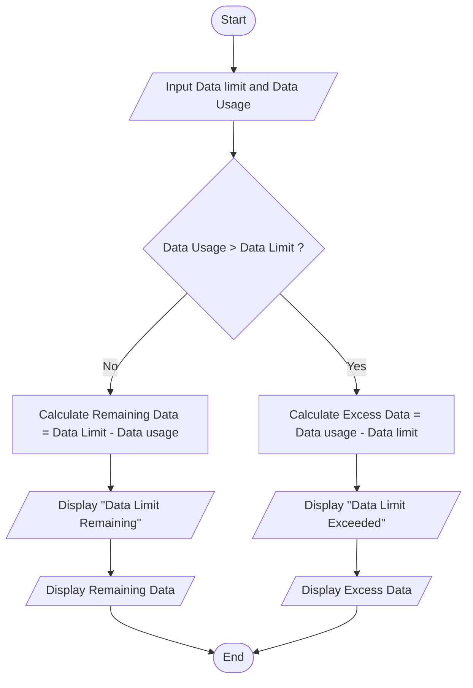

## 13. Mobile Data Usage Monitor

Write the algorithm and draw the flowchart for a program that inputs a user's monthly data limit and data usage, then displays whether the user has exceeded the limit or how much data remains.

---

### ✔ Pseudocode

```text

START

    Input Data_Limit, Data_Usage

    IF Data_Usage > Data_Limit

        Excess_Data = Data_Usage - Data_Limit

        PRINT "Data Limit exceeded"

        PRINT Excess_Data

    ELSE 

        Remaining_Data = Data_Limit - Data_Usage

        PRINT "Remaining Data"

        PRINT Remaining_Data

    ENDIF

END

```

### ✔ Flowchart

