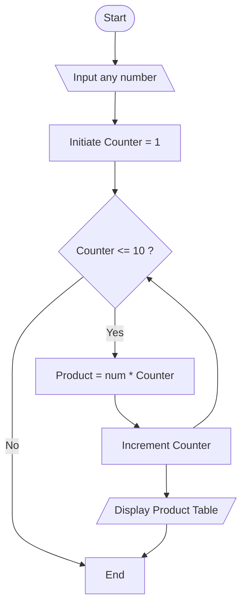

## 3. Display Multiplication Table

Create an algorithm and flowchart that input a number and display its multiplication table from 1 to 10 using a loop.

---

### ✔ PseudoCode

```text

START

    Input num

    For i = 1 TO 10

        Prodcut = number * i

        PRINT Product

    ENDFOR
    
END  

```

### ✔ Flowchart


