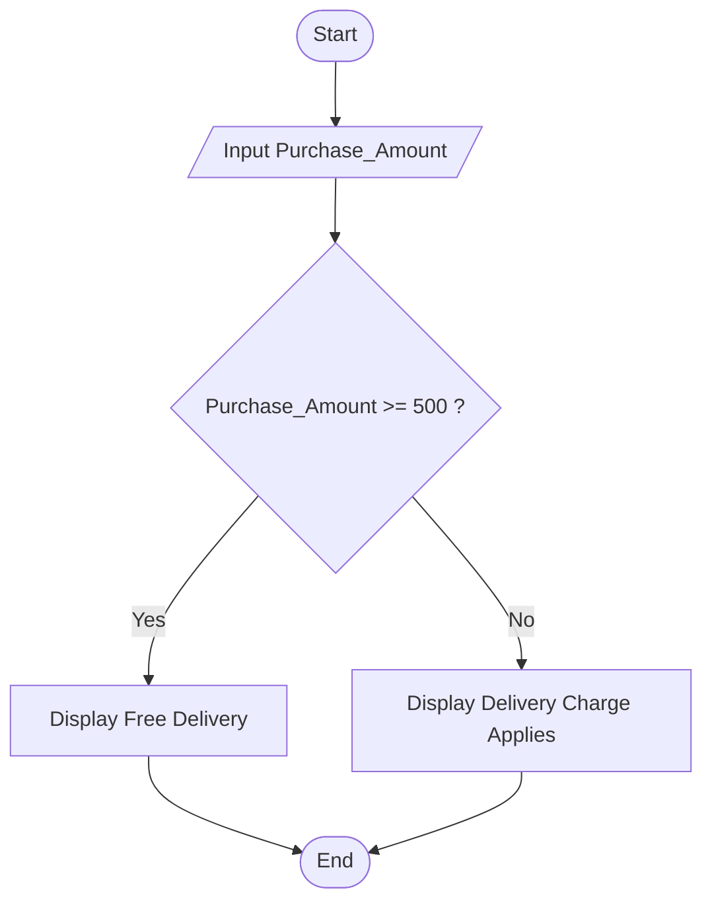

## 11. Online Shopping Delivery Eligibility

Write the algorithm and draw the flowchart for a program that inputs a customer's purchase amount and displays **"Free Delivery"** if the amount is 500 SEK or more; otherwise display **"Delivery Charge Applies"**.

---

### ✔ Pseudocode

```text

START

    INPUT Purchase_Amount

    IF Purchase_Amount >= 500

        PRINT "Free Delivery"

    ELSE

        PRINT "Delivery Charge Applies"

    ENDIF

END

```

### ✔ Flowchart

