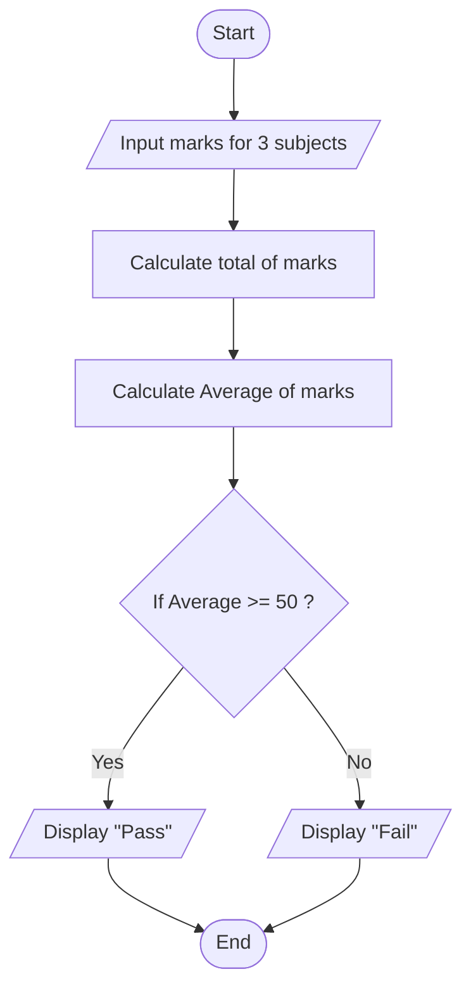

## 8. Determine Pass or Fail

Write the algorithm and draw the flowchart for a program that takes a student's average marks and displays **"Pass"** if average ≥ 50,
otherwise **"Fail"**.

---

### ✔ Pseudocode

```text

START

    Input mark1, mark2, mark3

	Total = mark1 + mark2 + mark3

	Average = Total / 3

	Print Total

	Print Average

    IF Average >= 50

        PRINT "Pass"
    Else 

        PRINT "Fail"

    ENDIF

END

```

### ✔ Flowchart

