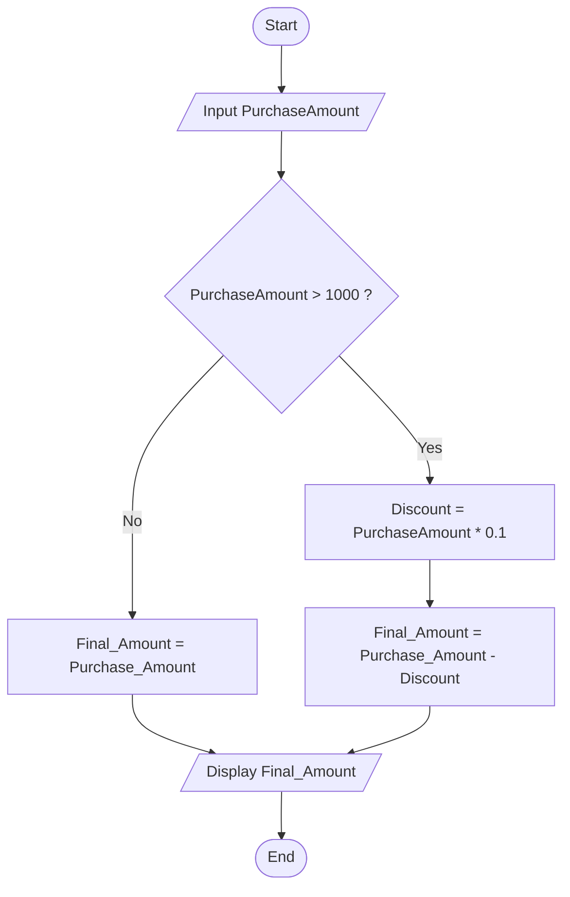

## 10. Calculate Discount on Purchase

Write the algorithm and draw the flowchart for a program that inputs the purchase amount and gives a **10% discount** if the amount is greater than 1000.

---

### ✔ Pseudocode

```text

START

    INPUT Purchase_Amount

    IF Purchase_Amount > 1000

        Discount = Purchase_Amount * 0.1

        Final_Amount = Purchase_Amount - Discount

    ELSE 

        Final_Amount = Purchase_Amount

    ENDIF

    PRINT Final_Amount

END

```
### ✔ Flowchart




