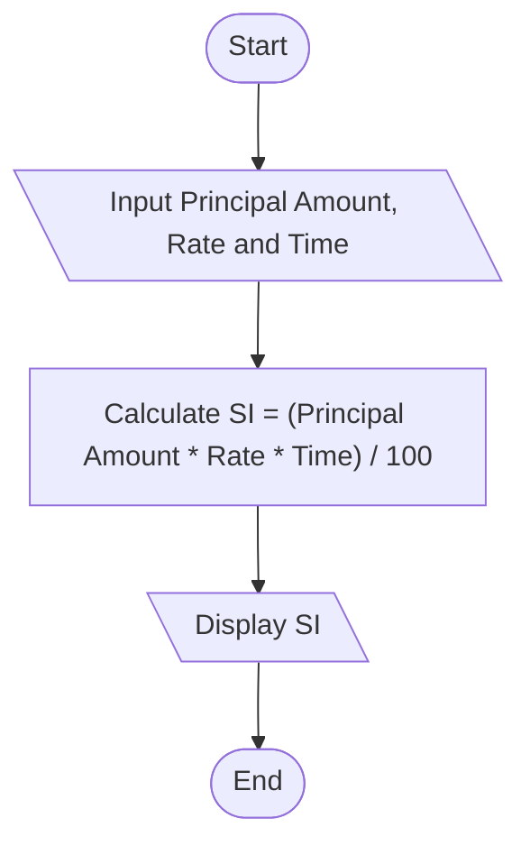

## 5. Simple Interest Calculator

Create an algorithm and flowchart for a program that calculates simple interest using the formula:

**SI = (P × R × T) / 100**

- **P = Principal** → original amount of money
- **R = Rate of Interest** → percentage per year
- **T = Time** → number of years

---

### ✔ Pseudocode

```text
START

    INPUT Principal_Amount, Rate_of_Interest, Time

    SI = (Principal_Amount * Rate_of_Interest * Time) / 100

    PRINT SI

END

```

### ✔ Flowchart




