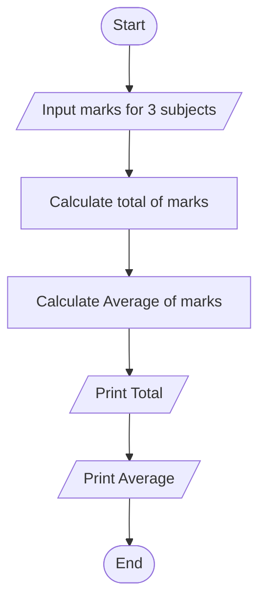

## 2. Calculate Total and Average Marks

Write the algorithm and draw the flowchart for a program that inputs
marks for 3 subjects, calculates the total and average, and displays
both.

### ✔ Pseudocode

```text

START

	Input mark1, mark2, mark3

	Total = mark1 + mark2 + mark3

	Average = Total / 3

	Print Total

	Print Average
    
End
```

### ✔ Flowchart


