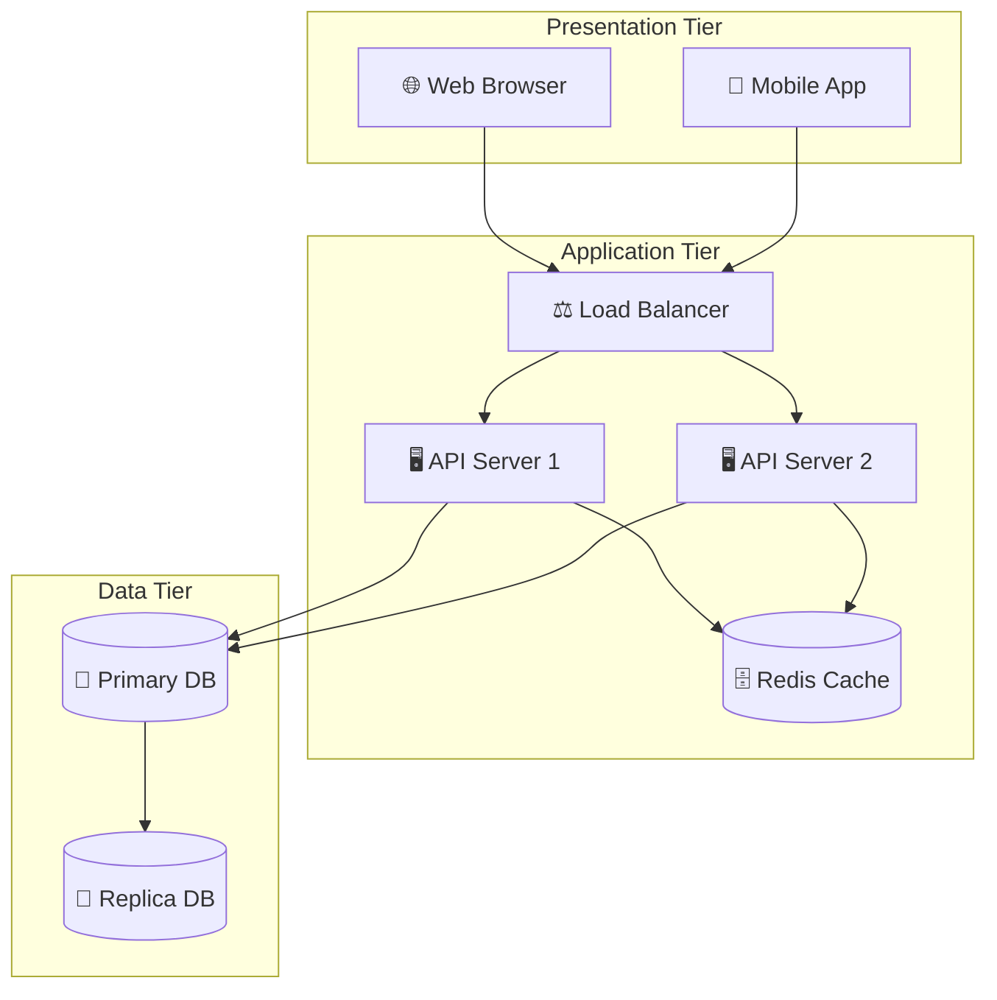
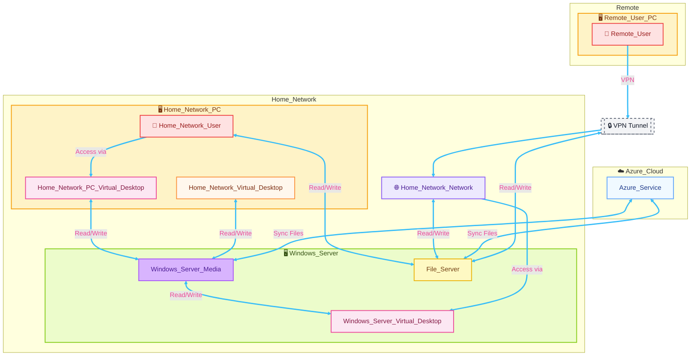
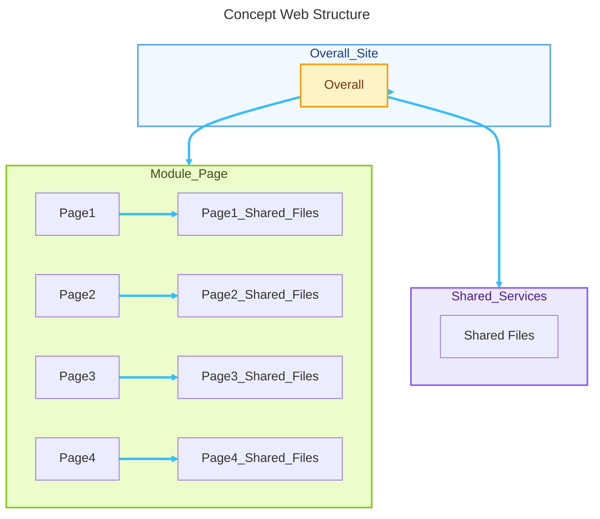

# Collection of Mermaid Syntax Simple Diagram

```markdown
> Austin.Lai |
> -----------| January 25th, 2026
> -----------| Updated on January 25th, 2026
```

---

## Table of Contents

<!-- TOC -->

- [Collection of Mermaid Syntax Simple Diagram](#collection-of-mermaid-syntax-simple-diagram)
    - [Table of Contents](#table-of-contents)
    - [Disclaimer](#disclaimer)
    - [Description](#description)
    - [Sample Diagrams](#sample-diagrams)

<!-- /TOC -->

<br>

## Disclaimer

<span style="color: red; font-weight: bold;">DISCLAIMER:</span>

This project/repository is provided "as is" and without warranty of any kind, express or implied, including but not limited to the warranties of merchantability, fitness for a particular purpose and noninfringement. In no event shall the authors or copyright holders be liable for any claim, damages or other liability, whether in an action of contract, tort or otherwise, arising from, out of or in connection with the software or the use or other dealings in the software.

This project/repository is for <span style="color: red; font-weight: bold;">Educational</span> purpose <span style="color: red; font-weight: bold;">ONLY</span>. Do not use it without permission. The usual disclaimer applies, especially the fact that me (Austin) is not liable for any damages caused by direct or indirect use of the information or functionality provided by these programs. The author or any Internet provider bears NO responsibility for content or misuse of these programs or any derivatives thereof. By using these programs you accept the fact that any damage (data loss, system crash, system compromise, etc.) caused by the use of these programs is not Austin responsibility.

<br>

## Description

<!-- Description -->

It's just me learning and playing around with Mermaid.

You can refer to <https://github.com/mermaid-js/mermaid> for syntax, documentation, examples, customization, and more.

There’s also a free online tool available: [Simple Mermaid - free mermaid editor online](https://www.simplemermaid.com/)

<!-- /Description -->

<br>

## Sample Diagrams

Here are some simple diagrams created using Mermaid syntax:

Sample 1: Basic Flowchart



<details>

<summary><span style="padding-left:10px;">Click here for "Sample 1"</span></summary>

```
flowchart TB
subgraph Presentation [Presentation Tier]
Web[🌐 Web Browser]
Mobile[📱 Mobile App]
end
subgraph Application [Application Tier]
LB[⚖️ Load Balancer]
API1[🖥️ API Server 1]
API2[🖥️ API Server 2]
Cache[(🗄️ Redis Cache)]
end
subgraph Data [Data Tier]
Primary[(📀 Primary DB)]
Replica[(📀 Replica DB)]
end
Web --> LB
Mobile --> LB
LB --> API1
LB --> API2
API1 --> Cache
API2 --> Cache
API1 --> Primary
API2 --> Primary
Primary --> Replica
```

</details>

<br>

Sample 2: Network Flowchart



<details>

<summary><span style="padding-left:10px;">Click here for "Sample 2"</span></summary>

```
%%{init: {
    "useMaxWidth": false, 
    "flowchart": {
        "markdownAutoWrap": false,
        "wrappingWidth": 2000,
        "htmlLabels": true
    }
}}%%
flowchart TB
    classDef cloud fill:#f0f9ff,stroke:#60a5fa,stroke-width:2px,color:#1e3a8a
    classDef pc fill:#fef3c7,stroke:#f59e0b,stroke-width:2px,color:#78350f
    classDef server fill:#ecfccb,stroke:#84cc16,stroke-width:2px,color:#365314
    classDef network fill:#ede9fe,stroke:#8b5cf6,stroke-width:2px,color:#4c1d95
    classDef user fill:#fee2e2,stroke:#ef4444,stroke-width:2px,color:#991b1b
    classDef Virtual_Desktop fill:#fff7ed,stroke:#fb923c,stroke-width:2px,color:#7c2d12
    classDef vpn fill:#f3f4f6,stroke:#6b7280,stroke-width:2px,color:#111827,stroke-dasharray: 5 5
    classDef file_server fill:#fef9c3,stroke:#eab308,stroke-width:2px,color:#713f12
    classDef db_access_manager fill:#d8b4fe,stroke:#a855f7,stroke-width:2px,color:#4c1d95
    classDef Azure_account_desktop fill:#fce7f3,stroke:#ec4899,stroke-width:2px,color:#831843

%% -------------------------
%% Azure Cloud side
%% -------------------------
subgraph Azure_Cloud[☁️ Azure_Cloud]
    Azure_Service[Azure_Service]
end

%% -------------------------
%% Remote side
%% -------------------------
subgraph Remote
  direction TB
  subgraph Remote_User_PC[🖥️ Remote_User_PC]
    Remote_User[👤 Remote_User]
  end
end

%% -------------------------
%% In-store side
%% -------------------------
subgraph Home_Network
  direction TB

  %% In-store PC block
  subgraph Home_Network_PC[🖥️ Home_Network_PC]
    Home_Network_User[👤 Home_Network_User] --> | Access via | Home_Network_PC_Virtual_Desktop[Home_Network_PC_Virtual_Desktop]
    Home_Network_Virtual_Desktop[Home_Network_Virtual_Desktop]
  end

  %% Windows Server block
  subgraph Windows_Server[🖥️ Windows_Server]
    Windows_Server_Media[Windows_Server_Media] <--> | Read/Write | Windows_Server_Virtual_Desktop[Windows_Server_Virtual_Desktop]
    File_Server[File_Server]
  end

  %% Store network node
  Home_Network_Network[🌐 Home_Network_Network]

  %% In-store flows
  Home_Network_PC_Virtual_Desktop[Home_Network_PC_Virtual_Desktop] <--> | Read/Write | Windows_Server_Media[Windows_Server_Media]
  Home_Network_User[👤 Home_Network_User] <--> | Read/Write | File_Server[File_Server]
  Home_Network_Virtual_Desktop[Home_Network_Virtual_Desktop] <--> | Read/Write | Windows_Server_Media[Windows_Server_Media]
  Home_Network_Network <--> | Read/Write | File_Server[File_Server]
      
  %% Azure flows
  Azure_Service <--> | Sync Files | File_Server
  Azure_Service <--> | Sync Files | Windows_Server_Media
end

%% -------------------------
%% VPN path (explicit tunnel)
%% -------------------------
VPN_Tunnel[[🔒 VPN Tunnel]]

Remote_User --> | VPN | VPN_Tunnel
VPN_Tunnel --> Home_Network_Network

%% Make the R/W path explicit to the File Server (choose one or both lines below):
%% Path 1: Route through network to file server (already connected above)
%% (This keeps the diagram tidy and layered.)
%% Home_Network_Network <--> | Read/Write | File_Server

%% Path 2 (also add an explicit edge from the tunnel to the file server):
VPN_Tunnel <--> | Read/Write | File_Server

%% -------------------------
%% (Optional) Remote access to Azure Desktop on the Windows Server
%% -------------------------
Home_Network_Network --> | Access via | Windows_Server_Virtual_Desktop[Windows_Server_Virtual_Desktop]


%% --- Apply it to one or more nodes ---
class Home_Network_Network network
class Home_Network_PC,Remote_User_PC pc
class Windows_Server server
class Azure_Service cloud
class Remote_User,Home_Network_User user
class Home_Network_Virtual_Desktop Virtual_Desktop
class VPN_Tunnel vpn
class Windows_Server_Virtual_Desktop,Home_Network_PC_Virtual_Desktop Azure_account_desktop
class Windows_Server_Media db_access_manager
class File_Server file_server


%%--- Style the links (edges) ---
%% The first link (A-->B) is index 0, the second (B-->C) is index 1
%% Make all links light slate by default
linkStyle default stroke:#38bdf8,stroke-width:3px,font-size:16px,color:#ec4999,opacity:2.0,stroke-linecap:round,stroke-linejoin:round
%% Style the VPN link: bright blue, thick, dashed
%% linkStyle 0 stroke:#60a5fa,stroke-width:3px,stroke-dasharray:6 3,color:#cbd5e1
```

</details>

<br>

Sample 3: Concept Web Structure



<details>

<summary><span style="padding-left:10px;">Click here for "Sample 3"</span></summary>

```
---
title: Concept Web Structure
---
%%{init: {
    "useMaxWidth": false, 
    "flowchart": {
        "markdownAutoWrap": false,
        "wrappingWidth": 2000,
        "htmlLabels": true
    }
}}%%
flowchart TD
    classDef site fill:#f0f9ff,stroke:#60a5fa,stroke-width:2px,color:#1e3a8a
    classDef portal fill:#fef3c7,stroke:#f59e0b,stroke-width:2px,color:#78350f
    classDef brand_site fill:#ecfccb,stroke:#84cc16,stroke-width:2px,color:#365314
    classDef shared_service fill:#ede9fe,stroke:#8b5cf6,stroke-width:2px,color:#4c1d95

subgraph Overall_Site[Overall_Site]
    Overall[Overall]
end

subgraph Module_Page[Module_Page]
    Page1[Page1] --> Page1_Shared_Files[Page1_Shared_Files]
    Page2[Page2] --> Page2_Shared_Files[Page2_Shared_Files]
    Page3[Page3] --> Page3_Shared_Files[Page3_Shared_Files]
    Page4[Page4] --> Page4_Shared_Files[Page4_Shared_Files]
end

subgraph Shared_Services[Shared_Services]
    Shared_Files[Shared Files]
end

Overall_Site[Overall_Site] --> Overall[Overall]

Overall[Overall] --> Module_Page[Module_Page]

Overall[Overall] --> Shared_Services[Shared_Services]

class Overall_Site site
class Overall portal
class Module_Page brand_site
class Shared_Services shared_service

%%--- Style the links (edges) ---
%% The first link (A-->B) is index 0, the second (B-->C) is index 1
%% Make all links light slate by default
linkStyle default stroke:#38bdf8,stroke-width:3px,font-size:16px,color:#ec4999,opacity:2.0,stroke-linecap:round,stroke-linejoin:round
```

</details>


