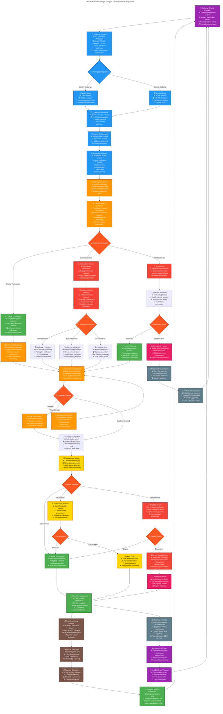

# Dvand Admin - Challenge Lifecycle Management

```mermaid
---
title: Dvand Admin Challenge Lifecycle & Competition Management
---
flowchart TD
    A[🎯 Challenge Strategy Planning<br/>📊 Platform engagement analysis<br/>📈 Creator participation trends<br/>🎪 Theme selection criteria<br/>💰 Prize allocation strategy] --> B[📝 Challenge Creation<br/>📊 2-3 concurrent challenges<br/>⏱️ Weekly: ₹5,000 / Monthly: ₹25,000<br/>🎨 Theme definition & guidelines<br/>📋 Content requirements specification]
    
    B --> C{🎯 Challenge Configuration}
    C -->|Weekly Challenge| D[⚡ Weekly Setup<br/>📊 7-day duration<br/>💰 ₹5,000 prize pool<br/>🎯 Quick engagement cycle<br/>📈 Frequency optimization]
    C -->|Monthly Challenge| E[🏆 Monthly Setup<br/>📊 30-day duration<br/>💰 ₹25,000 prize pool<br/>🎯 Premium competition<br/>📈 Quality focus]
    
    D --> F[📋 Challenge Parameters<br/>📊 2 videos max per creator<br/>⏱️ 15-60 second duration<br/>🏷️ 8 tags maximum<br/>🎨 Theme-specific guidelines]
    E --> F
    
    F --> G[🎨 Creative Configuration<br/>📊 Banner image upload<br/>📝 Description crafting<br/>🏷️ Hashtag requirements<br/>📚 Content examples]
    
    G --> H[⏰ Scheduling & Launch<br/>📊 Automated launch system<br/>🔔 Creator notification system<br/>📱 Platform-wide announcement<br/>🎯 Participation encouragement]
    
    H --> I[🚀 Challenge Goes Live<br/>📊 Real-time activation<br/>🔔 Push notifications sent<br/>📱 Social media promotion<br/>🎯 Creator engagement drive]
    
    I --> J[📊 Live Monitoring Dashboard<br/>📈 Participation tracking: 200+ videos<br/>⏱️ Submission timeline analysis<br/>🎯 Engagement rate monitoring<br/>📊 Content quality assessment]
    
    J --> K{📊 Health Check Analysis}
    K -->|Healthy Participation| L[✅ Optimal Performance<br/>📊 Target participation achieved<br/>📈 Strong engagement metrics<br/>🎯 Quality submissions maintained<br/>⚡ Smooth operation flow]
    K -->|Low Participation| M[⚠️ Participation Concern<br/>📊 Below target submissions<br/>📈 Engagement boost needed<br/>🎯 Creator outreach required<br/>📢 Additional promotion]
    K -->|Technical Issues| N[🚨 System Alert<br/>📊 Performance monitoring<br/>🔧 Technical intervention<br/>⚡ Issue resolution priority<br/>🛠️ System optimization]
    
    %% Healthy Performance Path
    L --> O[🎬 Content Quality Review<br/>📊 Continuous moderation<br/>✅ Approval rate tracking<br/>🎯 Quality standard maintenance<br/>📈 Creator satisfaction monitoring]
    
    %% Low Participation Response
    M --> P[📢 Engagement Boost Strategy<br/>📊 Additional creator outreach<br/>🎁 Incentive consideration<br/>📱 Social media push<br/>🔄 Deadline extension evaluation]
    
    P --> Q{💡 Intervention Decision}
    Q -->|Extend Deadline| R[⏰ Challenge Extension<br/>📊 Fair timeline adjustment<br/>🔔 Participant notification<br/>📝 Terms update<br/>⚖️ Fairness maintenance]
    Q -->|Boost Promotion| S[📢 Enhanced Marketing<br/>📊 Platform-wide promotion<br/>🎯 Creator incentivization<br/>📱 Social media campaign<br/>🎪 Community engagement]
    Q -->|Add Incentives| T[🎁 Bonus Incentives<br/>📊 Additional rewards<br/>🏆 Special recognition<br/>🎯 Participation motivation<br/>💰 Prize enhancement]
    
    %% Technical Issues Response
    N --> U[🔧 Technical Resolution<br/>📊 System diagnostics<br/>⚡ Rapid response protocol<br/>🛠️ Infrastructure scaling<br/>📈 Performance optimization]
    
    U --> V{🔍 Resolution Status}
    V -->|Resolved| W[✅ System Restored<br/>📊 Normal operations resumed<br/>🔔 Participant notification<br/>📈 Monitoring enhanced<br/>🎯 Challenge continuation]
    V -->|Complex Issue| X[🆘 Emergency Protocol<br/>📊 Senior team involvement<br/>📞 External support<br/>⏸️ Challenge pause consideration<br/>💰 Participant compensation]
    
    %% Challenge Progression
    O --> Y[📈 Real-Time Leaderboard<br/>📊 Shor score calculation<br/>🏆 Position tracking system<br/>⚡ Live updates every 30s<br/>🎯 Competition transparency]
    R --> Y
    S --> Y
    T --> Y
    W --> Y
    
    Y --> Z{⏰ Challenge Timeline}
    Z -->|Ongoing| AA[🔄 Continuous Monitoring<br/>📊 Performance tracking<br/>🎯 Quality assurance<br/>📈 Engagement optimization<br/>⚡ Issue prevention]
    Z -->|Final 24 Hours| BB[⏰ Final Sprint Phase<br/>📊 Increased monitoring<br/>🔔 Deadline reminders<br/>🎯 Last-minute submissions<br/>📈 Competition intensity]
    Z -->|Deadline Reached| CC[🏁 Challenge Completion<br/>📊 Submission cutoff<br/>🔒 Final leaderboard lock<br/>🏆 Winner determination prep<br/>⚖️ Fairness verification]
    
    AA --> Y
    BB --> CC
    
    %% Winner Selection Process
    CC --> DD[🏆 Final Winner Review<br/>📊 Leaderboard analysis<br/>⚖️ Admin discretion review<br/>🎯 Single winner selection<br/>👑 Winner-takes-all principle]
    
    DD --> EE{⚖️ Winner Validation}
    EE -->|Clear Winner| FF[👑 Winner Confirmation<br/>📊 Shor score verification<br/>✅ Eligibility validated<br/>🎉 Victory celebration<br/>💰 Prize processing trigger]
    EE -->|Tie Situation| GG[⚖️ Tie-Breaking Protocol<br/>📊 Manual evaluation criteria<br/>🎨 Content quality assessment<br/>📈 Engagement analysis<br/>⚖️ Fair determination]
    EE -->|Eligibility Issue| HH[🚨 Eligibility Review<br/>📊 KYC status verification<br/>⚖️ Rule compliance check<br/>🔍 Violation history review<br/>📋 Documentation requirement]
    
    GG --> II{🎯 Tie Resolution}
    II -->|Resolved| FF
    II -->|Joint Winners| JJ[👥 Shared Victory<br/>📊 Prize distribution plan<br/>⚖️ Fair compensation<br/>🎉 Dual celebration<br/>💰 Split payment processing]
    
    HH --> KK{📋 Eligibility Status}
    KK -->|Eligible| FF
    KK -->|Disqualified| LL[❌ Winner Disqualification<br/>📊 Next-in-line promotion<br/>⚖️ Fair process execution<br/>🔔 Transparent communication<br/>📋 Decision documentation]
    
    %% Winner Announcement & Prize Processing
    FF --> MM[🎉 Winner Announcement<br/>📊 Platform-wide celebration<br/>🎊 Creator recognition<br/>📱 Social media promotion<br/>🏆 Community acknowledgment]
    JJ --> MM
    LL --> NN[🔄 Alternative Winner<br/>📊 Next eligible candidate<br/>⚖️ Fair succession process<br/>🎉 Recognition transfer<br/>💰 Prize reallocation]
    NN --> MM
    
    MM --> OO[💰 Prize Processing Initiation<br/>📊 Full KYC verification trigger<br/>🏦 Bank account validation<br/>📋 Tax documentation prep<br/>⚡ Payment system activation]
    
    %% Challenge Analytics & Learning
    MM --> PP[📊 Challenge Analytics<br/>📈 Participation analysis: 87% creator rate<br/>🎯 Engagement metrics: +156% votes<br/>📊 Content quality: 91% approval<br/>💰 Prize distribution: 100% success]
    
    PP --> QQ[📚 Strategic Learning<br/>📊 Performance insights<br/>🎯 Optimization opportunities<br/>📈 Future planning data<br/>🔄 Process improvements]
    
    QQ --> RR[🎯 Next Challenge Planning<br/>📊 Theme development<br/>📈 Prize optimization<br/>🎪 Format innovation<br/>🔄 Cycle continuation]
    
    %% System Integration & Monitoring
    X --> SS[📋 Incident Documentation<br/>📊 Technical issue log<br/>🔧 Resolution tracking<br/>📈 Prevention measures<br/>🛠️ System hardening]
    
    OO --> TT[🏦 Financial Integration<br/>📊 Payment system sync<br/>💰 Prize disbursement<br/>📋 Tax compliance<br/>⚡ Automated processing]
    
    %% Continuous Improvement Loop
    SS --> UU[🔄 Platform Enhancement<br/>📊 Reliability improvements<br/>⚡ Performance optimization<br/>🛠️ System upgrades<br/>📈 User experience boost]
    
    TT --> VV[💰 Financial Operations<br/>📊 100% payment success<br/>⚡ 5-7 day processing<br/>📋 Complete compliance<br/>🏆 Creator satisfaction]
    
    %% Return to Planning Cycle
    RR --> A
    UU --> A
    VV --> WW[📈 Success Metrics Dashboard<br/>• Challenge completion: 98%<br/>• Creator participation: 87%<br/>• Payment success: 100%<br/>• Platform satisfaction: 94%]
    
    WW --> A
    
    %% Styling
    classDef planning fill:#9C27B0,stroke:#6A1B9A,stroke-width:3px,color:#fff
    classDef creation fill:#2196F3,stroke:#1565C0,stroke-width:2px,color:#fff
    classDef monitoring fill:#FF9800,stroke:#E65100,stroke-width:2px,color:#fff
    classDef decision fill:#FF5722,stroke:#D84315,stroke-width:2px,color:#fff
    classDef success fill:#4CAF50,stroke:#2E7D32,stroke-width:3px,color:#fff
    classDef issue fill:#F44336,stroke:#C62828,stroke-width:2px,color:#fff
    classDef winner fill:#FFD700,stroke:#F57C00,stroke-width:3px,color:#000
    classDef financial fill:#795548,stroke:#5D4037,stroke-width:2px,color:#fff
    classDef analytics fill:#607D8B,stroke:#37474F,stroke-width:2px,color:#fff
    classDef emergency fill:#E91E63,stroke:#AD1457,stroke-width:3px,color:#fff
    
    class A,RR,QQ planning
    class B,C,D,E,F,G,H creation
    class I,J,O,Y,AA,BB monitoring
    class K,Q,V,Z,EE,II,KK decision
    class L,W,FF,MM,WW success
    class M,N,P,HH,LL issue
    class DD,GG,JJ winner
    class OO,TT,VV financial
    class PP,SS,UU analytics
    class X,NN emergency
    
    %% Interactive elements
    click MM "javascript:alert('Winner Celebration: Platform-wide announcement + social promotion')"
    click PP "javascript:alert('Challenge Analytics: 87% creator participation, 91% content approval')"
    click VV "javascript:alert('Financial Success: 100% payment rate, 5-7 day processing')"
    click WW "javascript:alert('Platform KPIs: 98% completion, 94% satisfaction, 100% payment success')"
```
