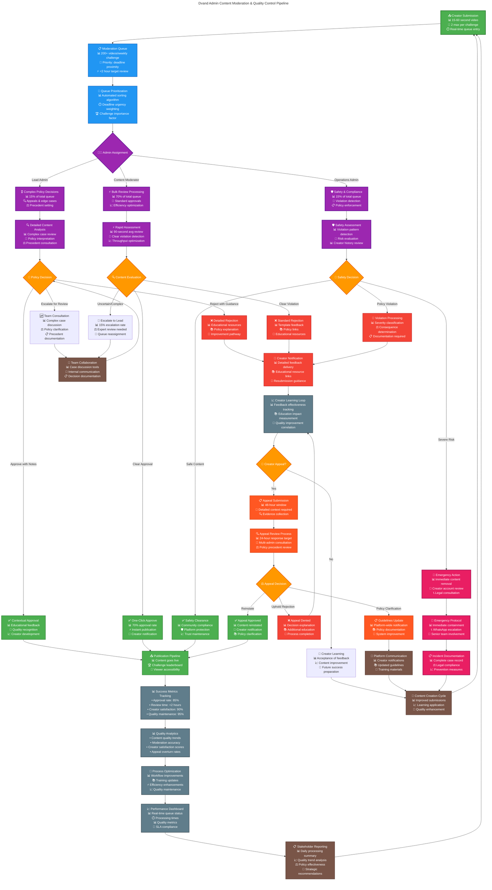

# Dvand Admin - Content Moderation Complete Flow

```mermaid
---
title: Dvand Admin Content Moderation & Quality Control Pipeline
---
flowchart TD
    A[📤 Creator Submission<br/>📊 15-60 second video<br/>🎯 2 max per challenge<br/>⏱️ Real-time queue entry] --> B[📋 Moderation Queue<br/>📊 200+ videos/weekly challenge<br/>🔄 Priority: deadline proximity<br/>⚡ <2 hour target review]
    
    B --> C[🎯 Queue Prioritization<br/>📊 Automated sorting algorithm<br/>⏱️ Deadline urgency weighting<br/>🏆 Challenge importance factor]
    
    C --> D{👨‍💼 Admin Assignment}
    D -->|Lead Admin| E[🎖️ Complex Policy Decisions<br/>📊 15% of total queue<br/>🔍 Appeals & edge cases<br/>⚖️ Precedent setting]
    D -->|Content Moderator| F[⚡ Bulk Review Processing<br/>📊 70% of total queue<br/>🔄 Standard approvals<br/>📈 Efficiency optimization]
    D -->|Operations Admin| G[🛡️ Safety & Compliance<br/>📊 15% of total queue<br/>🚨 Violation detection<br/>📋 Policy enforcement]
    
    %% Lead Admin Flow
    E --> H[🔍 Detailed Content Analysis<br/>📊 Complex case review<br/>📝 Policy interpretation<br/>⚖️ Precedent consultation]
    H --> I{🎯 Policy Decision}
    I -->|Approve with Notes| J[✅ Contextual Approval<br/>📊 Educational feedback<br/>🎯 Quality recognition<br/>📈 Creator development]
    I -->|Reject with Guidance| K[❌ Detailed Rejection<br/>📊 Educational resources<br/>📚 Policy explanation<br/>🔄 Improvement pathway]
    I -->|Escalate for Review| L[🆙 Team Consultation<br/>📊 Complex case discussion<br/>⚖️ Policy clarification<br/>📋 Precedent documentation]
    
    %% Content Moderator Flow
    F --> M[⚡ Rapid Assessment<br/>📊 90-second avg review<br/>🎯 Clear violation detection<br/>📈 Throughput optimization]
    M --> N{🔍 Content Evaluation}
    N -->|Clear Approval| O[✅ One-Click Approve<br/>📊 70% approval rate<br/>⚡ Instant publication<br/>🎉 Creator notification]
    N -->|Clear Violation| P[❌ Standard Rejection<br/>📊 Template feedback<br/>📚 Policy links<br/>📧 Educational resources]
    N -->|Uncertain/Complex| Q[🤔 Escalate to Lead<br/>📊 15% escalation rate<br/>⚖️ Expert review needed<br/>🔄 Queue reassignment]
    
    %% Operations Admin Flow
    G --> R[🛡️ Safety Assessment<br/>📊 Violation pattern detection<br/>🚨 Risk evaluation<br/>📊 Creator history review]
    R --> S{🚨 Safety Decision}
    S -->|Safe Content| T[✅ Safety Clearance<br/>📊 Community compliance<br/>🛡️ Platform protection<br/>📈 Trust maintenance]
    S -->|Policy Violation| U[🚨 Violation Processing<br/>📊 Severity classification<br/>⚖️ Consequence determination<br/>📋 Documentation required]
    S -->|Severe Risk| V[🚨 Emergency Action<br/>📊 Immediate content removal<br/>🚫 Creator account review<br/>📞 Legal consultation]
    
    %% Approval Processing
    J --> W[📤 Publication Pipeline<br/>📊 Content goes live<br/>🏆 Challenge leaderboard<br/>📱 Viewer accessibility]
    O --> W
    T --> W
    
    W --> X[📊 Success Metrics Tracking<br/>• Approval rate: 85%<br/>• Review time: <2 hours<br/>• Creator satisfaction: 90%<br/>• Quality maintenance: 95%]
    
    %% Rejection Processing
    K --> Y[📧 Creator Notification<br/>📊 Detailed feedback delivery<br/>📚 Educational resource links<br/>🔄 Resubmission guidance]
    P --> Y
    U --> Y
    
    Y --> Z[📈 Creator Learning Loop<br/>📊 Feedback effectiveness tracking<br/>📚 Education impact measurement<br/>🔄 Quality improvement correlation]
    
    %% Appeals Processing
    Z --> AA{📝 Creator Appeal?}
    AA -->|Yes| BB[📋 Appeal Submission<br/>📊 48-hour window<br/>📝 Detailed context required<br/>🔍 Evidence collection]
    AA -->|No| CC[🔄 Creator Learning<br/>📊 Acceptance of feedback<br/>📈 Content improvement<br/>🎯 Future success preparation]
    
    BB --> DD[🔍 Appeal Review Process<br/>📊 24-hour response target<br/>👥 Multi-admin consultation<br/>⚖️ Policy precedent review]
    
    DD --> EE{⚖️ Appeal Decision}
    EE -->|Reinstate| FF[✅ Appeal Approved<br/>📊 Content reinstated<br/>🎉 Creator notification<br/>📚 Policy clarification]
    EE -->|Uphold Rejection| GG[❌ Appeal Denied<br/>📊 Decision explanation<br/>📚 Additional education<br/>🔄 Process completion]
    EE -->|Policy Clarification| HH[📋 Guidelines Update<br/>📊 Platform-wide notification<br/>📚 Policy documentation<br/>🔄 System improvement]
    
    FF --> W
    GG --> Z
    HH --> II[📢 Platform Communication<br/>📊 Creator notifications<br/>📚 Updated guidelines<br/>🔄 Training materials]
    
    %% Emergency Escalation
    V --> JJ[🚨 Emergency Protocol<br/>📊 Immediate containment<br/>📞 WhatsApp escalation<br/>👥 Senior team involvement]
    
    JJ --> KK[📋 Incident Documentation<br/>📊 Complete case record<br/>⚖️ Legal compliance<br/>📈 Prevention measures]
    
    %% Quality Assurance Loop
    X --> LL[📊 Quality Analytics<br/>• Content quality trends<br/>• Moderation accuracy<br/>• Creator satisfaction scores<br/>• Appeal overturn rates]
    
    LL --> MM[🎯 Process Optimization<br/>📊 Workflow improvements<br/>📚 Training updates<br/>⚡ Efficiency enhancements<br/>📈 Quality maintenance]
    
    %% System Integration
    L --> NN[👥 Team Collaboration<br/>📊 Case discussion tools<br/>💬 Internal communication<br/>📋 Decision documentation]
    Q --> NN
    NN --> I
    
    %% Monitoring & Reporting
    MM --> OO[📈 Performance Dashboard<br/>📊 Real-time queue status<br/>⏱️ Processing times<br/>📊 Quality metrics<br/>🎯 SLA compliance]
    
    OO --> PP[📋 Stakeholder Reporting<br/>📊 Daily processing summary<br/>📈 Quality trend analysis<br/>⚖️ Policy effectiveness<br/>🎯 Strategic recommendations]
    
    %% Return Loops
    CC --> QQ[🔄 Content Creation Cycle<br/>📊 Improved submissions<br/>📈 Learning application<br/>🎯 Quality enhancement]
    II --> QQ
    KK --> QQ
    PP --> A
    QQ --> A
    
    %% Styling
    classDef submission fill:#4CAF50,stroke:#2E7D32,stroke-width:3px,color:#fff
    classDef queue fill:#2196F3,stroke:#1565C0,stroke-width:2px,color:#fff
    classDef admin fill:#9C27B0,stroke:#6A1B9A,stroke-width:3px,color:#fff
    classDef decision fill:#FF9800,stroke:#E65100,stroke-width:2px,color:#fff
    classDef approval fill:#4CAF50,stroke:#2E7D32,stroke-width:2px,color:#fff
    classDef rejection fill:#F44336,stroke:#C62828,stroke-width:2px,color:#fff
    classDef appeal fill:#FF5722,stroke:#D84315,stroke-width:2px,color:#fff
    classDef emergency fill:#E91E63,stroke:#AD1457,stroke-width:3px,color:#fff
    classDef analytics fill:#607D8B,stroke:#37474F,stroke-width:2px,color:#fff
    classDef system fill:#795548,stroke:#5D4037,stroke-width:2px,color:#fff
    
    class A submission
    class B,C queue
    class D,E,F,G,H,M,R admin
    class I,N,S,AA,EE decision
    class J,O,T,W,FF approval
    class K,P,U,Y,GG rejection
    class BB,DD,HH appeal
    class V,JJ,KK emergency
    class X,Z,LL,MM,OO analytics
    class NN,II,PP,QQ system
    
    %% Interactive elements
    click W "javascript:alert('Content Published: 85% approval rate, <2hr processing')"
    click X "javascript:alert('Success Metrics: 90% creator satisfaction, 95% quality maintained')"
    click LL "javascript:alert('Quality Analytics: Track trends, accuracy, satisfaction, appeals')"
    click OO "javascript:alert('Live Dashboard: Real-time queue, processing times, SLA compliance')"
```
