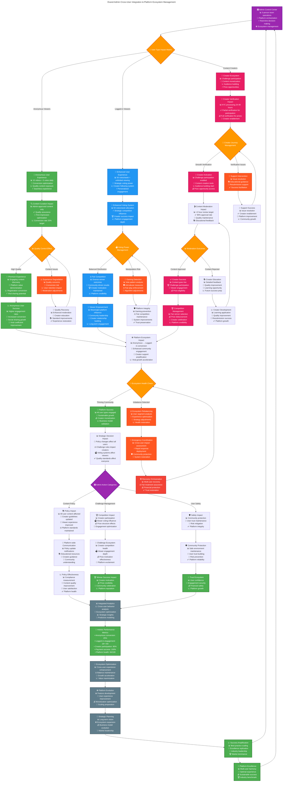

# Dvand Admin - Cross-User Integration & System Impact Flow

```mermaid
---
title: Dvand Admin Cross-User Integration & Platform Ecosystem Management
---
flowchart TD
    A[🎛️ Admin Control Center<br/>📊 3-person team operations<br/>🎯 Platform orchestration<br/>⚡ Real-time decision making<br/>🌐 Ecosystem management] --> B{👥 User Type Impact Matrix}
    
    B -->|Anonymous Viewers| C[📱 Anonymous User Experience<br/>📊 10 videos + 5 votes daily<br/>🎯 Conversion optimization<br/>📈 Quality content exposure<br/>⚡ Seamless experience]
    B -->|Logged-in Viewers| D[👤 Enhanced User Experience<br/>📊 50 votes/week + unlimited viewing<br/>🎯 Strategic voting power<br/>📈 Creator following system<br/>⚡ Personalized engagement]
    B -->|Content Creators| E[🎨 Creator Ecosystem<br/>📊 Challenge participation<br/>🎯 Content monetization<br/>📈 Audience building<br/>⚡ Prize opportunities]
    
    %% Anonymous Viewer Impact Chain
    C --> F[🔍 Content Curation Impact<br/>📊 Admin-approved content only<br/>✅ Quality assurance<br/>🎯 First impression optimization<br/>📈 Conversion rate 25% target]
    
    F --> G{📊 Quality Control Effect}
    G -->|High Quality| H[✨ Premium Experience<br/>📊 Engaging content discovery<br/>🎯 Platform value demonstration<br/>📈 Registration conversion<br/>⚡ Viral sharing potential]
    G -->|Content Issues| I[⚠️ Experience Degradation<br/>📊 Quality concerns<br/>🎯 Conversion risk<br/>📈 User retention impact<br/>🔄 Moderation adjustments]
    
    H --> J[📈 Anonymous User Success<br/>📊 Higher engagement rates<br/>🎯 Increased conversion<br/>📱 Social sharing growth<br/>🌊 Viral coefficient improvement]
    
    I --> K[🔧 Quality Recovery<br/>📊 Enhanced moderation<br/>🎯 Creator education<br/>📚 Standard improvements<br/>✅ Experience restoration]
    K --> G
    
    %% Logged-in Viewer Impact Chain
    D --> L[🎯 Enhanced Voting System<br/>📊 50 votes/week allocation<br/>⚡ Strategic competition influence<br/>🏆 Creator success impact<br/>📈 Platform engagement depth]
    
    L --> M{🗳️ Voting Power Management}
    M -->|Balanced Distribution| N[⚖️ Fair Competition<br/>📊 Diverse winner outcomes<br/>🎯 Community-driven results<br/>🏆 Creator motivation maintained<br/>📈 Platform credibility]
    M -->|Manipulation Risk| O[🚨 Gaming Detection<br/>📊 Vote pattern analysis<br/>🛡️ Anti-abuse measures<br/>⚖️ Fair play enforcement<br/>🔧 Algorithm adjustments]
    
    N --> P[🌟 Viewer Empowerment<br/>📊 Meaningful platform influence<br/>🎯 Community leadership<br/>👥 Creator relationship building<br/>📈 Long-term engagement]
    
    O --> Q[🛡️ Platform Integrity<br/>📊 Gaming prevention<br/>⚖️ Fair competition maintenance<br/>🔧 System improvements<br/>✅ Trust preservation]
    Q --> M
    
    %% Content Creator Impact Chain
    E --> R[📝 Creator Verification Impact<br/>📊 KYC processing 24-48 hours<br/>✅ Partial verification for participation<br/>💰 Full verification for prizes<br/>🎯 Creator enablement]
    
    R --> S{🎨 Creator Journey Management}
    S -->|Smooth Verification| T[🚀 Creator Activation<br/>📊 Challenge participation enabled<br/>🎯 Content creation tools<br/>📈 Audience building start<br/>💰 Prize opportunity access]
    S -->|Verification Issues| U[🔧 Support Intervention<br/>📊 Issue resolution<br/>📚 Educational guidance<br/>🔄 Resubmission support<br/>✅ Success facilitation]
    
    T --> V[🎬 Content Moderation Impact<br/>📊 <2 hour review target<br/>✅ 85% approval rate<br/>🎯 Quality maintenance<br/>📚 Educational feedback]
    
    V --> W{📊 Moderation Outcomes}
    W -->|Content Approved| X[✅ Creator Success<br/>📊 Content goes live<br/>🏆 Challenge participation<br/>👥 Viewer engagement<br/>💰 Prize eligibility]
    W -->|Content Rejected| Y[📚 Creator Education<br/>📊 Detailed feedback<br/>🎯 Quality improvement<br/>🔄 Learning opportunity<br/>📈 Future success prep]
    
    X --> Z[🏆 Competition Management<br/>📊 Fair winner selection<br/>💰 Prize disbursement<br/>🎉 Creator celebration<br/>📈 Platform credibility]
    
    Y --> AA[📈 Creator Development<br/>📊 Learning application<br/>🎯 Quality improvement<br/>🔄 Resubmission success<br/>✅ Platform growth]
    AA --> V
    
    %% Cross-User Ecosystem Effects
    J --> BB[🌐 Platform Ecosystem Impact<br/>📊 Anonymous → Logged-in conversion<br/>👥 Enhanced community engagement<br/>🎯 Creator support amplification<br/>📈 Viral growth acceleration]
    
    P --> BB
    Z --> BB
    
    BB --> CC{🎯 Ecosystem Health Check}
    CC -->|Thriving Community| DD[🌟 Platform Success<br/>📊 All user types engaged<br/>🎯 Sustainable growth<br/>💰 Creator monetization<br/>📈 Business model validation]
    CC -->|Imbalance Detected| EE[⚖️ Ecosystem Rebalancing<br/>📊 User segment analysis<br/>🎯 Experience optimization<br/>🔄 Strategy adjustments<br/>📈 Health restoration]
    
    %% Admin Decision Impact Matrix
    DD --> FF[📊 Strategic Decision Impact<br/>🎯 Policy changes affect all users<br/>⚖️ Challenge rules impact creators<br/>🗳️ Voting systems affect viewers<br/>✅ Quality standards affect everyone]
    
    FF --> GG{🎛️ Admin Action Categories}
    GG -->|Content Policy| HH[📚 Policy Impact<br/>📊 All user content affected<br/>🎯 Creator guidelines updated<br/>👥 Viewer experience improved<br/>⚖️ Platform standards maintained]
    GG -->|Challenge Management| II[🏆 Competition Impact<br/>📊 Creator participation<br/>🗳️ Viewer voting influence<br/>💰 Prize structure effects<br/>🎯 Engagement optimization]
    GG -->|User Safety| JJ[🛡️ Safety Impact<br/>📊 Community protection<br/>👥 User trust maintenance<br/>🚨 Risk mitigation<br/>✅ Platform integrity]
    
    %% Policy Impact Flow
    HH --> KK[📢 Platform-wide Communication<br/>📊 Policy update notifications<br/>📚 Educational resources<br/>🎯 Creator guidance<br/>👥 Community understanding]
    
    KK --> LL[📈 Policy Effectiveness<br/>📊 Compliance measurement<br/>🎯 Content quality improvement<br/>👥 User satisfaction<br/>✅ Platform health]
    
    %% Challenge Impact Flow
    II --> MM[🎪 Challenge Ecosystem<br/>📊 Creator competition health<br/>🗳️ Viewer engagement depth<br/>💰 Prize motivation effectiveness<br/>🎯 Platform excitement]
    
    MM --> NN[🏆 Winner Success Impact<br/>📊 Creator motivation<br/>💰 Prize credibility<br/>🎉 Community celebration<br/>📈 Platform reputation]
    
    %% Safety Impact Flow  
    JJ --> OO[🛡️ Community Protection<br/>📊 Safe environment maintenance<br/>👥 User trust building<br/>🚨 Risk prevention<br/>✅ Platform reliability]
    
    OO --> PP[🌟 Trust Ecosystem<br/>📊 User confidence<br/>🎯 Engagement security<br/>💰 Financial safety<br/>📈 Platform growth]
    
    %% System Integration & Monitoring
    LL --> QQ[📊 Integrated Analytics<br/>📈 Cross-user behavior analysis<br/>🎯 Ecosystem optimization<br/>📊 Strategic insights<br/>🔮 Predictive modeling]
    NN --> QQ
    PP --> QQ
    
    QQ --> RR[🎯 Holistic Performance Metrics<br/>• Anonymous conversion: 25%<br/>• Logged-in engagement: 18+ min<br/>• Creator participation: 80%<br/>• Payment success: 100%<br/>• Platform health: 94/100]
    
    %% Continuous Ecosystem Optimization
    RR --> SS[🔄 Ecosystem Optimization<br/>📊 Cross-user experience enhancement<br/>⚖️ Balance maintenance<br/>🎯 Growth acceleration<br/>📈 Value maximization]
    
    SS --> TT[🌐 Platform Evolution<br/>📊 Feature development<br/>🎯 User experience improvement<br/>💰 Monetization optimization<br/>🚀 Scaling preparation]
    
    %% Emergency Response Integration
    EE --> UU[🚨 Emergency Coordination<br/>📊 Cross-user impact assessment<br/>⚡ Rapid response deployment<br/>🛡️ Community protection<br/>🔧 System restoration]
    
    UU --> VV[🛠️ Recovery Orchestration<br/>📊 Multi-user recovery<br/>⚖️ Fair treatment assurance<br/>💰 Financial protection<br/>✅ Trust restoration]
    
    VV --> CC
    
    %% Strategic Planning Loop
    TT --> WW[🎯 Strategic Planning<br/>📊 Long-term vision<br/>🌐 Ecosystem expansion<br/>💰 Business model evolution<br/>🚀 Market leadership]
    
    WW --> XX[📈 Success Amplification<br/>📊 Best practice scaling<br/>🎯 Excellence replication<br/>🌟 Industry leadership<br/>🏆 Market dominance]
    
    XX --> A
    
    %% Return to Monitoring
    U --> YY[🔄 Support Success<br/>📊 Issue resolution<br/>✅ Creator enablement<br/>🎯 Platform improvement<br/>📈 Community growth]
    YY --> S
    
    %% Final Integration Point
    XX --> ZZ[🌟 Platform Excellence<br/>📊 Multi-user harmony<br/>🎯 Optimal experience<br/>💰 Sustainable success<br/>🏆 Industry benchmark]
    
    ZZ --> A
    
    %% Styling
    classDef admin fill:#9C27B0,stroke:#6A1B9A,stroke-width:3px,color:#fff
    classDef anonymous fill:#4CAF50,stroke:#2E7D32,stroke-width:2px,color:#fff
    classDef logged fill:#2196F3,stroke:#1565C0,stroke-width:2px,color:#fff
    classDef creator fill:#E91E63,stroke:#AD1457,stroke-width:2px,color:#fff
    classDef decision fill:#FF9800,stroke:#E65100,stroke-width:2px,color:#fff
    classDef success fill:#4CAF50,stroke:#2E7D32,stroke-width:3px,color:#fff
    classDef warning fill:#FF5722,stroke:#D84315,stroke-width:2px,color:#fff
    classDef integration fill:#607D8B,stroke:#37474F,stroke-width:2px,color:#fff
    classDef excellence fill:#FFD700,stroke:#F57C00,stroke-width:3px,color:#000
    classDef emergency fill:#F44336,stroke:#C62828,stroke-width:3px,color:#fff
    
    class A,GG admin
    class C,F,H,J anonymous
    class D,L,N,P logged
    class E,R,T,X,Z creator
    class B,G,M,S,W,CC decision
    class DD,NN,PP,RR,XX,ZZ success
    class I,O,U,EE,UU warning
    class QQ,SS,TT,WW integration
    class VV emergency
    
    %% Interactive elements
    click DD "javascript:alert('Platform Success: All user segments thriving, sustainable growth')"
    click SS "javascript:alert('Holistic Metrics: 25% conversion, 80% creator participation, 100% payments')"
    click XX "javascript:alert('Success Amplification: Best practices scaled, industry leadership')"
    click ZZ "javascript:alert('Platform Excellence: Multi-user harmony, optimal experience, benchmark status')"
```
