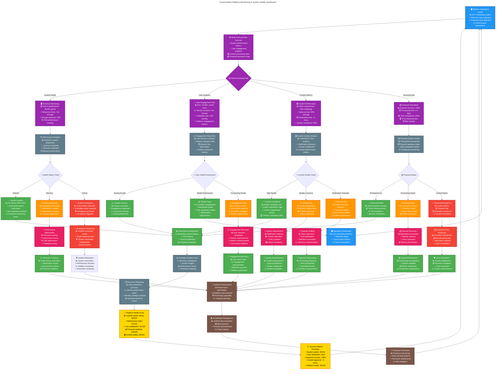

# Dvand Admin - Platform Monitoring & System Health Management

```mermaid
---
title: Dvand Admin Platform Monitoring & System Health Dashboard
---
flowchart TD
    A[🖥️ Platform Operations Center<br/>📊 24/7 monitoring system<br/>⚡ Real-time data collection<br/>🎯 Proactive issue detection<br/>📈 Performance optimization] --> B[📊 Multi-Channel Data Sources<br/>💾 System performance metrics<br/>👥 User engagement analytics<br/>🎬 Content processing stats<br/>💰 Financial transaction logs]
    
    B --> C{📊 Data Processing Hub}
    C -->|System Health| D[🖥️ Technical Monitoring<br/>📊 Server performance: 99.5% uptime<br/>⚡ Response times: <3s average<br/>💾 Storage utilization: 78%<br/>🌐 CDN performance tracking]
    C -->|User Analytics| E[👥 User Engagement Hub<br/>📊 DAU: 20,000+ active users<br/>📈 Session duration: 18+ minutes<br/>🎯 Retention rate: 70% monthly<br/>📱 Platform engagement metrics]
    C -->|Content Metrics| F[🎬 Content Performance<br/>📊 Video submissions: 200+/challenge<br/>✅ Approval rate: 85% average<br/>⏱️ Moderation time: <2 hours<br/>🎯 Quality compliance: 95%]
    C -->|Financial Data| G[💰 Financial Operations<br/>📊 Payment success: 100%<br/>⏱️ Processing time: 5-7 days<br/>💳 TDS compliance: 100%<br/>🏆 Prize disbursement: ₹180K monthly]
    
    %% System Health Monitoring
    D --> H[🔍 Performance Analysis<br/>📊 Real-time system diagnostics<br/>⚡ Latency monitoring<br/>💾 Resource utilization<br/>🌐 Network performance]
    
    H --> I{🚨 Health Status Check}
    I -->|Optimal| J[✅ System Healthy<br/>📊 All metrics within SLA<br/>⚡ Peak performance maintained<br/>🎯 User experience optimal<br/>📈 Proactive monitoring active]
    I -->|Warning| K[⚠️ Performance Alert<br/>📊 Degradation detected<br/>🔧 Intervention needed<br/>⚡ Optimization required<br/>📈 Capacity adjustment]
    I -->|Critical| L[🚨 System Emergency<br/>📊 Critical failure detected<br/>⚡ Immediate action required<br/>🛠️ Emergency protocols<br/>📞 Escalation triggered]
    
    %% User Engagement Analytics
    E --> M[📈 Engagement Deep Dive<br/>📊 User behavior analysis<br/>🎯 Feature adoption rates<br/>⏱️ Session flow optimization<br/>📱 Platform stickiness metrics]
    
    M --> N{👥 User Health Assessment}
    N -->|Strong Growth| O[📈 Growth Success<br/>📊 Targets exceeded<br/>🎯 Engagement optimized<br/>👥 Community thriving<br/>🚀 Scaling preparation]
    N -->|Stable Performance| P[📊 Steady State<br/>📈 Consistent engagement<br/>🎯 Maintained quality<br/>👥 User satisfaction stable<br/>🔄 Optimization opportunities]
    N -->|Concerning Trends| Q[⚠️ Engagement Alert<br/>📊 Declining metrics<br/>🎯 Intervention planning<br/>📈 Retention strategies<br/>🔄 Platform adjustments]
    
    %% Content Quality Monitoring
    F --> R[🎬 Content Quality Analysis<br/>📊 Submission trend analysis<br/>✅ Moderation efficiency<br/>🎯 Creator satisfaction<br/>📈 Content performance metrics]
    
    R --> S{🎯 Content Health Check}
    S -->|High Quality| T[✅ Content Excellence<br/>📊 Quality standards met<br/>🎯 Creator satisfaction high<br/>👥 Viewer engagement strong<br/>🏆 Platform reputation solid]
    S -->|Quality Concerns| U[⚠️ Content Alert<br/>📊 Quality degradation<br/>🎯 Moderation adjustments<br/>📚 Creator education<br/>🔄 Policy refinement]
    S -->|Moderation Overload| V[🚨 Capacity Alert<br/>📊 Queue overload detected<br/>⚡ Processing delays<br/>👥 Team scaling needed<br/>🔧 Workflow optimization]
    
    %% Financial System Monitoring
    G --> W[💰 Financial System Health<br/>📊 Transaction processing<br/>💳 Payment gateway status<br/>🏦 Bank integration health<br/>⚖️ Compliance monitoring]
    
    W --> X{💰 Financial Status}
    X -->|All Systems Go| Y[✅ Financial Health<br/>📊 100% payment success<br/>💰 Timely disbursements<br/>⚖️ Full compliance<br/>🔐 Security maintained]
    X -->|Processing Issues| Z[⚠️ Payment Alert<br/>📊 Transaction delays<br/>🏦 Gateway issues<br/>🔧 System intervention<br/>💰 Winner protection]
    X -->|Critical Failure| AA[🚨 Financial Emergency<br/>📊 System failure<br/>💰 Payment halt<br/>🆘 Emergency protocols<br/>👥 Executive escalation]
    
    %% Alert Response Systems
    K --> BB[🔧 Performance Optimization<br/>📊 Resource scaling<br/>⚡ Performance tuning<br/>🌐 CDN optimization<br/>💾 Database tuning]
    
    L --> CC[🚨 Emergency Response<br/>📊 Incident command center<br/>⚡ Rapid response team<br/>🛠️ System restoration<br/>📞 Stakeholder communication]
    
    Q --> DD[📈 Engagement Recovery<br/>📊 User retention campaigns<br/>🎯 Feature improvements<br/>📱 Platform enhancements<br/>🎪 Community initiatives]
    
    U --> EE[🎯 Quality Improvement<br/>📊 Moderation training<br/>📚 Creator education<br/>🔄 Policy updates<br/>🎬 Content standards]
    
    V --> FF[👥 Capacity Scaling<br/>📊 Team expansion<br/>🔧 Tool optimization<br/>⚡ Workflow automation<br/>📈 Efficiency improvements]
    
    Z --> GG[💰 Payment Recovery<br/>📊 Alternative processing<br/>🏦 Backup systems<br/>🔧 Issue resolution<br/>💰 Winner prioritization]
    
    AA --> HH[🆘 Financial Crisis Response<br/>📊 Executive intervention<br/>💰 Manual processing<br/>🏦 Alternative methods<br/>📞 Legal consultation]
    
    %% Success Monitoring
    J --> II[📊 Performance Dashboard<br/>📈 Real-time metrics display<br/>🎯 KPI tracking<br/>⚡ Trend visualization<br/>📊 Predictive analytics]
    O --> II
    T --> II
    Y --> II
    
    %% Recovery Monitoring
    BB --> JJ[📈 Recovery Tracking<br/>📊 Performance restoration<br/>⚡ Optimization results<br/>🎯 Improvement metrics<br/>📊 Success validation]
    
    CC --> KK[🛠️ Incident Resolution<br/>📊 System restoration<br/>⚡ Performance recovery<br/>📈 Stability monitoring<br/>🔄 Prevention measures]
    
    DD --> LL[👥 Engagement Recovery<br/>📊 User return rates<br/>📈 Engagement improvements<br/>🎯 Retention success<br/>📱 Platform satisfaction]
    
    EE --> MM[🎯 Quality Enhancement<br/>📊 Content improvement<br/>✅ Approval efficiency<br/>🎯 Creator satisfaction<br/>📈 Platform reputation]
    
    FF --> NN[⚡ Capacity Optimization<br/>📊 Processing efficiency<br/>👥 Team productivity<br/>🔧 Tool effectiveness<br/>📈 Workflow improvement]
    
    GG --> OO[💰 Payment Restoration<br/>📊 Processing normalization<br/>🏦 System reliability<br/>💰 Winner satisfaction<br/>⚖️ Compliance maintenance]
    
    HH --> PP[🛡️ Crisis Resolution<br/>📊 System stabilization<br/>💰 Payment completion<br/>🏦 Trust restoration<br/>📈 Process improvement]
    
    %% Strategic Analytics & Reporting
    II --> QQ[📊 Strategic Analytics Hub<br/>📈 Business intelligence<br/>🎯 Growth insights<br/>📊 Performance trends<br/>🔮 Predictive modeling]
    
    QQ --> RR[📋 Executive Reporting<br/>📊 Daily operations summary<br/>📈 Weekly performance report<br/>🎯 Monthly strategic analysis<br/>📊 Quarterly business review]
    
    %% Continuous Improvement Loop
    JJ --> SS[🔄 System Enhancement<br/>📊 Performance optimization<br/>⚡ Reliability improvements<br/>🛠️ Technology upgrades<br/>📈 Capacity planning]
    KK --> SS
    LL --> SS
    MM --> SS
    NN --> SS
    OO --> SS
    PP --> SS
    
    SS --> TT[📚 Knowledge Management<br/>📊 Incident documentation<br/>📚 Best practices<br/>🔄 Process improvements<br/>📈 Team training]
    
    TT --> UU[🎯 Proactive Prevention<br/>📊 Predictive monitoring<br/>⚡ Early warning systems<br/>🔧 Preventive maintenance<br/>📈 Risk mitigation]
    
    %% Platform Health Score
    RR --> VV[🎯 Platform Health Score<br/>📊 Overall system rating: 94/100<br/>⚡ Performance index: 97/100<br/>👥 User satisfaction: 91/100<br/>💰 Financial reliability: 100/100<br/>🎬 Content quality: 89/100]
    
    VV --> WW[📈 Success Metrics Summary<br/>• System uptime: 99.5%<br/>• User satisfaction: 91%<br/>• Payment success: 100%<br/>• Content approval: <2 hours<br/>• Platform health: 94/100]
    
    %% Return to Monitoring Cycle
    UU --> A
    WW --> A
    
    %% Real-time Operations Dashboard
    P --> XX[🖥️ Operations Dashboard<br/>📊 Live monitoring interface<br/>⚡ Real-time alerts<br/>🎯 Quick action buttons<br/>📈 Trend visualization]
    
    XX --> A
    
    %% Styling
    classDef monitoring fill:#2196F3,stroke:#1565C0,stroke-width:3px,color:#fff
    classDef data fill:#9C27B0,stroke:#6A1B9A,stroke-width:2px,color:#fff
    classDef health fill:#4CAF50,stroke:#2E7D32,stroke-width:2px,color:#fff
    classDef warning fill:#FF9800,stroke:#E65100,stroke-width:2px,color:#fff
    classDef critical fill:#F44336,stroke:#C62828,stroke-width:3px,color:#fff
    classDef success fill:#4CAF50,stroke:#2E7D32,stroke-width:3px,color:#fff
    classDef analytics fill:#607D8B,stroke:#37474F,stroke-width:2px,color:#fff
    classDef emergency fill:#E91E63,stroke:#AD1457,stroke-width:3px,color:#fff
    classDef improvement fill:#795548,stroke:#5D4037,stroke-width:2px,color:#fff
    classDef dashboard fill:#FFD700,stroke:#F57C00,stroke-width:3px,color:#000
    
    class A,XX monitoring
    class B,C,D,E,F,G data
    class J,O,P,T,Y health
    class K,Q,U,V,Z warning
    class L,AA,CC,HH critical
    class II,JJ,LL,MM,NN,OO,PP success
    class H,M,R,W,QQ,RR analytics
    class BB,DD,EE,FF,GG emergency
    class SS,TT,UU improvement
    class VV,WW dashboard
    
    %% Interactive elements
    click II "javascript:alert('Live Dashboard: Real-time KPIs, trend analysis, predictive alerts')"
    click VV "javascript:alert('Health Score: 94/100 overall, 99.5% uptime, 100% payment success')"
    click WW "javascript:alert('Success Summary: 91% satisfaction, <2hr approvals, 94/100 health')"
    click RR "javascript:alert('Executive Reports: Daily ops, weekly performance, strategic analysis')"
```
