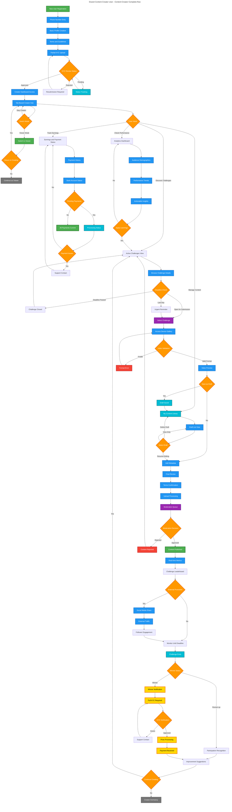

# Dvand Content Creator User - Content Creator Complete flow

```mermaid
---
title: Dvand Content Creator User - Content Creator Complete flow 
---
flowchart TD
    A[New User Registration] --> B[Phone Number Entry]
    B --> C[Basic Profile Creation]
    C --> D[Terms and Guidelines]
    D --> E[Partial KYC Upload]
    
    E --> F{KYC Review Status}
    F -->|Approved| G[Creator Dashboard Access]
    F -->|Rejected| H[Resubmission Required]
    F -->|Pending| I[Status Tracking]
    
    H --> E
    I --> F
    
    G --> J[Tab-Based Creator Hub]
    
    J --> K{User Intent}
    K -->|Discover Challenges| L[Active Challenges View]
    K -->|Manage Content| M[My Content Library]
    K -->|Check Performance| N[Analytics Dashboard]
    K -->|Track Earnings| O[Earnings and Payment Status]
    
    L --> P[Browse Challenge Details]
    P --> Q{Deadline Check}
    Q -->|Open for Submission| R[Select Challenge]
    Q -->|Deadline Passed| S[Challenge Closed]
    Q -->|Last Day| T[Urgent Reminder]
    
    S --> L
    T --> R
    
    R --> U[Access Device Gallery]
    U --> V{Video Validation}
    V -->|Valid Format| W[Video Preview]
    V -->|Invalid| X[Format Error]
    
    X --> U
    W --> Y{Save as Draft}
    Y -->|Yes| Z[Draft Saved]
    Y -->|No| AA[Add Metadata]
    
    Z --> M
    AA --> BB[Final Review]
    BB --> CC[Terms Confirmation]
    CC --> DD[Upload Processing]
    
    DD --> EE[Moderation Queue]
    EE --> FF{Moderation Decision}
    FF -->|Approved| GG[Content Published]
    FF -->|Rejected| HH[Content Rejected]
    
    HH --> L
    
    GG --> II[Real-time Metrics]
    II --> JJ[Challenge Leaderboard]
    JJ --> KK{External Promotion}
    KK -->|Yes| LL[Social Media Share]
    KK -->|No| MM[Monitor Until Deadline]
    
    LL --> NN[External Traffic]
    NN --> OO[Follower Engagement]
    OO --> MM
    
    MM --> PP[Challenge Ends]
    PP --> QQ{Winner Status}
    QQ -->|Winner| RR[Winner Notification]
    QQ -->|Runner-up| SS[Participation Recognition]
    
    RR --> TT[Full KYC Required]
    TT --> UU{KYC Verification}
    UU -->|Approved| VV[Prize Processing]
    UU -->|Issues| WW[Support Contact]
    
    WW --> TT
    VV --> XX[Payment Received]
    
    SS --> YY[Improvement Suggestions]
    XX --> YY
    YY --> ZZ{Continue Creating}
    ZZ -->|Yes| L
    ZZ -->|No| AAA[Creator Dormancy]
    
    J --> BBB{Switch Mode}
    BBB -->|Viewer Mode| CCC[Switch to Viewer]
    BBB -->|Stay Creator| J
    
    CCC --> DDD{Return to Creating}
    DDD -->|Yes| J
    DDD -->|No| EEE[Continue as Viewer]
    
    M --> FFF[Draft List View]
    FFF --> GGG{Select Draft}
    GGG -->|Resume Editing| AA
    GGG -->|Delete Draft| M
    GGG -->|View Only| FFF
    
    N --> HHH[Audience Demographics]
    HHH --> III[Performance Trends]
    III --> JJJ[Actionable Insights]
    JJJ --> KKK{Apply Learnings}
    KKK -->|Yes| L
    KKK -->|No| N
    
    O --> LLL[Payment History]
    LLL --> MMM[Bank Account Status]
    MMM --> NNN{Pending Payments}
    NNN -->|Yes| OOO[Processing Status]
    NNN -->|No| PPP[All Payments Current]
    
    OOO --> QQQ{Payment Issues}
    QQQ -->|Yes| RRR[Support Contact]
    QQQ -->|No| O
    
    RRR --> O
    
    classDef entryPoint fill:#4CAF50,stroke:#2E7D32,stroke-width:3px,color:#fff
    classDef action fill:#2196F3,stroke:#1565C0,stroke-width:2px,color:#fff
    classDef decision fill:#FF9800,stroke:#E65100,stroke-width:2px,color:#fff
    classDef limit fill:#F44336,stroke:#C62828,stroke-width:3px,color:#fff
    classDef conversion fill:#9C27B0,stroke:#6A1B9A,stroke-width:3px,color:#fff
    classDef success fill:#4CAF50,stroke:#2E7D32,stroke-width:4px,color:#fff
    classDef exit fill:#757575,stroke:#424242,stroke-width:2px,color:#fff
    classDef process fill:#00BCD4,stroke:#006064,stroke-width:2px,color:#fff
    classDef winner fill:#FFD700,stroke:#F57F17,stroke-width:4px,color:#000
    
    class A,CCC entryPoint
    class B,C,D,E,G,J,P,U,W,AA,BB,CC,DD,II,LL,NN,TT,VV,HHH,III,JJJ,LLL,MMM,FFF action
    class F,K,Q,V,Y,FF,KK,QQ,UU,ZZ,BBB,DDD,GGG,KKK,NNN,QQQ decision
    class X,HH limit
    class R,EE,RR conversion
    class GG,XX,PPP success
    class AAA,EEE exit
    class I,Z,M,PP,OOO process
    class RR,TT,VV,XX winner
```
