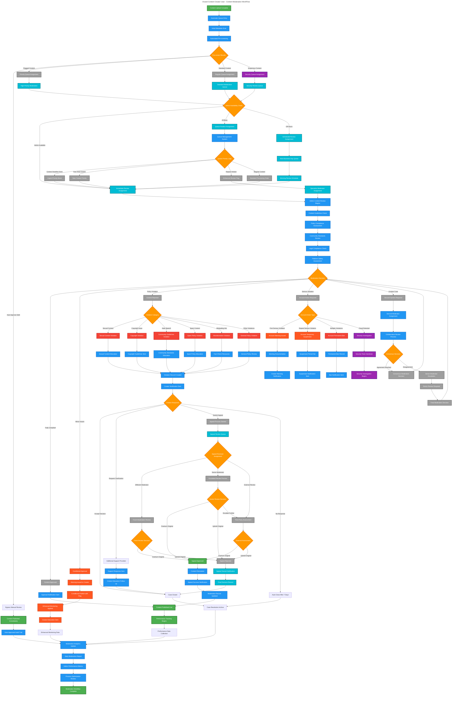

# Dvand Content Creator User - Content Moderation WorkFlow

```mermaid
---
title: Dvand Content Creator User - Content Moderation WorkFlow
---
flowchart TD
    A[Content Upload Complete] --> B[Automatic Queue Entry]
    B --> C[Initial Metadata Scan]
    C --> D[Automated Pre-screening]
    
    D --> E{Pre-screen Results}
    E -->|Auto-Approve Safe| F[Bypass Manual Review]
    E -->|Flagged Content| G[Priority Queue Assignment]
    E -->|Standard Content| H[Regular Queue Assignment]
    E -->|Suspicious Content| I[Security Queue Assignment]
    
    F --> J[Content Published Immediately]
    
    G --> K[High Priority Moderation]
    H --> L[Standard Moderation Queue]
    I --> M[Security Review Queue]
    
    K --> N{Admin Availability Check}
    L --> N
    M --> N
    
    N -->|Admin Available| O[Immediate Review Assignment]
    N -->|All Busy| P[Queue Position Assignment]
    N -->|Off Hours| Q[Scheduled Review Assignment]
    
    P --> R[Queue Management System]
    R --> S{Queue Priority Logic}
    S -->|Contest Deadline Soon| T[Urgent Priority Boost]
    S -->|First Time Creator| U[New Creator Priority]
    S -->|Repeat Violator| V[Enhanced Review Flag]
    S -->|Regular Content| W[Standard Processing Order]
    
    T --> O
    U --> O
    V --> X[Specialist Moderator Assignment]
    W --> O
    
    Q --> Y[Next Business Day Queue]
    Y --> Z[Morning Review Schedule]
    Z --> O
    
    O --> AA[Admin Content Review Begins]
    X --> AA
    
    AA --> BB[Content Guidelines Check]
    BB --> CC[Policy Compliance Assessment]
    CC --> DD[Community Standards Review]
    DD --> EE[Legal Compliance Check]
    EE --> FF[Platform Safety Assessment]
    
    FF --> GG{Moderation Decision}
    GG -->|Fully Compliant| HH[Content Approved]
    GG -->|Minor Issues| II[Conditional Approval]
    GG -->|Policy Violation| JJ[Content Rejected]
    GG -->|Serious Violation| KK[Account Action Required]
    GG -->|Unclear Case| LL[Second Opinion Required]
    
    HH --> MM[Approval Notification Sent]
    MM --> NN[Content Published Live]
    NN --> OO[Performance Tracking Begins]
    
    II --> PP[Warning Issued to Creator]
    PP --> QQ[Conditional Publish with Flag]
    QQ --> RR[Enhanced Monitoring Applied]
    RR --> SS[Creator Education Sent]
    
    JJ --> TT{Violation Category}
    TT -->|Sexual Content| UU[Sexual Content Violation]
    TT -->|Copyright Issue| VV[Copyright Violation]
    TT -->|Hate Speech| WW[Community Guidelines Violation]
    TT -->|Spam Content| XX[Spam Policy Violation]
    TT -->|Misleading Info| YY[Misinformation Violation]
    TT -->|Other Violations| ZZ[General Policy Violation]
    
    UU --> AAA[Sexual Content Education]
    VV --> BBB[Copyright Guidelines Sent]
    WW --> CCC[Community Standards Education]
    XX --> DDD[Spam Policy Education]
    YY --> EEE[Fact-Check Resources]
    ZZ --> FFF[General Policy Review]
    
    AAA --> GGG[Violation Record Created]
    BBB --> GGG
    CCC --> GGG
    DDD --> GGG
    EEE --> GGG
    FFF --> GGG
    
    GGG --> HHH[Creator Notification Sent]
    HHH --> III{Creator Response}
    III -->|Accept Decision| JJJ[Case Closed]
    III -->|Request Clarification| KKK[Additional Support Provided]
    III -->|Submit Appeal| LLL[Appeal Process Started]
    III -->|No Response| MMM[Auto-Close After 7 Days]
    
    KKK --> NNN[Support Response Sent]
    NNN --> OOO[Creator Education Follow-up]
    OOO --> JJJ
    
    LLL --> PPP[Appeal Review Queue]
    PPP --> QQQ{Appeal Reviewer Assignment}
    QQQ -->|Different Moderator| RRR[Fresh Moderation Review]
    QQQ -->|Senior Moderator| SSS[Escalated Review Process]
    QQQ -->|External Review| TTT[Third Party Assessment]
    
    RRR --> UUU{Fresh Review Decision}
    UUU -->|Overturn Original| VVV[Appeal Approved]
    UUU -->|Uphold Original| WWW[Appeal Rejected]
    
    SSS --> XXX{Senior Review Decision}
    XXX -->|Overturn Original| VVV
    XXX -->|Uphold Original| WWW
    XXX -->|Escalate Further| TTT
    
    TTT --> YYY{External Assessment}
    YYY -->|Overturn Original| VVV
    YYY -->|Uphold Original| WWW
    
    VVV --> ZZZ[Content Reinstated]
    ZZZ --> AAAA[Appeal Success Notification]
    AAAA --> BBBB[Moderation Record Updated]
    BBBB --> NN
    
    WWW --> CCCC[Appeal Denied Notification]
    CCCC --> DDDD[Final Decision Record]
    DDDD --> JJJ
    
    KK --> EEEE{Account Action Type}
    EEEE -->|First Serious Violation| FFFF[Account Warning Issued]
    EEEE -->|Repeat Serious Violation| GGGG[Account Temporary Suspension]
    EEEE -->|Multiple Violations| HHHH[Account Permanent Ban]
    EEEE -->|Fraud Detected| IIII[Security Investigation]
    
    FFFF --> JJJJ[Warning Documentation]
    GGGG --> KKKK[Suspension Period Set]
    HHHH --> LLLL[Permanent Ban Record]
    IIII --> MMMM[Security Team Handover]
    
    JJJJ --> NNNN[Creator Warning Notification]
    KKKK --> OOOO[Suspension Notification Sent]
    LLLL --> PPPP[Ban Notification Sent]
    MMMM --> QQQQ[Security Investigation Begins]
    
    LL --> RRRR[Second Moderator Assignment]
    RRRR --> SSSS[Collaborative Review Process]
    SSSS --> TTTT{Consensus Decision}
    TTTT -->|Agreement Reached| UUUU[Consensus Moderation Decision]
    TTTT -->|Disagreement| VVVV[Senior Moderator Escalation]
    
    UUUU --> GG
    VVVV --> WWWW[Senior Review Required]
    WWWW --> XXXX[Final Moderation Decision]
    XXXX --> GG
    
    J --> YYYY[Auto-Approved Audit Trail]
    OO --> ZZZZ[Performance Data Collection]
    SS --> AAAAA[Enhanced Monitoring Data]
    JJJ --> BBBBB[Case Resolution Archive]
    MMM --> BBBBB
    
    YYYY --> CCCCC[Moderation Analytics Update]
    ZZZZ --> CCCCC
    AAAAA --> CCCCC
    BBBBB --> CCCCC
    
    CCCCC --> DDDDD[Daily Moderation Report]
    DDDDD --> EEEEE[Admin Performance Metrics]
    EEEEE --> FFFFF[Process Optimization Review]
    FFFFF --> GGGGG[Moderation Workflow Complete]
    
    classDef entryPoint fill:#4CAF50,stroke:#2E7D32,stroke-width:3px,color:#fff
    classDef action fill:#2196F3,stroke:#1565C0,stroke-width:2px,color:#fff
    classDef decision fill:#FF9800,stroke:#E65100,stroke-width:2px,color:#fff
    classDef limit fill:#F44336,stroke:#C62828,stroke-width:3px,color:#fff
    classDef process fill:#00BCD4,stroke:#006064,stroke-width:2px,color:#fff
    classDef success fill:#4CAF50,stroke:#2E7D32,stroke-width:4px,color:#fff
    classDef warning fill:#FF5722,stroke:#BF360C,stroke-width:2px,color:#fff
    classDef security fill:#9C27B0,stroke:#4A148C,stroke-width:3px,color:#fff
    classDef moderation fill:#9E9E9E,stroke:#424242,stroke-width:2px,color:#fff
    
    class A entryPoint
    class B,C,D,R,AA,BB,CC,DD,EE,FF,MM,PP,HHH,NNN,OOO,AAA,BBB,CCC,DDD,EEE,FFF,GGG,ZZZ,AAAA,BBBB,JJJJ,KKKK,LLLL,MMMM,NNNN,OOOO,PPPP,QQQQ,RRRR,SSSS,YYYY,CCCCC,DDDDD,EEEEE,FFFFF action
    class E,N,S,GG,TT,III,QQQ,UUU,XXX,YYY,EEEE,TTTT decision
    class UU,VV,WW,XX,YY,ZZ,HHHH limit
    class K,L,M,O,P,Q,Y,Z,X,PPP,CCCC,DDDD process
    class J,NN,OO,VVV,GGGGG success
    class II,PP,QQ,RR,SS,FFFF,GGGG warning
    class I,IIII,MMMM,QQQQ security
    class G,H,T,U,V,W,HH,JJ,KK,LL,LLL,RRR,SSS,TTT,WWW,UUUU,VVVV,WWWW,XXXX moderation
```
