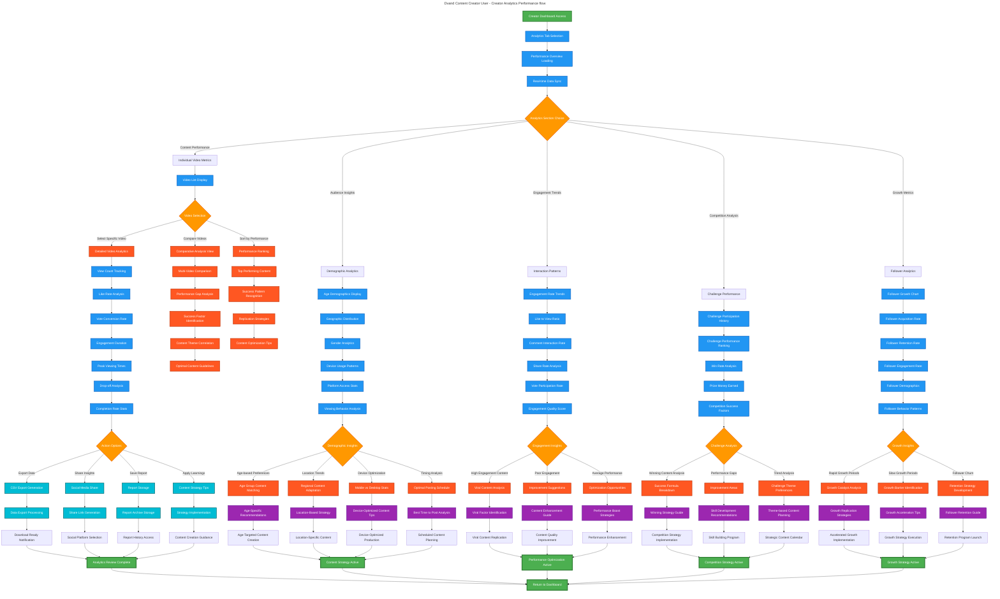

# Dvand Content Creator User - Creator Analytics Performance flow

```mermaid
---
title: Dvand Content Creator User - Creator Analytics Performance flow 
---
flowchart TD
    A[Creator Dashboard Access] --> B[Analytics Tab Selection]
    B --> C[Performance Overview Loading]
    C --> D[Real-time Data Sync]
    
    D --> E{Analytics Section Choice}
    E -->|Content Performance| F[Individual Video Metrics]
    E -->|Audience Insights| G[Demographic Analytics]
    E -->|Engagement Trends| H[Interaction Patterns]
    E -->|Competition Analysis| I[Challenge Performance]
    E -->|Growth Metrics| J[Follower Analytics]
    
    F --> K[Video List Display]
    K --> L{Video Selection}
    L -->|Select Specific Video| M[Detailed Video Analytics]
    L -->|Compare Videos| N[Comparative Analysis View]
    L -->|Sort by Performance| O[Performance Ranking]
    
    M --> P[View Count Tracking]
    P --> Q[Like Rate Analysis]
    Q --> R[Vote Conversion Rate]
    R --> S[Engagement Duration]
    S --> T[Peak Viewing Times]
    T --> U[Drop-off Analysis]
    U --> V[Completion Rate Stats]
    
    V --> W{Action Options}
    W -->|Export Data| X[CSV Export Generation]
    W -->|Share Insights| Y[Social Media Share]
    W -->|Save Report| Z[Report Storage]
    W -->|Apply Learnings| AA[Content Strategy Tips]
    
    N --> BB[Multi-Video Comparison]
    BB --> CC[Performance Gap Analysis]
    CC --> DD[Success Factor Identification]
    DD --> EE[Content Theme Correlation]
    EE --> FF[Optimal Content Guidelines]
    
    O --> GG[Top Performing Content]
    GG --> HH[Success Pattern Recognition]
    HH --> II[Replication Strategies]
    II --> JJ[Content Optimization Tips]
    
    G --> KK[Age Demographics Display]
    KK --> LL[Geographic Distribution]
    LL --> MM[Gender Analytics]
    MM --> NN[Device Usage Patterns]
    NN --> OO[Platform Access Stats]
    OO --> PP[Viewing Behavior Analysis]
    
    PP --> QQ{Demographic Insights}
    QQ -->|Age-based Preferences| RR[Age Group Content Matching]
    QQ -->|Location Trends| SS[Regional Content Adaptation]
    QQ -->|Device Optimization| TT[Mobile vs Desktop Stats]
    QQ -->|Timing Analysis| UU[Optimal Posting Schedule]
    
    RR --> VV[Age-Specific Recommendations]
    SS --> WW[Location-Based Strategy]
    TT --> XX[Device-Optimized Content Tips]
    UU --> YY[Best Time to Post Analysis]
    
    H --> ZZ[Engagement Rate Trends]
    ZZ --> AAA[Like to View Ratio]
    AAA --> BBB[Comment Interaction Rate]
    BBB --> CCC[Share Rate Analysis]
    CCC --> DDD[Vote Participation Rate]
    DDD --> EEE[Engagement Quality Score]
    
    EEE --> FFF{Engagement Insights}
    FFF -->|High Engagement Content| GGG[Viral Content Analysis]
    FFF -->|Poor Engagement| HHH[Improvement Suggestions]
    FFF -->|Average Performance| III[Optimization Opportunities]
    
    GGG --> JJJ[Viral Factor Identification]
    HHH --> KKK[Content Enhancement Guide]
    III --> LLL[Performance Boost Strategies]
    
    I --> MMM[Challenge Participation History]
    MMM --> NNN[Challenge Performance Ranking]
    NNN --> OOO[Win Rate Analysis]
    OOO --> PPP[Prize Money Earned]
    PPP --> QQQ[Competition Success Factors]
    
    QQQ --> RRR{Challenge Analysis}
    RRR -->|Winning Content Analysis| SSS[Success Formula Breakdown]
    RRR -->|Performance Gaps| TTT[Improvement Areas]
    RRR -->|Trend Analysis| UUU[Challenge Theme Preferences]
    
    SSS --> VVV[Winning Strategy Guide]
    TTT --> WWW[Skill Development Recommendations]
    UUU --> XXX[Theme-based Content Planning]
    
    J --> YYY[Follower Growth Chart]
    YYY --> ZZZ[Follower Acquisition Rate]
    ZZZ --> AAAA[Follower Retention Rate]
    AAAA --> BBBB[Follower Engagement Rate]
    BBBB --> CCCC[Follower Demographics]
    CCCC --> DDDD[Follower Behavior Patterns]
    
    DDDD --> EEEE{Growth Insights}
    EEEE -->|Rapid Growth Periods| FFFF[Growth Catalyst Analysis]
    EEEE -->|Slow Growth Periods| GGGG[Growth Barrier Identification]
    EEEE -->|Follower Churn| HHHH[Retention Strategy Development]
    
    FFFF --> IIII[Growth Replication Strategies]
    GGGG --> JJJJ[Growth Acceleration Tips]
    HHHH --> KKKK[Follower Retention Guide]
    
    X --> LLLL[Data Export Processing]
    Y --> MMMM[Share Link Generation]
    Z --> NNNN[Report Archive Storage]
    AA --> OOOO[Strategy Implementation]
    
    LLLL --> PPPP[Download Ready Notification]
    MMMM --> QQQQ[Social Platform Selection]
    NNNN --> RRRR[Report History Access]
    OOOO --> SSSS[Content Creation Guidance]
    
    VV --> TTTT[Age-Targeted Content Creation]
    WW --> UUUU[Location-Specific Content]
    XX --> VVVV[Device-Optimized Production]
    YY --> WWWW[Scheduled Content Planning]
    
    JJJ --> XXXX[Viral Content Replication]
    KKK --> YYYY[Content Quality Improvement]
    LLL --> ZZZZ[Performance Enhancement]
    
    VVV --> AAAAA[Competition Strategy Implementation]
    WWW --> BBBBB[Skill Building Program]
    XXX --> CCCCC[Strategic Content Calendar]
    
    IIII --> DDDDD[Accelerated Growth Implementation]
    JJJJ --> EEEEE[Growth Strategy Execution]
    KKKK --> FFFFF[Retention Program Launch]
    
    PPPP --> GGGGG[Analytics Review Complete]
    QQQQ --> GGGGG
    RRRR --> GGGGG
    SSSS --> GGGGG
    
    TTTT --> HHHHH[Content Strategy Active]
    UUUU --> HHHHH
    VVVV --> HHHHH
    WWWW --> HHHHH
    
    XXXX --> IIIII[Performance Optimization Active]
    YYYY --> IIIII
    ZZZZ --> IIIII
    
    AAAAA --> JJJJJ[Competition Strategy Active]
    BBBBB --> JJJJJ
    CCCCC --> JJJJJ
    
    DDDDD --> KKKKK[Growth Strategy Active]
    EEEEE --> KKKKK
    FFFFF --> KKKKK
    
    GGGGG --> LLLLL[Return to Dashboard]
    HHHHH --> LLLLL
    IIIII --> LLLLL
    JJJJJ --> LLLLL
    KKKKK --> LLLLL
    
    classDef entryPoint fill:#4CAF50,stroke:#2E7D32,stroke-width:3px,color:#fff
    classDef action fill:#2196F3,stroke:#1565C0,stroke-width:2px,color:#fff
    classDef decision fill:#FF9800,stroke:#E65100,stroke-width:2px,color:#fff
    classDef process fill:#00BCD4,stroke:#006064,stroke-width:2px,color:#fff
    classDef insight fill:#9C27B0,stroke:#6A1B9A,stroke-width:2px,color:#fff
    classDef success fill:#4CAF50,stroke:#2E7D32,stroke-width:4px,color:#fff
    classDef analytics fill:#FF5722,stroke:#BF360C,stroke-width:2px,color:#fff
    
    class A entryPoint
    class B,C,D,K,P,Q,R,S,T,U,V,KK,LL,MM,NN,OO,PP,ZZ,AAA,BBB,CCC,DDD,EEE,MMM,NNN,OOO,PPP,QQQ,YYY,ZZZ,AAAA,BBBB,CCCC,DDDD action
    class E,L,W,QQ,FFF,RRR,EEEE decision
    class X,Y,Z,AA,LLLL,MMMM,NNNN,OOOO process
    class VV,WW,XX,YY,JJJ,KKK,LLL,VVV,WWW,XXX,IIII,JJJJ,KKKK insight
    class GGGGG,HHHHH,IIIII,JJJJJ,KKKKK,LLLLL success
    class M,N,O,BB,CC,DD,EE,FF,GG,HH,II,JJ,RR,SS,TT,UU,GGG,HHH,III,SSS,TTT,UUU,FFFF,GGGG,HHHH analytics
```
