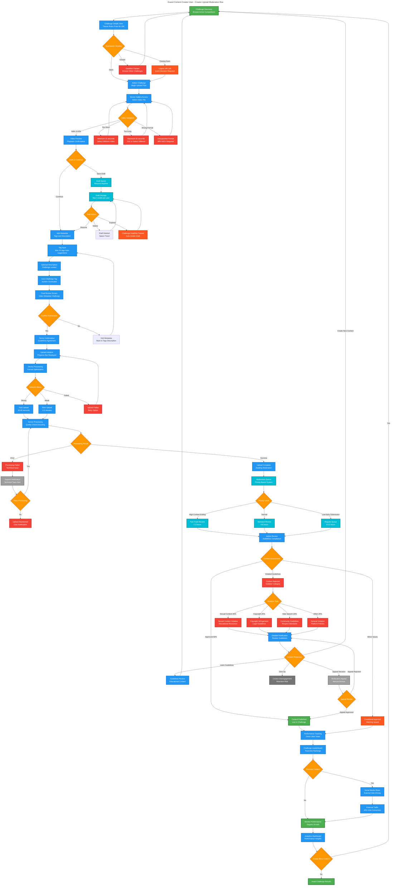

# Dvand Content Creator User - Creator Upload Moderation flow

```mermaid
---
title: Dvand Content Creator User - Creator Upload Moderation flow 
---
flowchart TD
    A[Challenge Discovery<br/>Browse Active Competitions] --> B[Challenge Details View<br/>Theme Rules Prize 5K-25K]
    B --> C{Submission Window}
    C -->|Open| D[Select Challenge<br/>Begin Upload Flow]
    C -->|Closing Soon| E[Urgent 24h Left<br/>Quick Decision Required]
    C -->|Closed| F[Deadline Passed<br/>Browse Other Challenges]
    
    F --> A
    E --> D
    
    D --> G[Device Gallery Access<br/>Select Video File]
    G --> H{Video Validation}
    H -->|Valid 10-60s| I[Video Preview<br/>Playback Confirmation]
    H -->|Too Short| J[Minimum 10 seconds<br/>Select Different Video]
    H -->|Too Long| K[Maximum 60 seconds<br/>Trim or Select Different]
    H -->|Wrong Format| L[Unsupported Format<br/>MP4 MOV Required]
    
    J --> G
    K --> G
    L --> G
    
    I --> M{Draft or Continue}
    M -->|Save Draft| N[Draft Saved<br/>Resume Anytime]
    M -->|Continue| O[Add Metadata<br/>Tags and Description]
    
    N --> P[Draft Storage<br/>Max 5 drafts per user]
    P --> Q{Draft Action}
    Q -->|Resume| O
    Q -->|Delete| R[Draft Deleted<br/>Space Freed]
    Q -->|Expired| S[Challenge Deadline Passed<br/>Auto-Delete Draft]
    
    R --> P
    S --> P
    
    O --> T[Tag Input<br/>Max 10 tags Auto-suggestions]
    T --> U[Optional Description<br/>Challenge context]
    U --> V[Auto-Challenge Tag<br/>System Generated]
    V --> W[Final Review Screen<br/>Video Metadata Challenge]
    
    W --> X{Confirm Submission}
    X -->|Yes| Y[Terms Confirmation<br/>Guidelines Agreement]
    X -->|No| Z[Edit Metadata<br/>Back to Tags Description]
    
    Z --> T
    Y --> AA[Upload Initiation<br/>Progress Bar Displayed]
    
    AA --> BB[Device Processing<br/>Format Optimization]
    BB --> CC{Network Status}
    CC -->|Strong| DD[Fast Upload<br/>30-60 seconds]
    CC -->|Weak| EE[Slow Upload<br/>2-5 minutes]
    CC -->|Failed| FF[Upload Failed<br/>Retry Option]
    
    FF --> AA
    DD --> GG[Server Processing<br/>Quality Check Encoding]
    EE --> GG
    
    GG --> HH{Processing Result}
    HH -->|Success| II[Upload Complete<br/>Awaiting Moderation]
    HH -->|Error| JJ[Processing Failed<br/>Technical Issue]
    
    JJ --> KK[Support Notification<br/>Technical Team Alert]
    KK --> LL{Retry Processing}
    LL -->|Yes| GG
    LL -->|No| MM[Upload Abandoned<br/>User Notification]
    
    II --> NN[Moderation Queue<br/>Priority Based System]
    NN --> OO{Priority Level}
    OO -->|High Contest Ending| PP[Fast Track Review<br/>1-2 hours]
    OO -->|Normal| QQ[Standard Review<br/>4-8 hours]
    OO -->|Low Early Submission| RR[Regular Queue<br/>8-12 hours]
    
    PP --> SS[Admin Review<br/>Guidelines Compliance]
    QQ --> SS
    RR --> SS
    
    SS --> TT{Content Assessment}
    TT -->|Approved 92%| UU[Content Published<br/>Live in Challenge]
    TT -->|Minor Issues| VV[Conditional Approval<br/>Warning Issued]
    TT -->|Violated Guidelines| WW[Content Rejected<br/>Violation Category]
    
    WW --> XX{Violation Type}
    XX -->|Sexual Content 35%| YY[Sexual Content Violation<br/>Educational Resources]
    XX -->|Copyright 25%| ZZ[Copyright Infringement<br/>Legal Guidelines]
    XX -->|Hate Speech 20%| AAA[Community Guidelines<br/>Respect Standards]
    XX -->|Other 20%| BBB[General Violation<br/>Platform Policies]
    
    YY --> CCC[Detailed Notification<br/>Reason Guidelines]
    ZZ --> CCC
    AAA --> CCC
    BBB --> CCC
    
    CCC --> DDD{Creator Response}
    DDD -->|Learn Guidelines| EEE[Guidelines Review<br/>Educational Content]
    DDD -->|Create New Content| A
    DDD -->|Appeal Decision| FFF[Moderation Appeal<br/>Manual Review]
    DDD -->|Give Up| GGG[Creator Disengagement<br/>Retention Risk]
    
    EEE --> A
    FFF --> HHH{Appeal Review}
    HHH -->|Appeal Approved| UU
    HHH -->|Appeal Rejected| CCC
    
    UU --> III[Performance Tracking<br/>Views Likes Votes]
    VV --> III
    
    III --> JJJ[Challenge Leaderboard<br/>Real-time Rankings]
    JJJ --> KKK{Promote Content}
    KKK -->|Yes| LLL[Social Media Share<br/>External Vote Driving]
    KKK -->|No| MMM[Monitor Performance<br/>Organic Growth]
    
    LLL --> NNN[External Traffic<br/>18% Vote Conversion]
    NNN --> MMM
    
    MMM --> OOO[Analytics Dashboard<br/>Performance Insights]
    OOO --> PPP{Create More Content}
    PPP -->|Yes| A
    PPP -->|No| QQQ[Await Challenge Results]
    
    classDef entryPoint fill:#4CAF50,stroke:#2E7D32,stroke-width:3px,color:#fff
    classDef action fill:#2196F3,stroke:#1565C0,stroke-width:2px,color:#fff
    classDef decision fill:#FF9800,stroke:#E65100,stroke-width:2px,color:#fff
    classDef limit fill:#F44336,stroke:#C62828,stroke-width:3px,color:#fff
    classDef conversion fill:#9C27B0,stroke:#6A1B9A,stroke-width:3px,color:#fff
    classDef success fill:#4CAF50,stroke:#2E7D32,stroke-width:4px,color:#fff
    classDef exit fill:#757575,stroke:#424242,stroke-width:2px,color:#fff
    classDef process fill:#00BCD4,stroke:#006064,stroke-width:2px,color:#fff
    classDef warning fill:#FF5722,stroke:#BF360C,stroke-width:2px,color:#fff
    classDef moderation fill:#9E9E9E,stroke:#424242,stroke-width:2px,color:#fff
    
    class A entryPoint
    class B,D,G,I,O,T,U,V,W,Y,AA,BB,DD,EE,GG,II,SS,CCC,EEE,III,JJJ,LLL,NNN,OOO action
    class C,H,M,Q,X,CC,HH,LL,OO,TT,XX,DDD,HHH,KKK,PPP decision
    class F,J,K,L,FF,JJ,MM,WW,YY,ZZ,AAA,BBB limit
    class N,P,NN,PP,QQ,RR process
    class E,S,VV warning
    class UU,MMM,QQQ success
    class KK,FFF moderation
    class GGG exit
```
