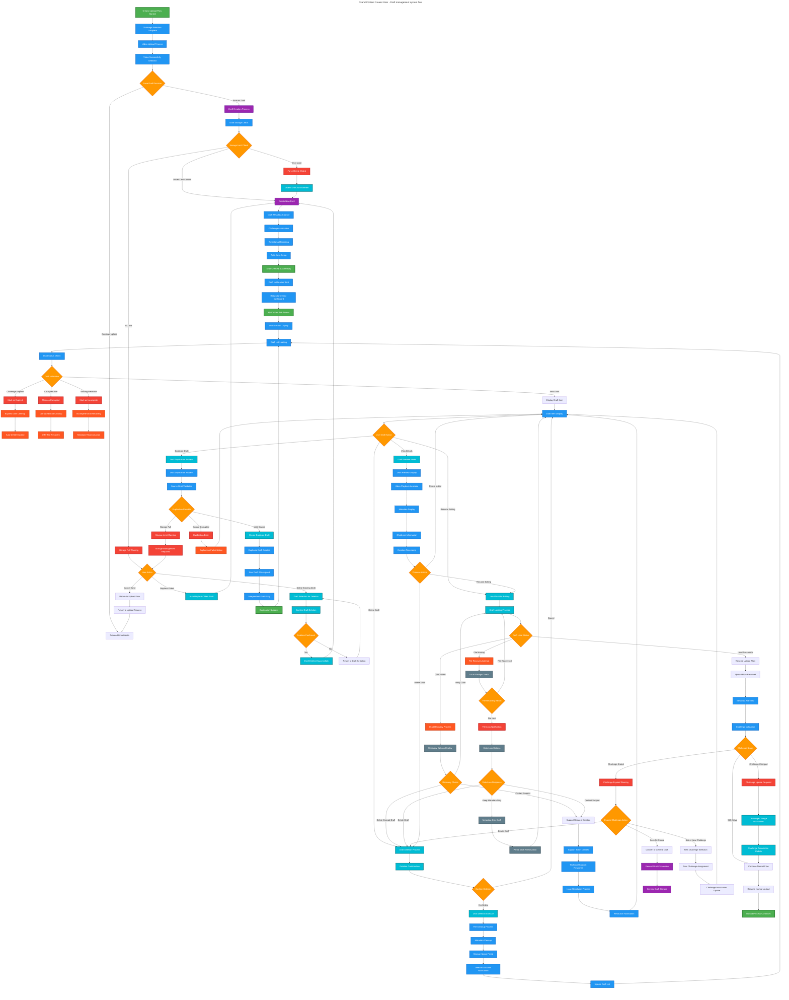

# Dvand Content Creator User - Draft management system flow

```mermaid
---
title: Dvand Content Creator User - Draft management system flow 
---
flowchart TD
    A[Creator Upload Flow Started] --> B[Challenge Selection Complete]
    B --> C[Video Upload Process]
    C --> D[Video Successfully Selected]
    
    D --> E{Save Draft Decision}
    E -->|Continue Upload| F[Proceed to Metadata]
    E -->|Save as Draft| G[Draft Creation Process]
    
    G --> H[Draft Storage Check]
    H --> I{Storage Limit Check}
    I -->|Under Limit 5 drafts| J[Create New Draft]
    I -->|At Limit| K[Storage Full Warning]
    I -->|Over Limit| L[Force Delete Oldest]
    
    K --> M{User Action}
    M -->|Delete Existing Draft| N[Draft Selection for Deletion]
    M -->|Cancel Save| O[Return to Upload Flow]
    M -->|Replace Oldest| P[Auto-Replace Oldest Draft]
    
    L --> Q[Oldest Draft Auto-Deleted]
    Q --> J
    P --> J
    
    N --> R[Confirm Draft Deletion]
    R --> S{Deletion Confirmed}
    S -->|Yes| T[Draft Deleted Successfully]
    S -->|No| U[Return to Draft Selection]
    
    T --> J
    U --> N
    
    J --> V[Draft Metadata Capture]
    V --> W[Challenge Association]
    W --> X[Timestamp Recording]
    X --> Y[Auto-Save Setup]
    Y --> Z[Draft Created Successfully]
    
    Z --> AA[Draft Notification Sent]
    AA --> BB[Return to Creator Dashboard]
    
    BB --> CC[My Content Tab Access]
    CC --> DD[Draft Section Display]
    DD --> EE[Draft List Loading]
    EE --> FF[Draft Status Check]
    
    FF --> GG{Draft Validation}
    GG -->|Valid Draft| HH[Display Draft Item]
    GG -->|Challenge Expired| II[Mark as Expired]
    GG -->|Corrupted File| JJ[Mark as Corrupted]
    GG -->|Missing Metadata| KK[Mark as Incomplete]
    
    II --> LL[Expired Draft Cleanup]
    JJ --> MM[Corrupted Draft Cleanup]
    KK --> NN[Incomplete Draft Recovery]
    
    LL --> OO[Auto-Delete Expired]
    MM --> PP[Offer File Recovery]
    NN --> QQ[Metadata Reconstruction]
    
    HH --> RR[Draft Item Display]
    RR --> SS{User Draft Action}
    SS -->|Resume Editing| TT[Load Draft for Editing]
    SS -->|View Details| UU[Draft Preview Mode]
    SS -->|Delete Draft| VV[Draft Deletion Process]
    SS -->|Duplicate Draft| WW[Draft Duplication Process]
    
    TT --> XX[Draft Loading Process]
    XX --> YY{Draft Load Status}
    YY -->|Load Successful| ZZ[Resume Upload Flow]
    YY -->|Load Failed| AAA[Draft Recovery Process]
    YY -->|File Missing| BBB[File Recovery Attempt]
    
    AAA --> CCC[Recovery Options Display]
    CCC --> DDD{Recovery Choice}
    DDD -->|Retry Load| XX
    DDD -->|Delete Corrupt Draft| VV
    DDD -->|Contact Support| EEE[Support Request Creation]
    
    BBB --> FFF[Local Storage Check]
    FFF --> GGG{File Recovery Result}
    GGG -->|File Recovered| XX
    GGG -->|File Lost| HHH[File Loss Notification]
    
    HHH --> III[Data Loss Options]
    III --> JJJ{Data Loss Response}
    JJJ -->|Delete Draft| VV
    JJJ -->|Keep Metadata Only| KKK[Metadata-Only Draft]
    JJJ -->|Contact Support| EEE
    
    KKK --> LLL[Partial Draft Preservation]
    LLL --> RR
    
    ZZ --> MMM[Upload Flow Resumed]
    MMM --> NNN[Metadata Pre-filled]
    NNN --> OOO[Challenge Validation]
    OOO --> PPP{Challenge Status}
    PPP -->|Still Active| QQQ[Continue Normal Flow]
    PPP -->|Challenge Ended| RRR[Challenge Expired Warning]
    PPP -->|Challenge Changed| SSS[Challenge Update Required]
    
    RRR --> TTT{Expired Challenge Action}
    TTT -->|Select New Challenge| UUU[New Challenge Selection]
    TTT -->|Save for Future| VVV[Convert to General Draft]
    TTT -->|Delete Draft| VV
    
    SSS --> WWW[Challenge Change Notification]
    WWW --> XXX[Challenge Association Update]
    XXX --> QQQ
    
    UU --> YYY[Draft Preview Display]
    YYY --> ZZZ[Video Playback Available]
    ZZZ --> AAAA[Metadata Display]
    AAAA --> BBBB[Challenge Information]
    BBBB --> CCCC[Creation Timestamp]
    CCCC --> DDDD{Preview Actions}
    DDDD -->|Resume Editing| TT
    DDDD -->|Delete Draft| VV
    DDDD -->|Return to List| RR
    
    VV --> EEEE[Deletion Confirmation]
    EEEE --> FFFF{Confirm Deletion}
    FFFF -->|Yes Delete| GGGG[Draft Deletion Execute]
    FFFF -->|Cancel| RR
    
    GGGG --> HHHH[File Cleanup Process]
    HHHH --> IIII[Metadata Cleanup]
    IIII --> JJJJ[Storage Space Freed]
    JJJJ --> KKKK[Deletion Success Notification]
    KKKK --> LLLL[Update Draft List]
    LLLL --> EE
    
    WW --> MMMM[Draft Duplication Process]
    MMMM --> NNNN[Source Draft Validation]
    NNNN --> OOOO{Duplication Possible}
    OOOO -->|Valid Source| PPPP[Create Duplicate Draft]
    OOOO -->|Source Corrupted| QQQQ[Duplication Error]
    OOOO -->|Storage Full| RRRR[Storage Limit Warning]
    
    PPPP --> SSSS[Duplicate Draft Created]
    SSSS --> TTTT[New Draft ID Assigned]
    TTTT --> UUUU[Independent Draft Entry]
    UUUU --> VVVV[Duplication Success]
    VVVV --> EE
    
    QQQQ --> WWWW[Duplication Failed Notice]
    RRRR --> XXXXX[Storage Management Required]
    WWWW --> RR
    XXXXX --> M
    
    QQQ --> YYYYY[Resume Normal Upload]
    VVV --> ZZZZZ[General Draft Conversion]
    UUU --> AAAAAA[New Challenge Assignment]
    
    EEE --> BBBBBB[Support Ticket Created]
    BBBBBB --> CCCCCC[Technical Support Response]
    CCCCCC --> DDDDDD[Issue Resolution Process]
    DDDDDD --> EEEEEE[Resolution Notification]
    EEEEEE --> RR
    
    O --> FFFFFF[Return to Upload Process]
    FFFFFF --> F
    
    YYYYY --> GGGGGG[Upload Process Continues]
    ZZZZZ --> HHHHHH[Generic Draft Storage]
    AAAAAA --> IIIIII[Challenge Association Update]
    IIIIII --> RR
    
    classDef entryPoint fill:#4CAF50,stroke:#2E7D32,stroke-width:3px,color:#fff
    classDef action fill:#2196F3,stroke:#1565C0,stroke-width:2px,color:#fff
    classDef decision fill:#FF9800,stroke:#E65100,stroke-width:2px,color:#fff
    classDef limit fill:#F44336,stroke:#C62828,stroke-width:3px,color:#fff
    classDef process fill:#00BCD4,stroke:#006064,stroke-width:2px,color:#fff
    classDef success fill:#4CAF50,stroke:#2E7D32,stroke-width:4px,color:#fff
    classDef warning fill:#FF5722,stroke:#BF360C,stroke-width:2px,color:#fff
    classDef storage fill:#9C27B0,stroke:#6A1B9A,stroke-width:2px,color:#fff
    classDef recovery fill:#607D8B,stroke:#37474F,stroke-width:2px,color:#fff
    
    class A,CC entryPoint
    class B,C,D,H,V,W,X,Y,Z,AA,BB,DD,EE,FF,RR,XX,NNN,OOO,YYY,ZZZ,AAAA,BBBB,CCCC,HHHH,IIII,JJJJ,KKKK,LLLL,MMMM,NNNN,SSSS,TTTT,UUUU,BBBBBB,CCCCCC,DDDDDD,EEEEEE action
    class E,I,M,S,GG,SS,YY,DDD,GGG,JJJ,PPP,TTT,DDDD,FFFF,OOOO decision
    class K,L,II,JJ,KK,HHH,RRR,SSS,QQQQ,RRRR,XXXXX limit
    class J,N,R,T,Q,P,TT,UU,VV,WW,XX,CCC,FFF,III,LLL,WWW,XXX,EEEE,GGGG,PPPP process
    class Z,VVVV,GGGGGG success
    class LL,MM,NN,OO,PP,QQ,AAA,BBB,WWWW warning
    class G,J,ZZZZZ,HHHHHH storage
    class CCC,FFF,III,KKK,LLL recovery
```
