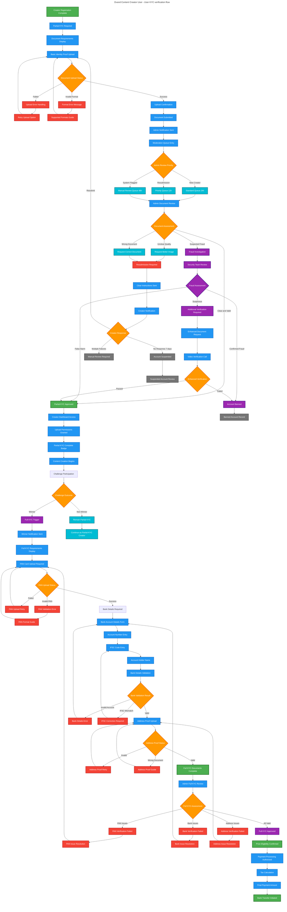

# Dvand Content Creator User - User KYC verification flow

```mermaid
---
title: Dvand Content Creator User - User KYC verification flow 
---

flowchart TD
    A[Creator Registration Complete] --> B[Partial KYC Required]
    B --> C[Document Requirements Display]
    C --> D[Basic Identity Proof Upload]
    
    D --> E{Document Upload Status}
    E -->|Success| F[Upload Confirmation]
    E -->|Failed| G[Upload Error Handling]
    E -->|Invalid Format| H[Format Error Message]
    
    G --> I[Retry Upload Option]
    H --> J[Supported Formats Guide]
    I --> D
    J --> D
    
    F --> K[Document Submitted]
    K --> L[Admin Notification Sent]
    L --> M[Moderation Queue Entry]
    
    M --> N{Admin Review Priority}
    N -->|New Creator| O[Standard Queue 24h]
    N -->|Resubmission| P[Priority Queue 12h]
    N -->|System Flagged| Q[Manual Review Queue 48h]
    
    O --> R[Admin Document Review]
    P --> R
    Q --> R
    
    R --> S{Document Assessment}
    S -->|Clear and Valid| T[Partial KYC Approved]
    S -->|Unclear Quality| U[Request Better Image]
    S -->|Wrong Document| V[Request Correct Document]
    S -->|Suspected Fraud| W[Fraud Investigation]
    
    U --> X[Resubmission Required]
    V --> X
    X --> Y[Clear Instructions Sent]
    Y --> Z[Creator Notification]
    Z --> AA{Creator Response}
    AA -->|Resubmit| D
    AA -->|No Response 7 days| BB[Account Suspended]
    AA -->|Multiple Failures| CC[Manual Review Required]
    
    W --> DD[Security Team Review]
    DD --> EE{Fraud Assessment}
    EE -->|False Alarm| T
    EE -->|Confirmed Fraud| FF[Account Banned]
    EE -->|Suspicious| GG[Additional Verification Required]
    
    GG --> HH[Enhanced Document Request]
    HH --> II[Video Verification Call]
    II --> JJ{Enhanced Verification}
    JJ -->|Passed| T
    JJ -->|Failed| FF
    
    T --> KK[Creator Dashboard Access]
    KK --> LL[Upload Permissions Granted]
    LL --> MM[Partial KYC Complete Badge]
    
    MM --> NN[Content Creation Begins]
    NN --> OO[Challenge Participation]
    OO --> PP{Challenge Outcome}
    PP -->|Winner| QQ[Full KYC Trigger]
    PP -->|Non Winner| RR[Remain Partial KYC]
    
    QQ --> SS[Winner Notification Sent]
    SS --> TT[Full KYC Requirements Display]
    TT --> UU[PAN Card Upload Required]
    
    UU --> VV{PAN Upload Status}
    VV -->|Success| WW[Bank Details Required]
    VV -->|Failed| XX[PAN Upload Retry]
    VV -->|Invalid PAN| YY[PAN Validation Error]
    
    XX --> UU
    YY --> ZZ[PAN Format Guide]
    ZZ --> UU
    
    WW --> AAA[Bank Account Details Form]
    AAA --> BBB[Account Number Entry]
    BBB --> CCC[IFSC Code Entry]
    CCC --> DDD[Account Holder Name]
    DDD --> EEE[Bank Details Validation]
    
    EEE --> FFF{Bank Validation Result}
    FFF -->|Valid| GGG[Address Proof Upload]
    FFF -->|Invalid Account| HHH[Bank Details Error]
    FFF -->|IFSC Mismatch| III[IFSC Correction Required]
    
    HHH --> AAA
    III --> CCC
    
    GGG --> JJJ{Address Proof Status}
    JJJ -->|Valid| KKK[Full KYC Documents Complete]
    JJJ -->|Invalid| LLL[Address Proof Retry]
    JJJ -->|Wrong Document| MMM[Address Proof Guide]
    
    LLL --> GGG
    MMM --> GGG
    
    KKK --> NNN[Admin Full KYC Review]
    NNN --> OOO{Full KYC Assessment}
    OOO -->|All Valid| PPP[Full KYC Approved]
    OOO -->|PAN Issues| QQQ[PAN Verification Failed]
    OOO -->|Bank Issues| RRR[Bank Verification Failed]
    OOO -->|Address Issues| SSS[Address Verification Failed]
    
    QQQ --> TTT[PAN Issue Resolution]
    RRR --> UUU[Bank Issue Resolution]
    SSS --> VVV[Address Issue Resolution]
    
    TTT --> UU
    UUU --> AAA
    VVV --> GGG
    
    PPP --> WWW[Prize Eligibility Confirmed]
    WWW --> XXX[Payment Processing Authorized]
    XXX --> YYY[Tax Calculation]
    YYY --> ZZZ[Final Payment Amount]
    ZZZ --> AAAA[Bank Transfer Initiated]
    
    BB --> BBBB[Suspended Account Review]
    FF --> CCCC[Banned Account Record]
    RR --> DDDD[Continue as Partial KYC Creator]
    
    classDef entryPoint fill:#4CAF50,stroke:#2E7D32,stroke-width:3px,color:#fff
    classDef action fill:#2196F3,stroke:#1565C0,stroke-width:2px,color:#fff
    classDef decision fill:#FF9800,stroke:#E65100,stroke-width:2px,color:#fff
    classDef limit fill:#F44336,stroke:#C62828,stroke-width:3px,color:#fff
    classDef conversion fill:#9C27B0,stroke:#6A1B9A,stroke-width:3px,color:#fff
    classDef success fill:#4CAF50,stroke:#2E7D32,stroke-width:4px,color:#fff
    classDef exit fill:#757575,stroke:#424242,stroke-width:2px,color:#fff
    classDef process fill:#00BCD4,stroke:#006064,stroke-width:2px,color:#fff
    classDef warning fill:#FF5722,stroke:#BF360C,stroke-width:2px,color:#fff
    classDef security fill:#9C27B0,stroke:#4A148C,stroke-width:3px,color:#fff
    
    class A entryPoint
    class B,C,D,F,K,L,M,R,Y,Z,HH,II,KK,LL,MM,NN,SS,TT,UU,AAA,BBB,CCC,DDD,EEE,GGG,NNN,WWW,XXX,YYY,ZZZ,AAAA action
    class E,N,S,AA,EE,JJ,PP,VV,FFF,JJJ,OOO decision
    class G,H,I,J,X,XX,YY,ZZ,HHH,III,LLL,MMM,QQQ,RRR,SSS,TTT,UUU,VVV limit
    class QQ,PPP conversion
    class T,KKK,WWW,AAAA success
    class BB,CC,FF,BBBB,CCCC exit
    class O,P,Q,U,V process
    class W,DD,GG warning
    class DD,EE,FF,W,GG security
    class RR,DDDD process
```
