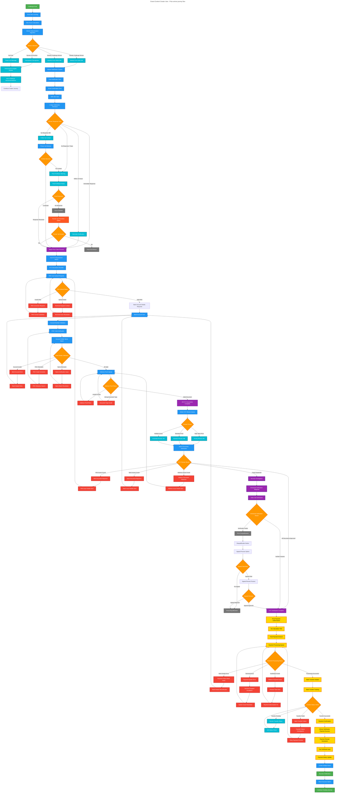

# Dvand Content Creator User - Prize winner journey flow

```mermaid
---
title: Dvand Content Creator User - Prize winner journey flow 
---
flowchart TD
    A[Challenge Ends] --> B[Final Vote Counting]
    B --> C[Shor Score Calculation]
    C --> D[Winner Determination Algorithm]
    
    D --> E{Winner Selection}
    E -->|Weekly Challenge Winner| F[Weekly Prize 5000 INR]
    E -->|Monthly Challenge Winner| G[Monthly Prize 25000 INR]
    E -->|Runner Up Position| H[Participation Recognition]
    E -->|No Prize| I[Thank You Message]
    
    H --> J[Performance Insights Shared]
    I --> J
    J --> K[Next Challenge Recommendations]
    K --> L[Continue Creator Journey]
    
    F --> M[Winner Notification System]
    G --> M
    
    M --> N[Push Notification Sent]
    N --> O[Email Confirmation Sent]
    O --> P[SMS Alert Sent]
    P --> Q[In App Celebration Animation]
    
    Q --> R{Winner Response Time}
    R -->|Immediate Response| S[Begin Prize Claim Process]
    R -->|Within 24 Hours| T[Reminder Notification]
    R -->|No Response 48h| U[Follow Up Contact]
    R -->|No Response 7 Days| V[Prize Forfeiture Warning]
    
    T --> S
    U --> W[Phone Call Attempt]
    W --> X{Contact Success}
    X -->|Contacted| S
    X -->|No Contact| V
    
    V --> Y[Final Forfeiture Notice]
    Y --> Z{Final Response}
    Z -->|Response Received| S
    Z -->|No Response| AA[Prize Forfeited]
    
    AA --> BB[Runner Up Promotion Option]
    BB --> CC{Runner Up Accepts}
    CC -->|Yes| S
    CC -->|No| DD[Prize Pool Return]
    
    S --> EE[Full KYC Requirement Notice]
    EE --> FF[KYC Document Checklist]
    FF --> GG[PAN Card Upload Required]
    
    GG --> HH{PAN Upload Status}
    HH -->|Valid PAN| II[Bank Account Details Required]
    HH -->|Invalid PAN| JJ[PAN Correction Required]
    HH -->|Upload Failed| KK[Technical Support Contact]
    
    JJ --> LL[PAN Format Guidelines]
    KK --> MM[Technical Issue Resolution]
    LL --> GG
    MM --> GG
    
    II --> NN[Bank Account Form]
    NN --> OO[Account Number Validation]
    OO --> PP[IFSC Code Verification]
    PP --> QQ[Account Holder Name Match]
    
    QQ --> RR{Bank Details Validation}
    RR -->|All Valid| SS[Address Proof Upload]
    RR -->|Account Invalid| TT[Bank Account Error]
    RR -->|IFSC Mismatch| UU[IFSC Code Correction]
    RR -->|Name Mismatch| VV[Name Verification Issue]
    
    TT --> WW[Bank Details Retry]
    UU --> XX[IFSC Directory Search]
    VV --> YY[Name Match Resolution]
    WW --> NN
    XX --> PP
    YY --> QQ
    
    SS --> ZZ{Address Proof Status}
    ZZ -->|Valid Document| AAA[All KYC Documents Complete]
    ZZ -->|Invalid Format| BBB[Address Proof Retry]
    ZZ -->|Wrong Document Type| CCC[Document Type Guide]
    
    BBB --> SS
    CCC --> SS
    
    AAA --> DDD[Admin KYC Review Queue]
    DDD --> EEE{Review Priority}
    EEE -->|High Value Prize| FFF[Priority Review 24h]
    EEE -->|Standard Prize| GGG[Standard Review 48h]
    EEE -->|Multiple Issues| HHH[Extended Review 72h]
    
    FFF --> III[Admin Document Verification]
    GGG --> III
    HHH --> III
    
    III --> JJJ{KYC Review Result}
    JJJ -->|All Documents Approved| KKK[KYC Verification Complete]
    JJJ -->|PAN Issues Found| LLL[PAN Document Rejection]
    JJJ -->|Bank Issues Found| MMM[Bank Document Rejection]
    JJJ -->|Address Issues Found| NNN[Address Document Rejection]
    JJJ -->|Fraud Suspected| OOO[Security Investigation]
    
    LLL --> PPP[PAN Issue Details Sent]
    MMM --> QQQ[Bank Issue Details Sent]
    NNN --> RRR[Address Issue Details Sent]
    PPP --> GG
    QQQ --> NN
    RRR --> SS
    
    OOO --> SSS[Enhanced Verification Required]
    SSS --> TTT[Video Call Verification]
    TTT --> UUU{Enhanced Verification Result}
    UUU -->|Verified Genuine| KKK
    UUU -->|Verification Failed| VVV[Prize Disqualification]
    
    VVV --> WWW[Disqualification Notice]
    WWW --> XXX[Appeal Process Option]
    XXX --> YYY{Appeal Submitted}
    YYY -->|Appeal Filed| ZZZ[Appeal Review Process]
    YYY -->|No Appeal| AAAA[Final Disqualification]
    
    ZZZ --> BBBB{Appeal Decision}
    BBBB -->|Appeal Approved| KKK
    BBBB -->|Appeal Rejected| AAAA
    
    KKK --> CCCC[Prize Payment Authorization]
    CCCC --> DDDD[Tax Calculation TDS]
    DDDD --> EEEE[Final Payment Amount]
    EEEE --> FFFF[Payment Processing Queue]
    
    FFFF --> GGGG{Payment Processing Status}
    GGGG -->|Processing Successful| HHHH[Bank Transfer Initiated]
    GGGG -->|Bank Details Error| IIII[Payment Failure Bank Issue]
    GGGG -->|Technical Error| JJJJ[Payment System Error]
    GGGG -->|Insufficient Funds| KKKK[Platform Payment Issue]
    
    IIII --> LLLL[Bank Details Reverification]
    JJJJ --> MMMM[Technical Support Escalation]
    KKKK --> NNNN[Finance Team Alert]
    LLLL --> NN
    MMMM --> OOOO[System Issue Resolution]
    NNNN --> PPPP[Payment Authorization Fix]
    OOOO --> FFFF
    PPPP --> FFFF
    
    HHHH --> QQQQ[Bank Transfer Tracking]
    QQQQ --> RRRR{Transfer Status Check}
    RRRR -->|Transfer Successful| SSSS[Payment Confirmation]
    RRRR -->|Transfer Pending| TTTT[Monitor Transfer Status]
    RRRR -->|Transfer Failed| UUUU[Bank Transfer Failure]
    
    TTTT --> VVVV[24h Status Check]
    VVVV --> RRRR
    UUUU --> WWWW[Transfer Failure Investigation]
    WWWW --> XXXX[Retry Payment Process]
    XXXX --> FFFF
    
    SSSS --> YYYY[Winner Notification Payment Success]
    YYYY --> ZZZZ[Payment Receipt Generation]
    ZZZZ --> AAAAA[Tax Certificate Issue]
    AAAAA --> BBBBB[Payment History Update]
    BBBBB --> CCCCC[Creator Badge Award]
    CCCCC --> DDDDD[Success Celebration]
    DDDDD --> EEEEE[Share Success Option]
    EEEEE --> FFFFF[Continue Creating Journey]
    
    classDef entryPoint fill:#4CAF50,stroke:#2E7D32,stroke-width:3px,color:#fff
    classDef action fill:#2196F3,stroke:#1565C0,stroke-width:2px,color:#fff
    classDef decision fill:#FF9800,stroke:#E65100,stroke-width:2px,color:#fff
    classDef limit fill:#F44336,stroke:#C62828,stroke-width:3px,color:#fff
    classDef conversion fill:#9C27B0,stroke:#6A1B9A,stroke-width:3px,color:#fff
    classDef success fill:#4CAF50,stroke:#2E7D32,stroke-width:4px,color:#fff
    classDef exit fill:#757575,stroke:#424242,stroke-width:2px,color:#fff
    classDef process fill:#00BCD4,stroke:#006064,stroke-width:2px,color:#fff
    classDef warning fill:#FF5722,stroke:#BF360C,stroke-width:2px,color:#fff
    classDef security fill:#9C27B0,stroke:#4A148C,stroke-width:3px,color:#fff
    classDef payment fill:#FFD700,stroke:#F57F17,stroke-width:4px,color:#000
    
    class A entryPoint
    class B,C,D,M,N,O,P,Q,W,EE,FF,GG,NN,OO,PP,QQ,SS,DDD,III,CCCC,DDDD,EEEE,FFFF,HHHH,QQQQ,YYYY,ZZZZ,AAAAA,BBBBB,CCCCC,DDDDD,EEEEE action
    class E,R,X,Z,CC,HH,RR,ZZ,EEE,JJJ,UUU,YYY,BBBB,GGGG,RRRR decision
    class JJ,KK,LL,MM,TT,UU,VV,WW,XX,YY,BBB,CCC,LLL,MMM,NNN,PPP,QQQ,RRR,IIII,JJJJ,KKKK,LLLL,MMMM,NNNN,OOOO,PPPP,UUUU,WWWW,XXXX limit
    class S,AAA,KKK conversion
    class SSSS,DDDDD,FFFFF success
    class AA,DD,VVV,AAAA exit
    class F,G,H,I,J,K,T,U,V,Y,FFF,GGG,HHH,TTTT,VVVV process
    class BB,EEEE warning
    class OOO,SSS,TTT security
    class CCCC,DDDD,EEEE,FFFF,HHHH,QQQQ,SSSS,YYYY,ZZZZ,AAAAA,BBBBB payment
```
