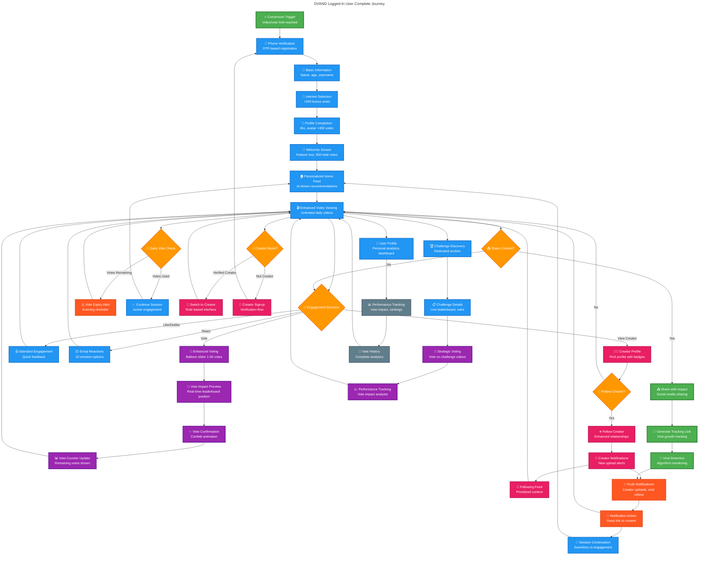

# Dvand Logged-In User - User Complete Journey

```mermaid
---
title: DVAND Logged-In User Complete Journey
---
flowchart TD
    A[🔥 Conversion Trigger<br/>Video/vote limit reached] --> B[📱 Phone Verification<br/>OTP-based registration]
    B --> C[📝 Basic Information<br/>Name, age, username]
    C --> D[🎯 Interest Selection<br/>+200 bonus votes]
    D --> E[👤 Profile Completion<br/>Bio, avatar +400 votes]
    E --> F[👋 Welcome Screen<br/>Feature tour, 650 total votes]
    
    F --> G[🏠 Personalized Home Feed<br/>AI-driven recommendations]
    
    G --> H[🎬 Enhanced Video Viewing<br/>Unlimited daily videos]
    
    H --> I{💭 Engagement Decision}
    I -->|Vote| J[🎯 Enhanced Voting<br/>Balloon slider 1-50 votes]
    I -->|Like/Dislike| K[👍 Standard Engagement<br/>Quick feedback]
    I -->|React| L[😊 Emoji Reactions<br/>10 emotion options]
    I -->|View Creator| M[👨‍🎨 Creator Profile<br/>Rich profile with badges]
    
    %% Voting Flow
    J --> N[🔮 Vote Impact Preview<br/>Real-time leaderboard position]
    N --> O[✨ Vote Confirmation<br/>Confetti animation]
    O --> P[📊 Vote Counter Update<br/>Remaining votes shown]
    P --> H
    
    %% Like/React Flow
    K --> H
    L --> H
    
    %% Creator Following Flow
    M --> Q{🤔 Follow Creator?}
    Q -->|Yes| R[➕ Follow Creator<br/>Enhanced relationships]
    Q -->|No| H
    R --> S[🔔 Creator Notifications<br/>New upload alerts]
    S --> T[🎯 Following Feed<br/>Prioritized content]
    T --> H
    
    %% Challenge Engagement
    H --> U[🏆 Challenge Discovery<br/>Dedicated section]
    U --> V[📋 Challenge Details<br/>Live leaderboard, rules]
    V --> W[🎯 Strategic Voting<br/>Vote on challenge videos]
    W --> X[📈 Performance Tracking<br/>Vote impact analysis]
    X --> H
    
    %% Profile & Analytics
    H --> Y[👤 User Profile<br/>Personal analytics dashboard]
    Y --> Z[📊 Performance Tracking<br/>Vote impact, rankings]
    Z --> AA[📜 Vote History<br/>Complete analytics]
    AA --> H
    
    %% Notification System
    S --> BB[📱 Push Notifications<br/>Creator uploads, viral videos]
    BB --> CC[🔗 Notification Action<br/>Deep link to content]
    CC --> H
    
    %% Daily Engagement Cycle
    H --> DD{🌅 Daily Vote Check}
    DD -->|Votes Remaining| EE[⚠️ Vote Expiry Alert<br/>Evening reminder]
    DD -->|Votes Used| FF[✅ Continue Session<br/>Active engagement]
    EE --> H
    FF --> G
    
    %% Creator Mode Switch
    H --> GG{🎨 Creator Mode?}
    GG -->|Verified Creator| HH[🔄 Switch to Creator<br/>Role-based interface]
    GG -->|Not Creator| II[📝 Creator Signup<br/>Verification flow]
    HH --> H
    II --> B
    
    %% Sharing & Viral
    H --> JJ{📤 Share Content?}
    JJ -->|Yes| KK[📤 Share with Impact<br/>Social media sharing]
    JJ -->|No| I
    KK --> LL[🔗 Generate Tracking Link<br/>Viral growth tracking]
    LL --> MM[🌊 Viral Detection<br/>Algorithm monitoring]
    MM --> BB
    
    %% Return User Flow
    CC --> NN[🔄 Session Continuation<br/>Seamless re-engagement]
    NN --> G
    
    %% Styling
    classDef entry fill:#4CAF50,stroke:#2E7D32,stroke-width:3px,color:#fff
    classDef onboarding fill:#2196F3,stroke:#1565C0,stroke-width:2px,color:#fff
    classDef action fill:#2196F3,stroke:#1565C0,stroke-width:2px,color:#fff
    classDef decision fill:#FF9800,stroke:#E65100,stroke-width:2px,color:#fff
    classDef voting fill:#9C27B0,stroke:#6A1B9A,stroke-width:3px,color:#fff
    classDef creator fill:#E91E63,stroke:#AD1457,stroke-width:2px,color:#fff
    classDef analytics fill:#607D8B,stroke:#37474F,stroke-width:2px,color:#fff
    classDef notification fill:#FF5722,stroke:#D84315,stroke-width:2px,color:#fff
    classDef success fill:#4CAF50,stroke:#2E7D32,stroke-width:3px,color:#fff
    
    class A entry
    class B,C,D,E,F onboarding
    class G,H,K,L,U,V,Y,FF,NN action
    class I,Q,DD,GG,JJ decision
    class J,N,O,P,W,X voting
    class M,R,S,T,HH,II creator
    class Z,AA analytics
    class BB,CC,EE notification
    class KK,LL,MM success
```
