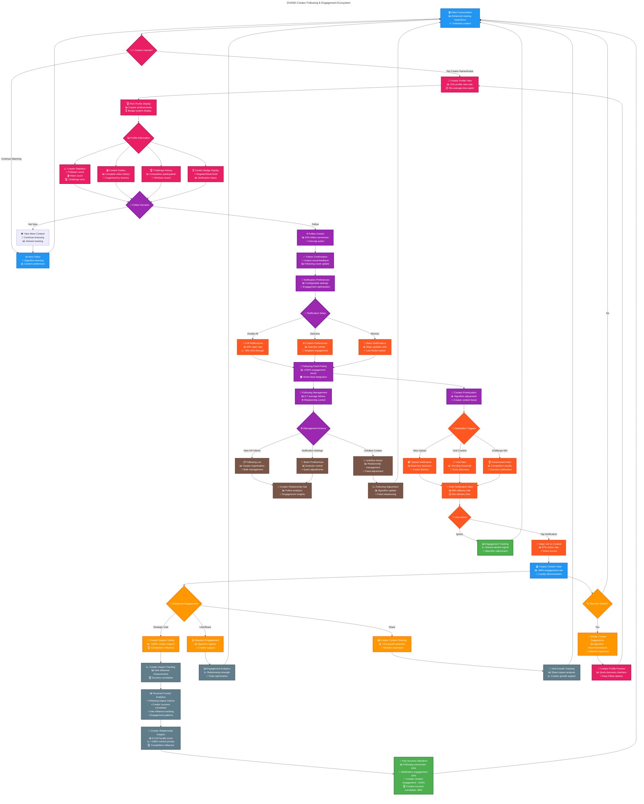

# Dvand Logged-In User - Creator Following & Engagement Ecosystem

```mermaid
---
title: DVAND Creator Following & Engagement Ecosystem
---
flowchart TD
    A[🎬 Video Consumption<br/>📊 Enhanced viewing experience<br/>♾️ Unlimited content] --> B{👨‍🎨 Creator Interest?}
    
    B -->|Tap Creator Name/Avatar| C[👤 Creator Profile View<br/>📊 31% profile view rate<br/>⏱️ 45s average time spent]
    B -->|Continue Watching| D[⏭️ Next Video<br/>🔄 Algorithm learning<br/>📊 Content preference]
    
    C --> E[🏆 Rich Profile Display<br/>📊 Creator achievements<br/>🎖️ Badge system display]
    
    E --> F{📊 Profile Information}
    F --> G[📈 Creator Statistics<br/>👥 Follower count<br/>🎬 Video count<br/>🏆 Challenge wins]
    F --> H[🎬 Content Gallery<br/>📊 Complete video history<br/>🔄 Organized by recency]
    F --> I[🏆 Challenge History<br/>📊 Competition participation<br/>🥇 Win/loss record]
    F --> J[🎖️ Creator Badge Display<br/>⭐ Regular/Silver/Gold<br/>📊 Verification status]
    
    G --> K{🤔 Follow Decision}
    H --> K
    I --> K
    J --> K
    
    K -->|Follow| L[➕ Follow Creator<br/>📊 24% follow conversion<br/>⚡ One-tap action]
    K -->|Not Now| M[👁️ View More Content<br/>🔄 Continue browsing<br/>📊 Interest tracking]
    
    L --> N[✅ Follow Confirmation<br/>🎉 Instant visual feedback<br/>📊 Following count update]
    
    N --> O[🔔 Notification Preferences<br/>📊 Configurable settings<br/>🎯 Engagement optimization]
    
    O --> P{📱 Notification Setup}
    P -->|Enable All| Q[🔔 Full Notifications<br/>📊 34% open rate<br/>📈 78% click-through]
    P -->|Selective| R[⚙️ Custom Preferences<br/>📊 Granular control<br/>🎯 Targeted engagement]
    P -->|Minimal| S[📵 Basic Notifications<br/>📊 Major updates only<br/>⚡ Low-friction option]
    
    Q --> T[🎯 Following Feed Priority<br/>📊 +234% engagement boost<br/>🏠 Home feed integration]
    R --> T
    S --> T
    
    T --> U[🔄 Content Prioritization<br/>📊 Algorithm adjustment<br/>🎯 Creator content boost]
    
    U --> V{📱 Notification Triggers}
    V -->|New Upload| W[📹 Upload Notification<br/>📊 Real-time detection<br/>⚡ Instant delivery]
    V -->|Viral Content| X[🔥 Viral Alert<br/>📊 Trending threshold<br/>🌊 Early discovery]
    V -->|Challenge Win| Y[🏆 Achievement Alert<br/>📊 Competition results<br/>🎉 Success celebration]
    
    W --> Z[📱 Push Notification Sent<br/>📊 98% delivery rate<br/>⏱️ 60s delivery time]
    X --> Z
    Y --> Z
    
    Z --> AA{👤 User Action}
    AA -->|Tap Notification| BB[🔗 Deep Link to Content<br/>📊 67% action rate<br/>⚡ Direct access]
    AA -->|Ignore| CC[📊 Engagement Tracking<br/>📉 Interest decline signal<br/>🔄 Algorithm adjustment]
    
    BB --> DD[🎬 Creator Content View<br/>📊 +89% engagement rate<br/>🎯 Loyalty demonstration]
    
    DD --> EE{💭 Enhanced Engagement}
    EE -->|Strategic Vote| FF[🎯 Creator Support Voting<br/>📊 +189% creator support<br/>🏆 Competition influence]
    EE -->|Like/React| GG[👍 Standard Engagement<br/>📊 Algorithm signals<br/>💪 Creator support]
    EE -->|Share| HH[📤 Creator Content Sharing<br/>📊 Viral growth potential<br/>👥 Network expansion]
    
    FF --> II[📈 Creator Impact Tracking<br/>📊 Vote influence measurement<br/>🏆 Success correlation]
    GG --> JJ[📊 Engagement Analytics<br/>📈 Relationship strength<br/>🔄 Feed optimization]
    HH --> KK[🌊 Viral Growth Tracking<br/>📊 Share impact analysis<br/>📈 Creator growth support]
    
    %% Following Management
    T --> LL[👥 Following Management<br/>📊 8.7 average follows<br/>⚙️ Relationship control]
    
    LL --> MM{⚙️ Management Actions}
    MM -->|View All Follows| NN[📋 Following List<br/>📊 Creator organization<br/>🔄 Bulk management]
    MM -->|Notification Settings| OO[🔔 Batch Preferences<br/>📊 Granular control<br/>⚡ Quick adjustments]
    MM -->|Unfollow Creator| PP[➖ Unfollow Action<br/>📊 Relationship management<br/>🔄 Feed adjustment]
    
    NN --> QQ[👥 Creator Relationship Hub<br/>📊 Follow analytics<br/>🎯 Engagement insights]
    OO --> QQ
    PP --> RR[📉 Following Adjustment<br/>📊 Algorithm update<br/>🔄 Feed rebalancing]
    
    %% Creator Discovery Loop
    DD --> SS{🔍 Discover Similar?}
    SS -->|Yes| TT[🎯 Similar Creator Suggestions<br/>📊 Algorithm recommendations<br/>👥 Network expansion]
    SS -->|No| A
    
    TT --> UU[👤 Creator Profile Preview<br/>📊 Quick discovery interface<br/>⚡ Easy follow options]
    UU --> C
    
    %% Analytics & Insights
    II --> VV[📊 Personal Creator Analytics<br/>• Following impact metrics<br/>• Creator success correlation<br/>• Vote influence tracking<br/>• Engagement patterns]
    
    VV --> WW[🎯 Creator Relationship Insights<br/>📊 9.1/10 loyalty score<br/>📈 +156% content priority<br/>🏆 Competition influence]
    
    %% Success Metrics
    WW --> XX[🎯 Key Success Indicators<br/>📊 Following conversion: 24%<br/>📱 Notification engagement: 34%<br/>🔄 Creator content engagement: +234%<br/>🏆 Creator success correlation: 89%]
    
    %% Return to Main Flow
    CC --> A
    RR --> A
    JJ --> A
    KK --> A
    XX --> A
    M --> D
    D --> A
    
    %% Styling
    classDef content fill:#2196F3,stroke:#1565C0,stroke-width:2px,color:#fff
    classDef creator fill:#E91E63,stroke:#AD1457,stroke-width:3px,color:#fff
    classDef following fill:#9C27B0,stroke:#6A1B9A,stroke-width:3px,color:#fff
    classDef notification fill:#FF5722,stroke:#D84315,stroke-width:2px,color:#fff
    classDef engagement fill:#FF9800,stroke:#E65100,stroke-width:2px,color:#fff
    classDef analytics fill:#607D8B,stroke:#37474F,stroke-width:2px,color:#fff
    classDef management fill:#795548,stroke:#5D4037,stroke-width:2px,color:#fff
    classDef success fill:#4CAF50,stroke:#2E7D32,stroke-width:3px,color:#fff
    
    class A,D,DD content
    class B,C,E,F,G,H,I,J,UU creator
    class K,L,N,O,P,T,U,LL,MM following
    class Q,R,S,V,W,X,Y,Z,AA,BB notification
    class EE,FF,GG,HH,SS,TT engagement
    class II,JJ,KK,VV,WW analytics
    class NN,OO,PP,QQ,RR management
    class CC,XX success
    
    %% Interactive elements
    click L "javascript:alert('Follow Success: Instant feedback + content prioritization')"
    click FF "javascript:alert('Strategic Support: Votes from followers have +189% impact')"
    click WW "javascript:alert('Loyalty Metrics: 9.1/10 satisfaction + 156% content priority')"
    click XX "javascript:alert('Success KPIs: Track following conversion, engagement, creator correlation')"
```
