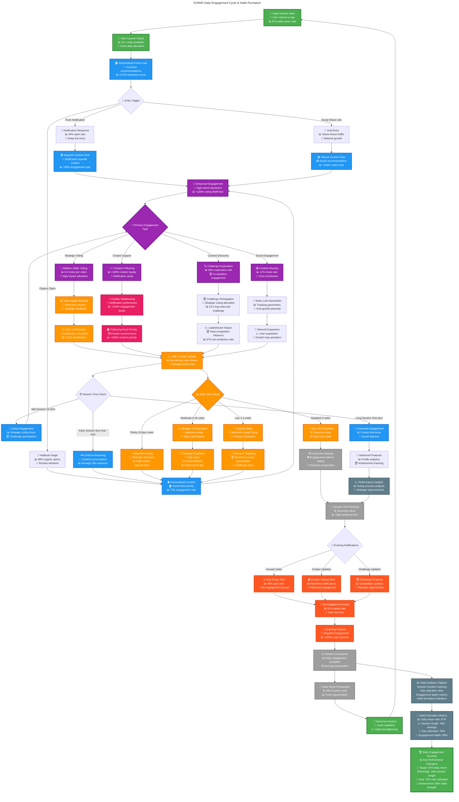

# Dvand Logged-In User - Daily Engagement Cycle & Habit Formation

```mermaid
---
title: DVAND Daily Engagement Cycle & Habit Formation
---
flowchart TD
    A[🌅 Daily Session Start<br/>🔄 User returns to app<br/>📊 67% daily return rate] --> B[🎯 Vote Counter Check<br/>📊 50+ votes available<br/>⚡ Fresh daily allocation]
    
    B --> C[🏠 Personalized Feed Load<br/>🤖 AI-driven recommendations<br/>📊 8.4/10 relevance score]
    
    C --> D{📱 Entry Trigger}
    D -->|Push Notification| E[🔔 Notification Response<br/>📊 34% open rate<br/>🎯 Deep link entry]
    D -->|Organic Open| F[👤 Habitual Usage<br/>📊 66% organic opens<br/>🔄 Routine behavior]
    D -->|Social Share Link| G[🔗 Viral Entry<br/>📊 Share-driven traffic<br/>🌊 Network growth]
    
    E --> H[🎬 Targeted Content View<br/>🎯 Notification-specific content<br/>📊 +89% engagement rate]
    F --> I[🎬 Personalized Content<br/>🏠 Home feed priority<br/>📊 73% engagement rate]
    G --> J[🎬 Shared Content View<br/>📤 Social recommendation<br/>📊 +156% watch time]
    
    H --> K[💭 Enhanced Engagement<br/>🎯 High-intent interaction<br/>📊 +234% voting likelihood]
    I --> K
    J --> K
    
    K --> L{🎯 Primary Engagement Type}
    L -->|Strategic Voting| M[🎈 Balloon Slider Voting<br/>📊 8.3 votes per video<br/>⚡ High-impact allocation]
    L -->|Creator Support| N[👨‍🎨 Creator Following<br/>📊 +189% creator loyalty<br/>🔔 Notification setup]
    L -->|Content Discovery| O[🔍 Challenge Exploration<br/>📊 56% exploration rate<br/>🏆 Competition engagement]
    L -->|Social Engagement| P[📤 Content Sharing<br/>📊 12% share rate<br/>🌊 Viral contribution]
    
    M --> Q[📊 Vote Impact Analysis<br/>🔮 Real-time preview<br/>📈 Strategic feedback]
    Q --> R[✅ Vote Confirmation<br/>🎊 Satisfaction animation<br/>📊 9.2/10 satisfaction]
    R --> S[📉 Vote Counter Update<br/>📊 Remaining votes shown<br/>⚡ Strategic awareness]
    
    N --> T[🔔 Creator Relationship<br/>📱 Notification preferences<br/>📊 +234% engagement boost]
    T --> U[🏠 Following Feed Priority<br/>📺 Creator content boost<br/>📊 +156% content priority]
    U --> S
    
    O --> V[🏆 Challenge Participation<br/>🎯 Strategic voting allocation<br/>📊 23.4 avg votes per challenge]
    V --> W[📈 Leaderboard Impact<br/>🏆 Real competition influence<br/>📊 67% win prediction rate]
    W --> S
    
    P --> X[🔗 Share Link Generation<br/>📊 Tracking parameters<br/>🌊 Viral growth potential]
    X --> Y[👥 Network Expansion<br/>📈 User acquisition<br/>🔄 Growth loop activation]
    Y --> S
    
    S --> Z{⏰ Session Time Check}
    Z -->|Early Session less than 10m| AA[⏭️ Continue Browsing<br/>🔄 Content consumption<br/>📊 Average 18m sessions]
    Z -->|Mid Session 10-20m| BB[🎯 Deep Engagement<br/>📊 Strategic voting focus<br/>🏆 Challenge participation]
    Z -->|Long Session 20m plus| CC[🎪 Extended Engagement<br/>📊 Creator discovery<br/>👥 Social features]
    
    AA --> I
    BB --> L
    CC --> DD[🎨 Advanced Features<br/>📊 Profile analytics<br/>🏆 Achievement tracking]
    
    DD --> EE[📈 Performance Insights<br/>📊 Voting success analysis<br/>🎯 Strategic improvements]
    
    S --> FF{📊 Daily Vote Status}
    FF -->|Plenty 20 plus votes| GG[💚 Abundant Voting<br/>🎯 Strategic allocation<br/>📊 High-impact opportunities]
    FF -->|Moderate 5-19 votes| HH[⚠️ Strategic Conservation<br/>🎯 Selective voting<br/>💡 Value optimization]
    FF -->|Low 1-4 votes| II[🔴 Scarcity Mode<br/>🎯 Maximum impact focus<br/>💎 Premium allocation]
    FF -->|Depleted 0 votes| JJ[🚫 Vote Limit Reached<br/>⏰ Tomorrow reset<br/>📺 View-only mode]
    
    GG --> I
    HH --> KK[💡 Strategic Guidance<br/>🎯 High-value recommendations<br/>📊 Optimization tips]
    II --> LL[💎 Premium Targeting<br/>🏆 Maximum impact opportunities<br/>🎯 Challenge focus]
    JJ --> MM[📺 Continued Viewing<br/>👁️ Engagement without voting<br/>🔄 Tomorrow preparation]
    
    KK --> I
    LL --> I
    
    MM --> NN[🌅 Session End Planning<br/>⏰ Tomorrow return<br/>📊 Habit reinforcement]
    EE --> NN
    
    NN --> OO{🔔 Evening Notifications}
    OO -->|Unused Votes| PP[⚠️ Vote Expiry Alert<br/>📊 45% open rate<br/>🎯 Re-engagement prompt]
    OO -->|Creator Updates| QQ[📹 Creator Upload Alert<br/>📊 Real-time notifications<br/>👥 Following engagement]
    OO -->|Challenge Updates| RR[🏆 Challenge Progress<br/>📊 Competition updates<br/>🎯 Strategic opportunities]
    
    PP --> SS[🔄 Re-engagement Action<br/>📊 67% action rate<br/>⚡ Vote recovery]
    QQ --> SS
    RR --> SS
    
    SS --> TT[🌙 Evening Session<br/>🎯 Targeted engagement<br/>📊 +234% vote recovery]
    
    TT --> UU[💤 Session Conclusion<br/>📊 Daily engagement complete<br/>⏰ Next day preparation]
    
    UU --> VV[🔄 Daily Reset Preparation<br/>⏰ Vote counter reset<br/>📊 Fresh opportunities]
    
    VV --> WW[🌅 Tomorrow Session<br/>🔄 Cycle repetition<br/>📈 Habit strengthening]
    
    WW --> A
    
    UU --> XX[📊 Daily Analytics Capture<br/>Session duration tracking<br/>Vote utilization rates<br/>Engagement depth metrics<br/>Habit formation indicators]
    
    XX --> YY[🎯 Habit Formation Metrics<br/>📊 Daily return rate: 67%<br/>📈 Session length: 18m average<br/>🔄 Vote utilization: 78%<br/>💪 Engagement depth: 89%]
    
    YY --> ZZ[🏆 Daily Engagement Success<br/>📊 Key Performance Indicators<br/>🎯 Target: 67% daily return<br/>⏰ Average: 18m session length<br/>🔄 Goal: 78% vote utilization<br/>💪 Achievement: 89% habit strength]
    
    classDef start fill:#4CAF50,stroke:#2E7D32,stroke-width:3px,color:#fff
    classDef content fill:#2196F3,stroke:#1565C0,stroke-width:2px,color:#fff
    classDef engagement fill:#9C27B0,stroke:#6A1B9A,stroke-width:3px,color:#fff
    classDef voting fill:#FF9800,stroke:#E65100,stroke-width:2px,color:#fff
    classDef creator fill:#E91E63,stroke:#AD1457,stroke-width:2px,color:#fff
    classDef notification fill:#FF5722,stroke:#D84315,stroke-width:2px,color:#fff
    classDef analytics fill:#607D8B,stroke:#37474F,stroke-width:2px,color:#fff
    classDef success fill:#4CAF50,stroke:#2E7D32,stroke-width:4px,color:#fff
    classDef management fill:#9E9E9E,stroke:#616161,stroke-width:2px,color:#fff
    
    class A,B,WW start
    class C,H,I,J,AA,BB,CC content
    class K,L,M,N,O,P engagement
    class Q,R,S,FF,GG,HH,II,JJ,KK,LL voting
    class T,U creator
    class PP,QQ,RR,SS,TT notification
    class XX,YY,EE analytics
    class ZZ success
    class MM,NN,UU,VV management
```
