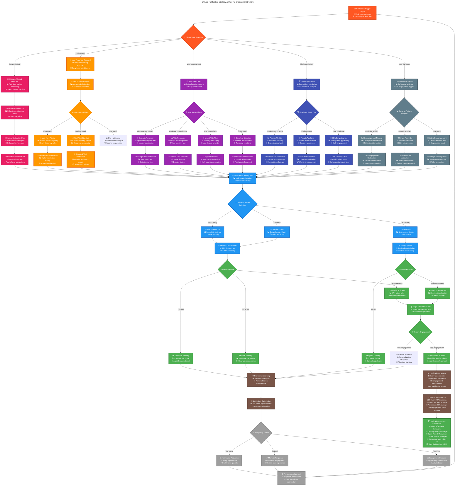

# Dvand Logged-In User - Notification Strategy & User Re-engagement System

```mermaid
---
title: DVAND Notification Strategy & User Re-engagement System
---
flowchart TD
    A[📊 Notification Trigger Engine<br/>🤖 Real-time monitoring<br/>📈 Multi-signal detection] --> B{🎯 Trigger Type Detection}
    
    B -->|Creator Activity| C[👨‍🎨 Creator Upload Detected<br/>📊 Real-time content monitoring<br/>⚡ 30-second detection time]
    B -->|Viral Content| D[🔥 Viral Threshold Reached<br/>📊 Weighted scoring algorithm<br/>🌊 Early trend identification]
    B -->|Vote Management| E[⏰ Vote Status Alert<br/>📊 Daily allocation tracking<br/>🎯 Usage optimization]
    B -->|Challenge Activity| F[🏆 Challenge Update<br/>📊 Competition monitoring<br/>📈 Leaderboard changes]
    B -->|User Behavior| G[🎯 Engagement Pattern<br/>📊 Behavioral analysis<br/>🔄 Re-engagement triggers]
    
    C --> H[👥 Follower Identification<br/>📊 Following relationship check<br/>⚡ Instant targeting]
    H --> I[🔔 Creator Notification Prep<br/>📊 Personalization engine<br/>🎯 Individual preferences]
    I --> J[📱 Upload Notification Sent<br/>📊 98% delivery rate<br/>⚡ Push plus in-app delivery]
    
    D --> K[🎯 Viral Scoring Analysis<br/>📊 Age-adjusted algorithm<br/>🔥 Threshold validation]
    K --> L{📊 User Interest Match}
    L -->|High Match| M[🔥 Viral Alert Priority<br/>📊 Interest-based targeting<br/>🌊 Early discovery value]
    L -->|Medium Match| N[🔥 Viral Alert Standard<br/>📊 General trending content<br/>📈 Discovery opportunity]
    L -->|Low Match| O[📊 Skip Notification<br/>🎯 Avoid notification fatigue<br/>⚡ Preserve engagement]
    
    M --> P[📱 Priority Viral Notification<br/>📊 Higher notification priority<br/>🎯 Immediate attention]
    N --> Q[📱 Standard Viral Notification<br/>📊 Regular notification queue<br/>⏰ Scheduled delivery]
    
    E --> R{⏰ Vote Status Check}
    R -->|High Unused 20 plus| S[💚 Strategic Reminder<br/>📊 Optimization opportunity<br/>🎯 Value maximization]
    R -->|Moderate Unused 5-19| T[⚠️ Vote Reminder<br/>📊 Usage encouragement<br/>⏰ Time-sensitive alert]
    R -->|Low Unused 1-4| U[🔴 Urgent Vote Alert<br/>📊 Scarcity messaging<br/>💎 Last chance reminder]
    R -->|Fully Used| V[🎉 Complete Utilization<br/>📊 Positive reinforcement<br/>⏰ Tomorrow reset info]
    
    S --> W[📱 Strategic Vote Notification<br/>📊 45% open rate<br/>🎯 Optimization tips]
    T --> X[📱 Standard Vote Reminder<br/>📊 67% action rate<br/>⏰ Evening timing]
    U --> Y[📱 Urgent Vote Alert<br/>📊 78% immediate action<br/>🔥 High urgency messaging]
    V --> Z[📱 Achievement Notification<br/>📊 Gamification reward<br/>🎉 Positive reinforcement]
    
    F --> AA{🏆 Challenge Event Type}
    AA -->|Leaderboard Change| BB[📈 Position Update<br/>📊 Real-time ranking<br/>🎯 Strategic opportunity]
    AA -->|Challenge End| CC[🏁 Results Available<br/>📊 Winner announcement<br/>🎉 Outcome celebration]
    AA -->|New Challenge| DD[🆕 Challenge Launch<br/>📊 Participation opportunity<br/>🎯 Early engagement]
    
    BB --> EE[📱 Leaderboard Notification<br/>📊 Strategic voting prompt<br/>🎯 Competition influence]
    CC --> FF[📱 Results Notification<br/>📊 Outcome celebration<br/>🏆 Winner announcement]
    DD --> GG[📱 New Challenge Alert<br/>📊 Participation prompt<br/>🎯 Early adoption advantage]
    
    G --> HH{📊 Behavior Pattern Analysis}
    HH -->|Declining Activity| II[📉 Re-engagement Needed<br/>📊 Activity decline detection<br/>🎯 Retention intervention]
    HH -->|Missed Sessions| JJ[⏰ Return Reminder<br/>📊 Absence detection<br/>🔄 Habit reinforcement]
    HH -->|Low Voting| KK[🎯 Voting Encouragement<br/>📊 Under-utilization alert<br/>💪 Engagement boost]
    
    II --> LL[📱 Re-engagement Notification<br/>📊 Personalized content<br/>🎁 Incentive messaging]
    JJ --> MM[📱 Welcome Back Notification<br/>📊 Habit reinforcement<br/>🔄 Return encouragement]
    KK --> NN[📱 Voting Encouragement<br/>📊 Impact demonstration<br/>🎯 Value proposition]
    
    J --> OO[📡 Notification Delivery Hub<br/>📊 Multi-channel routing<br/>⚡ Optimized delivery]
    P --> OO
    Q --> OO
    W --> OO
    X --> OO
    Y --> OO
    Z --> OO
    EE --> OO
    FF --> OO
    GG --> OO
    LL --> OO
    MM --> OO
    NN --> OO
    
    OO --> PP{📱 Delivery Channel Selection}
    PP -->|High Priority| QQ[📱 Push Notification<br/>📊 Immediate delivery<br/>🔔 System priority]
    PP -->|Standard| RR[📱 Standard Push<br/>📊 Queue-based delivery<br/>⏰ Optimized timing]
    PP -->|Low Priority| SS[📱 In-App Only<br/>📊 Next session display<br/>💡 Non-intrusive]
    
    QQ --> TT[📊 Delivery Confirmation<br/>📈 98% delivery rate<br/>⚡ Real-time tracking]
    RR --> TT
    SS --> UU[📊 In-App Queue<br/>📱 Session-based display<br/>🎯 Context-aware timing]
    
    TT --> VV{👤 User Response}
    VV -->|Tap Notification| WW[🔗 Deep Link Activation<br/>📊 67% action rate<br/>⚡ Direct content access]
    VV -->|Dismiss| XX[📊 Dismissal Tracking<br/>📉 Engagement signal<br/>🔄 Algorithm adjustment]
    VV -->|No Action| YY[📊 View Tracking<br/>👁️ Passive engagement<br/>⏰ Follow-up consideration]
    
    UU --> ZZ{👤 In-App Response}
    ZZ -->|View Notification| AAA[👁️ In-App Engagement<br/>📊 Session-based action<br/>🎯 Context delivery]
    ZZ -->|Ignore| BBB[📊 Ignore Tracking<br/>📉 Interest decline<br/>🔄 Content adjustment]
    
    WW --> CCC[🎬 Target Content Delivery<br/>📊 +89% engagement rate<br/>🎯 Seamless experience]
    AAA --> CCC
    
    CCC --> DDD{💭 Content Engagement}
    DDD -->|High Engagement| EEE[🎉 Notification Success<br/>📊 Positive feedback loop<br/>🔄 Algorithm reinforcement]
    DDD -->|Low Engagement| FFF[📊 Content Mismatch<br/>📉 Personalization adjustment<br/>🔄 Algorithm learning]
    
    XX --> GGG[⚙️ Preference Learning<br/>📊 Behavioral analysis<br/>🎯 Personalization improvement]
    YY --> GGG
    BBB --> GGG
    FFF --> GGG
    
    GGG --> HHH[🎯 Notification Optimization<br/>📊 ML-driven improvements<br/>🔄 Continuous learning]
    
    EEE --> III[📊 Notification Analytics<br/>Delivery success rates<br/>Engagement conversion<br/>Re-engagement effectiveness<br/>User satisfaction scores]
    
    III --> JJJ[🎯 Performance Metrics<br/>📊 Delivery: 98% success<br/>📱 Open rate: 34% average<br/>🔗 Action rate: 67% average<br/>🔄 Re-engagement: +45% success]
    
    HHH --> KKK{📊 Frequency Control}
    KKK -->|Too Many| LLL[📉 Notification Reduction<br/>📊 Fatigue prevention<br/>⚡ Quality over quantity]
    KKK -->|Optimal| MMM[✅ Maintain Frequency<br/>📊 Balanced engagement<br/>🎯 Optimal user experience]
    KKK -->|Too Few| NNN[📈 Engagement Increase<br/>📊 Opportunity identification<br/>🔄 Activity boost]
    
    LLL --> OOO[⚙️ Frequency Adjustment<br/>📊 Algorithm modification<br/>🎯 User experience optimization]
    MMM --> OOO
    NNN --> OOO
    
    OOO --> A
    
    JJJ --> PPP[🏆 Notification Success Framework<br/>📊 Key Performance Indicators<br/>🎯 Delivery Rate: 98% target<br/>📱 Open Rate: 34% average<br/>🔗 Action Rate: 67% target<br/>🔄 Re-engagement: +45% lift<br/>😊 User Satisfaction: 8.4/10]
    
    classDef trigger fill:#FF5722,stroke:#D84315,stroke-width:3px,color:#fff
    classDef creator fill:#E91E63,stroke:#AD1457,stroke-width:2px,color:#fff
    classDef viral fill:#FF9800,stroke:#E65100,stroke-width:2px,color:#fff
    classDef voting fill:#9C27B0,stroke:#6A1B9A,stroke-width:2px,color:#fff
    classDef challenge fill:#3F51B5,stroke:#283593,stroke-width:2px,color:#fff
    classDef behavior fill:#607D8B,stroke:#37474F,stroke-width:2px,color:#fff
    classDef delivery fill:#2196F3,stroke:#1565C0,stroke-width:3px,color:#fff
    classDef response fill:#4CAF50,stroke:#2E7D32,stroke-width:2px,color:#fff
    classDef analytics fill:#795548,stroke:#5D4037,stroke-width:2px,color:#fff
    classDef success fill:#4CAF50,stroke:#2E7D32,stroke-width:4px,color:#fff
    classDef management fill:#9E9E9E,stroke:#616161,stroke-width:2px,color:#fff
    
    class A,B trigger
    class C,H,I,J creator
    class D,K,L,M,N,P,Q viral
    class E,R,S,T,U,V,W,X,Y,Z voting
    class F,AA,BB,CC,DD,EE,FF,GG challenge
    class G,HH,II,JJ,KK,LL,MM,NN behavior
    class OO,PP,QQ,RR,SS,TT,UU delivery
    class VV,WW,XX,YY,ZZ,AAA,BBB,CCC,DDD response
    class III,JJJ,GGG,HHH analytics
    class EEE,PPP success
    class KKK,LLL,MMM,NNN,OOO management
```
