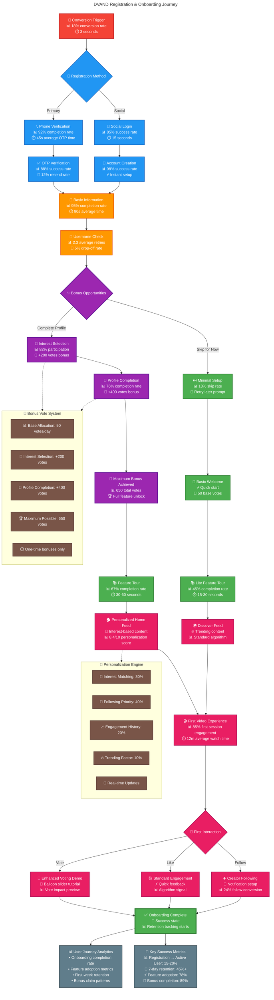

# Dvand Logged-In User - Registration & Onboarding Journey

```mermaid
---
title: DVAND Registration & Onboarding Journey
---
flowchart TD
    A[🚫 Conversion Trigger<br/>📊 18% conversion rate<br/>⏱️ 3 seconds] --> B{📱 Registration Method}
    
    B -->|Primary| C[📞 Phone Verification<br/>📊 92% completion rate<br/>⏱️ 45s average OTP time]
    B -->|Social| D[🔗 Social Login<br/>📊 85% success rate<br/>⏱️ 15 seconds]
    
    C --> E[✅ OTP Verification<br/>📊 88% success rate<br/>📧 12% resend rate]
    D --> F[🔐 Account Creation<br/>📊 98% success rate<br/>⚡ Instant setup]
    
    E --> G[📝 Basic Information<br/>📊 95% completion rate<br/>⏱️ 90s average time]
    F --> G
    
    G --> H[👤 Username Check<br/>📊 2.3 average retries<br/>🎯 5% drop-off rate]
    
    H --> I{✨ Bonus Opportunities}
    I -->|Complete Profile| J[🎯 Interest Selection<br/>📊 82% participation<br/>🎁 +200 votes bonus]
    I -->|Skip for Now| K[⏭️ Minimal Setup<br/>📊 18% skip rate<br/>🔄 Retry later prompt]
    
    J --> L[🎨 Profile Completion<br/>📊 76% completion rate<br/>🎁 +400 votes bonus]
    K --> M[👋 Basic Welcome<br/>⚡ Quick start<br/>🎯 50 base votes]
    
    L --> N[🎊 Maximum Bonus Achieved<br/>📊 650 total votes<br/>🏆 Full feature unlock]
    
    N --> O[📚 Feature Tour<br/>📊 67% completion rate<br/>⏱️ 30-60 seconds]
    M --> P[📚 Lite Feature Tour<br/>📊 45% completion rate<br/>⏱️ 15-30 seconds]
    
    O --> Q[🏠 Personalized Home Feed<br/>🎯 Interest-based content<br/>📊 8.4/10 personalization score]
    P --> R[🌍 Discover Feed<br/>🔥 Trending content<br/>📊 Standard algorithm]
    
    Q --> S[🎬 First Video Experience<br/>📊 85% first session engagement<br/>⏱️ 12m average watch time]
    R --> S
    
    S --> T{🎯 First Interaction}
    T -->|Vote| U[🎯 Enhanced Voting Demo<br/>🎈 Balloon slider tutorial<br/>📊 Vote impact preview]
    T -->|Like| V[👍 Standard Engagement<br/>⚡ Quick feedback<br/>📊 Algorithm signal]
    T -->|Follow| W[➕ Creator Following<br/>🔔 Notification setup<br/>📊 24% follow conversion]
    
    U --> X[✅ Onboarding Complete<br/>🎉 Success state<br/>📊 Retention tracking starts]
    V --> X
    W --> X
    
    %% Analytics & Tracking
    X --> Y[📊 User Journey Analytics<br/>• Onboarding completion rate<br/>• Feature adoption metrics<br/>• First-week retention<br/>• Bonus claim patterns]
    
    %% Bonus Calculation Subgraph
    subgraph BONUS[" 🎁 Bonus Vote System"]
        Z[📊 Base Allocation: 50 votes/day]
        AA[🎯 Interest Selection: +200 votes]
        BB[👤 Profile Completion: +400 votes]
        CC[🏆 Maximum Possible: 650 votes]
        DD[⏱️ One-time bonuses only]
    end
    
    %% Personalization Algorithm Subgraph
    subgraph ALGO[" 🤖 Personalization Engine"]
        EE[🎯 Interest Matching: 30%]
        FF[👥 Following Priority: 40%]
        GG[📈 Engagement History: 20%]
        HH[🔥 Trending Factor: 10%]
        II[🔄 Real-time Updates]
    end
    
    J -.-> BONUS
    L -.-> BONUS
    Q -.-> ALGO
    
    %% Success Metrics
    X --> JJ[🎯 Key Success Metrics<br/>📊 Registration → Active User: 15-20%<br/>🔄 7-day retention: 45%+<br/>⚡ Feature adoption: 78%<br/>🎁 Bonus completion: 89%]
    
    %% Styling
    classDef trigger fill:#F44336,stroke:#C62828,stroke-width:3px,color:#fff
    classDef registration fill:#2196F3,stroke:#1565C0,stroke-width:2px,color:#fff
    classDef information fill:#FF9800,stroke:#E65100,stroke-width:2px,color:#fff
    classDef bonus fill:#9C27B0,stroke:#6A1B9A,stroke-width:3px,color:#fff
    classDef welcome fill:#4CAF50,stroke:#2E7D32,stroke-width:2px,color:#fff
    classDef engagement fill:#E91E63,stroke:#AD1457,stroke-width:2px,color:#fff
    classDef success fill:#4CAF50,stroke:#2E7D32,stroke-width:4px,color:#fff
    classDef analytics fill:#607D8B,stroke:#37474F,stroke-width:2px,color:#fff
    classDef system fill:#795548,stroke:#5D4037,stroke-width:2px,color:#fff
    
    class A trigger
    class B,C,D,E,F registration
    class G,H information
    class I,J,L,N bonus
    class K,M,O,P welcome
    class Q,R,S,T,U,V,W engagement
    class X success
    class Y,JJ analytics
    class Z,AA,BB,CC,DD,EE,FF,GG,HH,II system
    
    %% Click interactions for demo
    click N "javascript:alert('Maximum Value: 650 total votes = 50 base + 200 interests + 400 profile')"
    click X "javascript:alert('Success: User fully onboarded with personalized experience')"
    click JJ "javascript:alert('Track these KPIs: Registration completion, feature adoption, retention rates')"
```
