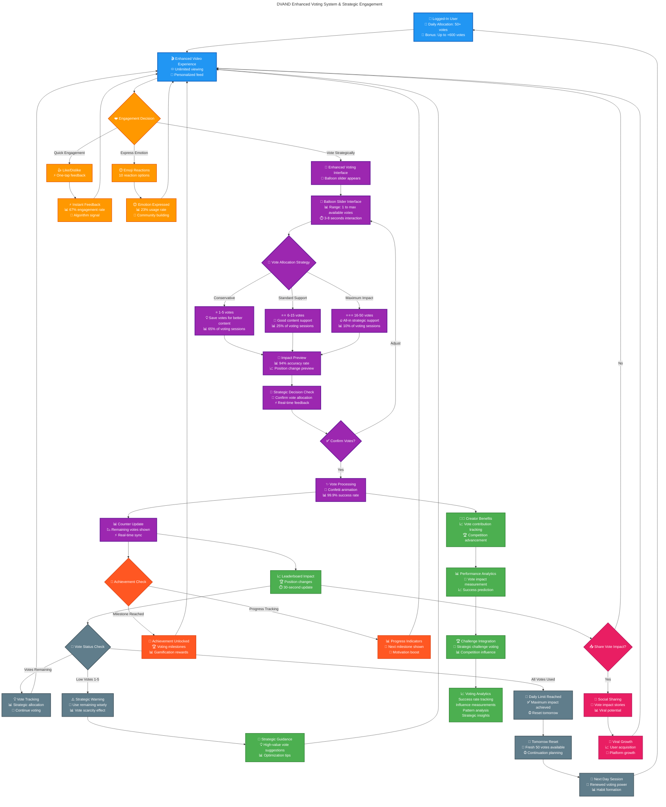

# Dvand Logged-In User - Enhanced Voting System & Strategic Engagement

```mermaid
---
title: DVAND Enhanced Voting System & Strategic Engagement
---
flowchart TD
    A[👤 Logged-In User<br/>🎯 Daily Allocation: 50+ votes<br/>🎁 Bonus: Up to +600 votes] --> B[🎬 Enhanced Video Experience<br/>♾️ Unlimited viewing<br/>🎯 Personalized feed]
    
    B --> C{❤️ Engagement Decision}
    C -->|Vote Strategically| D[🎯 Enhanced Voting Interface<br/>🎈 Balloon slider appears]
    C -->|Quick Engagement| E[👍 Like/Dislike<br/>⚡ One-tap feedback]
    C -->|Express Emotion| F[😊 Emoji Reactions<br/>10 reaction options]
    
    D --> G[🎈 Balloon Slider Interface<br/>📊 Range: 1 to max available votes<br/>⏱️ 3-8 seconds interaction]
    
    G --> H{🎯 Vote Allocation Strategy}
    H -->|Conservative| I[⭐ 1-5 votes<br/>💡 Save votes for better content<br/>📊 65% of voting sessions]
    H -->|Standard Support| J[⭐⭐ 6-15 votes<br/>💪 Good content support<br/>📊 25% of voting sessions]
    H -->|Maximum Impact| K[⭐⭐⭐ 16-50 votes<br/>🔥 All-in strategic support<br/>📊 10% of voting sessions]
    
    I --> L[🔮 Impact Preview<br/>📊 94% accuracy rate<br/>📈 Position change preview]
    J --> L
    K --> L
    
    L --> M[💭 Strategic Decision Check<br/>🤔 Confirm vote allocation<br/>⚡ Real-time feedback]
    
    M --> N{✅ Confirm Votes?}
    N -->|Yes| O[✨ Vote Processing<br/>🎊 Confetti animation<br/>📊 99.9% success rate]
    N -->|Adjust| G
    
    O --> P[📊 Counter Update<br/>📉 Remaining votes shown<br/>⚡ Real-time sync]
    
    P --> Q[📈 Leaderboard Impact<br/>🏆 Position changes<br/>⏱️ 30-second update]
    
    Q --> R{🎯 Vote Status Check}
    R -->|Votes Remaining| S[💡 Vote Tracking<br/>📊 Strategic allocation<br/>🔄 Continue voting]
    R -->|Low Votes 1-5| T[⚠️ Strategic Warning<br/>🎯 Use remaining wisely<br/>📊 Vote scarcity effect]
    R -->|All Votes Used| U[🚫 Daily Limit Reached<br/>✅ Maximum impact achieved<br/>⏰ Reset tomorrow]
    
    E --> V[⚡ Instant Feedback<br/>📊 67% engagement rate<br/>🔄 Algorithm signal]
    F --> W[😊 Emotion Expressed<br/>📊 23% usage rate<br/>👥 Community building]
    
    V --> B
    W --> B
    S --> B
    
    O --> X[👨‍🎨 Creator Benefits<br/>📈 Vote contribution tracking<br/>🏆 Competition advancement]
    X --> Y[📊 Performance Analytics<br/>🎯 Vote impact measurement<br/>📈 Success prediction]
    
    T --> Z[🎯 Strategic Guidance<br/>💡 High-value vote suggestions<br/>📊 Optimization tips]
    U --> AA[📱 Tomorrow Reset<br/>🔄 Fresh 50 votes available<br/>⏰ Continuation planning]
    
    Z --> B
    AA --> AB[🌅 Next Day Session<br/>🔄 Renewed voting power<br/>📊 Habit formation]
    AB --> A
    
    Y --> AC[🏆 Challenge Integration<br/>🎯 Strategic challenge voting<br/>📊 Competition influence]
    AC --> AD[📈 Voting Analytics<br/>Success rate tracking<br/>Influence measurements<br/>Pattern analysis<br/>Strategic insights]
    
    P --> AE{🏅 Achievement Check}
    AE -->|Milestone Reached| AF[🎉 Achievement Unlocked<br/>🏆 Voting milestones<br/>📊 Gamification rewards]
    AE -->|Progress Tracking| AG[📊 Progress Indicators<br/>🎯 Next milestone shown<br/>🔄 Motivation boost]
    
    AF --> B
    AG --> B
    
    Q --> AH{📤 Share Vote Impact?}
    AH -->|Yes| AI[📱 Social Sharing<br/>🎯 Vote impact stories<br/>📊 Viral potential]
    AH -->|No| B
    AI --> AJ[🌊 Viral Growth<br/>📈 User acquisition<br/>🔄 Platform growth]
    AJ --> B
    
    classDef user fill:#2196F3,stroke:#1565C0,stroke-width:3px,color:#fff
    classDef voting fill:#9C27B0,stroke:#6A1B9A,stroke-width:3px,color:#fff
    classDef engagement fill:#FF9800,stroke:#E65100,stroke-width:2px,color:#fff
    classDef impact fill:#4CAF50,stroke:#2E7D32,stroke-width:2px,color:#fff
    classDef analytics fill:#607D8B,stroke:#37474F,stroke-width:2px,color:#fff
    classDef social fill:#E91E63,stroke:#AD1457,stroke-width:2px,color:#fff
    classDef gamification fill:#FF5722,stroke:#D84315,stroke-width:2px,color:#fff
    
    class A,B user
    class D,G,H,I,J,K,L,M,N,O,P voting
    class C,E,F,V,W engagement
    class Q,X,Y,Z,AC,AD impact
    class R,S,T,U,AA,AB analytics
    class AH,AI,AJ social
    class AE,AF,AG gamification
```
