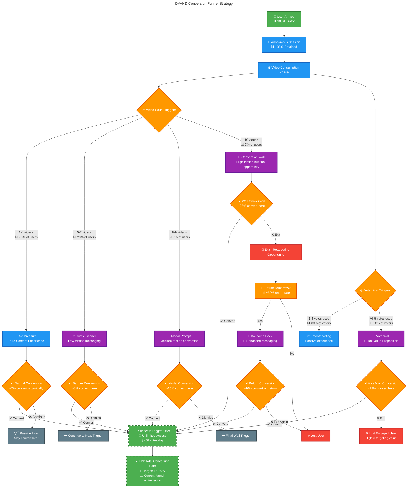

# Dvand Non-Logged-In User - Conversion Funnel Strategy

```mermaid
---
title: DVAND Conversion Funnel Strategy
---
flowchart TD
    A[🔗 User Arrives<br/>📊 100% Traffic] --> B[👤 Anonymous Session<br/>📊 ~95% Retained]
    
    B --> C[🎬 Video Consumption Phase]
    
    C --> D{📈 Video Count Triggers}
    D -->|1-4 videos<br/>📊 70% of users| E[🎯 No Pressure<br/>Pure Content Experience]
    D -->|5-7 videos<br/>📊 20% of users| F[💡 Subtle Banner<br/>Low-friction messaging]
    D -->|8-9 videos<br/>📊 7% of users| G[🔔 Modal Prompt<br/>Medium-friction conversion]
    D -->|10 videos<br/>📊 3% of users| H[🛑 Conversion Wall<br/>High-friction but final opportunity]
    
    %% Parallel Voting Trigger
    C --> I{👍 Vote Limit Triggers}
    I -->|1-4 votes used<br/>📊 80% of voters| J[✅ Smooth Voting<br/>Positive experience]
    I -->|All 5 votes used<br/>📊 20% of voters| K[🚫 Vote Wall<br/>🎯 10x Value Proposition]
    
    %% Conversion Outcomes
    E --> L{📊 Natural Conversion<br/>~2% convert organically}
    F --> M{📊 Banner Conversion<br/>~8% convert here}
    G --> N{📊 Modal Conversion<br/>~15% convert here}
    H --> O{📊 Wall Conversion<br/>~25% convert here}
    K --> P{📊 Vote Wall Conversion<br/>~12% convert here}
    
    %% Final Outcomes
    L -->|✅ Convert| Q[🎉 Success: Logged User<br/>♾️ Unlimited Access<br/>👍 50 votes/day]
    L -->|❌ Continue| R[😴 Passive User<br/>May convert later]
    
    M -->|✅ Convert| Q
    M -->|❌ Dismiss| S[⏭️ Continue to Next Trigger]
    
    N -->|✅ Convert| Q
    N -->|❌ Dismiss| T[⏭️ Final Wall Trigger]
    
    O -->|✅ Convert| Q
    O -->|❌ Exit| U[🚪 Exit - Retargeting Opportunity]
    
    P -->|✅ Convert| Q
    P -->|❌ Exit| V[💔 Lost Engaged User<br/>High retargeting value]
    
    %% Return Visitor Flow
    U --> W[🔄 Return Tomorrow?<br/>📊 ~30% return rate]
    W -->|Yes| X[👋 Welcome Back<br/>🎯 Enhanced Messaging]
    W -->|No| Y[💔 Lost User]
    
    X --> Z{📊 Return Conversion<br/>~40% convert on return}
    Z -->|✅ Convert| Q
    Z -->|❌ Exit Again| Y
    
    %% Key Metrics Annotations
    Q --> AA[📊 KPI: Total Conversion Rate<br/>🎯 Target: 15-20%<br/>📈 Current funnel optimization]
    
    %% Styling for client presentation
    classDef entry fill:#4CAF50,stroke:#2E7D32,stroke-width:3px,color:#fff
    classDef content fill:#2196F3,stroke:#1565C0,stroke-width:2px,color:#fff
    classDef trigger fill:#FF9800,stroke:#E65100,stroke-width:2px,color:#fff
    classDef conversion fill:#9C27B0,stroke:#6A1B9A,stroke-width:3px,color:#fff
    classDef success fill:#4CAF50,stroke:#2E7D32,stroke-width:4px,color:#fff,stroke-dasharray: 8 8
    classDef exit fill:#F44336,stroke:#C62828,stroke-width:2px,color:#fff
    classDef metrics fill:#607D8B,stroke:#37474F,stroke-width:2px,color:#fff
    classDef opportunity fill:#FF5722,stroke:#D84315,stroke-width:2px,color:#fff
    
    class A entry
    class B,C,E,J content
    class D,I,L,M,N,O,P,W,Z trigger
    class F,G,H,K,X conversion
    class Q,AA success
    class U,V,Y exit
    class R,S,T metrics
    
    %% Click interactions for client demo
    click Q "javascript:alert('Success State: User gains unlimited access + 50 votes/day')"
    click AA "javascript:alert('Key Success Metrics: Track conversion rates at each funnel stage')"
    click K "javascript:alert('Critical Moment: Vote limit creates urgency + value proposition')"
    click H "javascript:alert('Final Opportunity: Must convert or lose user')"
```
