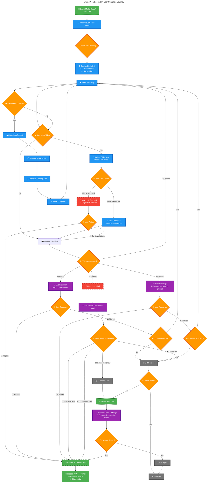

# Dvand Non-Logged-In User Complete Journey

```mermaid
---
title: Dvand Non-Logged-In User Complete Journey
---
flowchart TD
    A[🔗 Social Media Share/<br/>Direct Link] --> B[👤 Anonymous Session Created]
    B --> C{🍪 Cookie & IP Tracking}
    C --> D[⚙️ Session Limits Set:<br/>📺 10 videos/day<br/>👍 5 votes/day]
    D --> E[▶️ Video Auto-Play]
    
    E --> F{❤️ User Likes Video?}
    F -->|Yes| G[🎯 Balloon Slider Vote<br/>Allocate 1-5 votes]
    F -->|No| H[⏭️ Continue Watching]
    
    G --> I{📊 Vote Limit Check}
    I -->|Votes Remaining| J[✅ Vote Recorded<br/>Show remaining votes]
    I -->|All 5 Votes Used| K[🚫 Vote Limit Reached<br/>💡 Login for 10x more!]
    
    J --> H
    K --> L{🤔 User Action}
    L -->|📝 Register| M[🎉 Convert to Logged User]
    L -->|❌ Continue Without| H
    
    H --> N{📈 Video Count Check}
    N -->|1-4 videos| E
    N -->|5+ videos| O[💬 Subtle Banner:<br/>Login for more benefits]
    N -->|8-9 videos| P[🔔 Modal Overlay:<br/>Enhanced conversion prompt]
    N -->|10 videos| Q[🛑 Hard Video Limit]
    
    O --> R{🎯 User Response}
    R -->|📝 Register| M
    R -->|❌ Dismiss| S{⏭️ Continue Watching?}
    S -->|Yes| E
    S -->|No| T[🚪 Exit Session]
    
    P --> U{🎯 User Response}
    U -->|📝 Register| M
    U -->|❌ Dismiss| V{⏭️ Continue Watching?}
    V -->|Yes| E
    V -->|No| T
    
    Q --> W[🎯 Full-Screen Conversion Wall]
    W --> X{🔥 Final Conversion Attempt}
    X -->|📱 Download App| M
    X -->|🌐 Continue on Web| M
    X -->|⏰ Remind Tomorrow| Y[😴 Session Ends]
    X -->|❌ Close/Exit| T
    
    %% Sharing Flow
    E --> Z{📤 User Wants to Share?}
    Z -->|Yes| AA[📤 Share Icon Tapped]
    Z -->|No| F
    AA --> BB[📋 Platform Share Sheet]
    BB --> CC[🔗 Generate Tracking Link]
    CC --> DD[✅ Share Completed]
    DD --> E
    
    %% Return Visitor Flow
    Y --> EE[🔄 Return Next Day]
    T --> FF{🔄 Return Visitor?}
    FF -->|Yes| EE
    FF -->|No| GG[💔 Lost User]
    
    EE --> HH[👋 Welcome Back Message<br/>🎯 Enhanced conversion prompt]
    HH --> II{📝 Convert on Return?}
    II -->|Yes| M
    II -->|No| JJ[🚪 Exit Again]
    JJ --> GG
    
    %% Success States
    M --> KK[🎊 Logged-In User Journey<br/>♾️ Unlimited videos<br/>👍 50 votes/day]
    
    %% Enhanced Styling with animations
    classDef entryPoint fill:#4CAF50,stroke:#2E7D32,stroke-width:3px,color:#fff,stroke-dasharray: 5 5
    classDef action fill:#2196F3,stroke:#1565C0,stroke-width:2px,color:#fff
    classDef decision fill:#FF9800,stroke:#E65100,stroke-width:2px,color:#fff
    classDef limit fill:#F44336,stroke:#C62828,stroke-width:3px,color:#fff,stroke-dasharray: 3 3
    classDef conversion fill:#9C27B0,stroke:#6A1B9A,stroke-width:3px,color:#fff
    classDef success fill:#4CAF50,stroke:#2E7D32,stroke-width:4px,color:#fff,stroke-dasharray: 8 8
    classDef exit fill:#757575,stroke:#424242,stroke-width:2px,color:#fff
    
    class A,EE entryPoint
    class B,D,E,G,J,AA,BB,CC,DD action
    class C,F,I,L,N,R,S,U,V,X,Z,FF,II decision
    class K,Q limit
    class O,P,W,HH conversion
    class M,KK success
    class T,Y,GG,JJ exit
    
    %% Add click events for interactivity
    click M "javascript:alert('User successfully converted to logged-in state!')"
    click GG "javascript:alert('Opportunity for retargeting campaigns')"
    click K "javascript:alert('Key conversion moment - vote limit reached')"
    click Q "javascript:alert('Critical decision point - video limit reached')"
```
