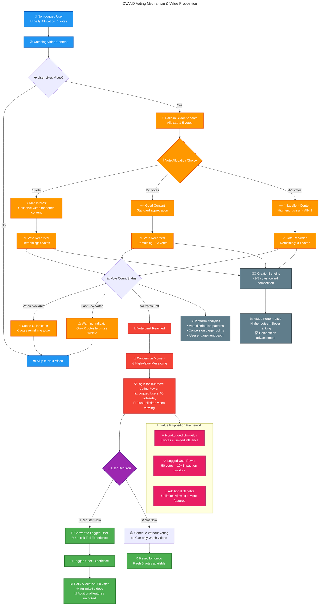

# Dvand Non-Logged-In User Voting Mechanism & Value Proposition

```mermaid
---
title: DVAND Voting Mechanism & Value Proposition
---
flowchart TD
    A[👤 Non-Logged User<br/>🎯 Daily Allocation: 5 votes] --> B[🎬 Watching Video Content]
    
    B --> C{❤️ User Likes Video?}
    C -->|No| D[⏭️ Skip to Next Video]
    C -->|Yes| E[🎯 Balloon Slider Appears<br/>Allocate 1-5 votes]
    
    E --> F{🎚️ Vote Allocation Choice}
    F -->|1 vote| G[⭐ Mild Interest<br/>Conserve votes for better content]
    F -->|2-3 votes| H[⭐⭐ Good Content<br/>Standard appreciation]
    F -->|4-5 votes| I[⭐⭐⭐ Excellent Content<br/>High enthusiasm - All-in!]
    
    G --> J[✅ Vote Recorded<br/>Remaining: 4 votes]
    H --> K[✅ Vote Recorded<br/>Remaining: 2-3 votes]  
    I --> L[✅ Vote Recorded<br/>Remaining: 0-1 votes]
    
    J --> M{📊 Vote Count Status}
    K --> M
    L --> M
    
    M -->|Votes Available| N[💡 Subtle UI Indicator<br/>X votes remaining today]
    M -->|Last Few Votes| O[⚠️ Warning Indicator<br/>Only X votes left - use wisely!]
    M -->|No Votes Left| P[🚫 Vote Limit Reached]
    
    N --> D
    O --> D
    
    P --> Q[🎯 Conversion Moment<br/>🔥 High-Value Messaging]
    Q --> R[💡 Login for 10x More Voting Power!<br/>📊 Logged Users: 50 votes/day<br/>🎁 Plus unlimited video viewing]
    
    R --> S{🤔 User Decision}
    S -->|📝 Register Now| T[🎉 Convert to Logged User<br/>♾️ Unlock Full Experience]
    S -->|❌ Not Now| U[😔 Continue Without Voting<br/>⏭️ Can only watch videos]
    
    U --> V[⏰ Reset Tomorrow<br/>Fresh 5 votes available]
    
    %% Logged User Comparison
    T --> W[🎊 Logged User Experience]
    W --> X[📊 Daily Allocation: 50 votes<br/>♾️ Unlimited videos<br/>🔄 Additional features unlocked]
    
    %% Creator Impact
    J --> Y[👨‍🎨 Creator Benefits<br/>+1-5 votes toward competition]
    K --> Y
    L --> Y
    
    Y --> Z[📈 Video Performance<br/>Higher votes = Better ranking<br/>🏆 Competition advancement]
    
    %% Analytics Tracking
    M --> AA[📊 Platform Analytics<br/>• Vote distribution patterns<br/>• Conversion trigger points<br/>• User engagement depth]
    
    %% Value Proposition Box
    subgraph VALUE[" 🎯 Value Proposition Framework"]
        BB[❌ Non-Logged Limitation<br/>5 votes = Limited influence]
        CC[✅ Logged User Power<br/>50 votes = 10x impact on creators]
        DD[🎁 Additional Benefits<br/>Unlimited viewing + More features]
    end
    
    R -.-> VALUE
    
    %% Styling
    classDef user fill:#2196F3,stroke:#1565C0,stroke-width:2px,color:#fff
    classDef voting fill:#FF9800,stroke:#E65100,stroke-width:2px,color:#fff
    classDef limit fill:#F44336,stroke:#C62828,stroke-width:3px,color:#fff
    classDef conversion fill:#9C27B0,stroke:#6A1B9A,stroke-width:3px,color:#fff
    classDef success fill:#4CAF50,stroke:#2E7D32,stroke-width:3px,color:#fff
    classDef analytics fill:#607D8B,stroke:#37474F,stroke-width:2px,color:#fff
    classDef value fill:#E91E63,stroke:#AD1457,stroke-width:2px,color:#fff
    
    class A,B,D user
    class E,F,G,H,I,J,K,L,N,O voting
    class P,Q,R limit
    class S conversion
    class T,W,X,V success
    class Y,Z,AA analytics
    class BB,CC,DD value
    
    %% Interactive elements
    click T "javascript:alert('Success: User converted with 10x voting power!')"
    click P "javascript:alert('Critical conversion moment - vote limit reached')"
    click Z "javascript:alert('Creator impact: Votes directly affect competition rankings')"
    click AA "javascript:alert('Analytics: Track voting patterns for optimization')"
```
