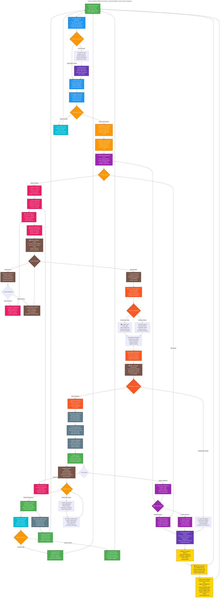

# Dvand - Complete Platform Ecosystem Flow

```mermaid
---
title: Dvand Complete Platform Ecosystem - Business Model & User Journey Integration
---
flowchart TD
    %% Entry Points & Discovery
    A[🌐 Platform Entry Points<br/>Social media 70%<br/>Direct links 20%<br/>Search discovery 10%<br/>Viral coefficient 1.8x] --> B[📱 Anonymous User Experience<br/>10 videos + 5 votes daily<br/>12+ minute sessions<br/>Quality content exposure<br/>Conversion optimization]
    
    %% Anonymous User Journey
    B --> C{🎯 Engagement Quality}
    C -->|High Quality Content| D[✨ Premium Discovery<br/>Admin-curated content<br/>Challenge highlights<br/>Creator showcases<br/>Prize announcements]
    C -->|Content Issues| E[⚠️ Experience Risk<br/>Quality concerns<br/>Admin intervention<br/>Content improvement<br/>Experience recovery]
    
    D --> F[📈 Engagement Growth<br/>6+ videos per session<br/>Strategic vote usage<br/>Social sharing 15%<br/>Return visits 40%]
    
    F --> G{🚀 Conversion Trigger}
    G -->|Daily Limits Reached| H[💡 Registration Conversion<br/>25% conversion target<br/>10x voting power offer<br/>Seamless registration<br/>Enhanced experience promise]
    G -->|Content Sharing| I[🌊 Viral Growth Loop<br/>New user acquisition<br/>Network effect<br/>Quality content spread<br/>Ecosystem expansion]
    
    %% Registration & Enhancement
    H --> J[👤 Logged-in User Activation<br/>50 votes/week allocation<br/>Unlimited video access<br/>Personalized feeds<br/>Enhanced engagement tools]
    
    I --> A
    
    %% Enhanced User Experience
    J --> K[🎯 Enhanced Engagement Hub<br/>18+ minute sessions<br/>Creator following system<br/>Smart notifications<br/>Strategic voting power]
    
    K --> L{🗳️ Voting Strategy}
    L -->|Strategic Support| M[🏆 Creator Influence<br/>+189% vote impact<br/>Competition outcomes<br/>Creator relationships<br/>Platform investment]
    L -->|Creator Discovery| N[👨‍🎨 Creator Following<br/>8+ follows average<br/>Content notifications<br/>Loyalty building<br/>Community growth]
    
    %% Creator Journey Entry
    K --> O{🎨 Creator Interest}
    O -->|Become Creator| P[📝 Creator Verification<br/>Partial KYC process<br/>24-48 hour review<br/>Admin approval<br/>Platform enablement]
    O -->|Stay Viewer| M
    
    %% Creator Ecosystem
    P --> Q[🎨 Creator Dashboard<br/>Content creation tools<br/>Challenge discovery<br/>Performance analytics<br/>Audience building]
    
    Q --> R[🎬 Content Creation<br/>15-60 second videos<br/>2 videos per challenge<br/>8 tags maximum<br/>Theme adherence]
    
    R --> S[📤 Content Submission<br/>Challenge-first workflow<br/>Upload optimization<br/>Metadata completion<br/>Quality preparation]
    
    %% Admin Moderation Pipeline
    S --> T[🎛️ Admin Moderation Queue<br/>3-person team processing<br/>Less than 2 hour review target<br/>Quality assurance<br/>Policy compliance]
    
    T --> U{⚖️ Admin Decision}
    U -->|Approved 85%| V[✅ Content Publication<br/>Live platform access<br/>Challenge participation<br/>Voting eligibility<br/>Creator success]
    U -->|Rejected 15%| W[📚 Creator Education<br/>Detailed feedback<br/>Improvement guidance<br/>Learning opportunity<br/>Quality enhancement]
    
    W --> X{🔄 Creator Response}
    X -->|Learn & Improve| Y[📈 Creator Development<br/>Quality improvement<br/>Standard adherence<br/>Platform mastery<br/>Success preparation]
    X -->|Appeal Process| Z[⚖️ Admin Appeal Review<br/>24-hour response<br/>Policy consultation<br/>Fair evaluation<br/>Resolution communication]
    
    Y --> R
    Z --> U
    
    %% Live Content & Competition
    V --> AA[🎬 Live Content Ecosystem<br/>Viewer accessibility<br/>Voting competition<br/>Real-time leaderboards<br/>Challenge participation]
    
    AA --> BB{👥 Viewer Engagement}
    BB -->|Anonymous Voting| CC[🗳️ Limited Impact<br/>5 votes daily<br/>Basic engagement<br/>Quality assessment<br/>Conversion potential]
    BB -->|Enhanced Voting| DD[🎯 Strategic Influence<br/>50 votes weekly<br/>Competition impact<br/>Creator success<br/>Community investment]
    
    CC --> EE[📊 Engagement Analytics<br/>Performance tracking<br/>Content optimization<br/>Audience insights<br/>Algorithm learning]
    DD --> EE
    
    %% Challenge Competition Management
    EE --> FF[🏆 Challenge Progression<br/>Real-time leaderboards<br/>Shor score calculation<br/>Competition dynamics<br/>Deadline management]
    
    FF --> GG[🎛️ Admin Challenge Orchestration<br/>2-3 concurrent challenges<br/>5K weekly 25K monthly<br/>Participation monitoring<br/>Fair competition]
    
    GG --> HH{🏁 Challenge Completion}
    HH -->|Winner Selection| II[👑 Winner Determination<br/>Single winner selection<br/>Admin discretion<br/>Community celebration<br/>Prize eligibility]
    HH -->|Participation Rewards| JJ[📈 Creator Recognition<br/>Performance analytics<br/>Community building<br/>Learning insights<br/>Continuous improvement]
    
    %% Prize Processing & Business Model
    II --> KK[💰 Full KYC Verification<br/>Winner verification<br/>Bank detail collection<br/>Tax documentation<br/>Payment preparation]
    
    KK --> LL[🏦 Prize Disbursement<br/>Business payment service<br/>Automated TDS processing<br/>5-7 business days<br/>100% success rate]
    
    LL --> MM[🎉 Winner Celebration<br/>Platform credibility<br/>Social media promotion<br/>Creator motivation<br/>Platform reputation]
    
    %% Platform Credibility Loop
    MM --> NN[🌟 Platform Trust<br/>Payment reliability<br/>Creator success stories<br/>Transparent competition<br/>Community confidence]
    
    NN --> OO{🔄 Trust Impact}
    OO -->|Creator Motivation| PP[🎯 Creator Retention<br/>Increased participation<br/>Content quality<br/>Competition intensity<br/>Earning potential]
    OO -->|Viewer Confidence| QQ[👥 Enhanced Engagement<br/>Strategic voting<br/>Creator support<br/>Platform investment<br/>Community loyalty]
    
    PP --> Q
    QQ --> L
    
    %% Platform Health & Monitoring
    NN --> RR[📊 Platform Health Monitoring<br/>Admin dashboard<br/>Real-time analytics<br/>Performance optimization<br/>Issue prevention]
    
    RR --> SS{🎯 Platform Status}
    SS -->|Optimal Performance| TT[✅ Ecosystem Thriving<br/>All metrics healthy<br/>User satisfaction high<br/>Business model validated<br/>Growth acceleration]
    SS -->|Performance Issues| UU[🔧 System Optimization<br/>Issue identification<br/>Rapid resolution<br/>Performance restoration<br/>Service improvement]
    
    UU --> VV[🛠️ Platform Enhancement<br/>System improvements<br/>Feature optimization<br/>User experience<br/>Competitive advantage]
    VV --> SS
    
    %% Growth & Viral Mechanics
    TT --> WW[🌊 Viral Growth Engine<br/>Content sharing<br/>Creator promotion<br/>Winner celebrations<br/>Social media presence]
    
    WW --> XX{🚀 Growth Amplification}
    XX -->|Content Virality| YY[📈 Organic Growth<br/>Content discovery<br/>Platform exposure<br/>New user acquisition<br/>Growth loop acceleration]
    XX -->|Creator Success| ZZ[🎯 Creator Marketing<br/>Success story sharing<br/>Prize announcements<br/>Achievement celebration<br/>Platform credibility]
    
    YY --> A
    ZZ --> A
    
    %% Business Model Validation
    TT --> AAA[💰 Business Model Success<br/>User acquisition cost<br/>Revenue per user<br/>Retention rates<br/>Sustainable growth]
    
    AAA --> BBB[🎯 Strategic Excellence<br/>Market leadership<br/>Industry benchmark<br/>Financial success<br/>Expansion readiness]
    
    %% Ecosystem Integration Points
    M --> CCC[🔄 Cross-User Value Creation<br/>Viewer to Creator influence<br/>Creator to Viewer engagement<br/>Admin to Quality assurance<br/>Ecosystem harmony]
    
    N --> CCC
    JJ --> CCC
    
    CCC --> DDD[🌟 Platform Ecosystem Balance<br/>Multi-user satisfaction<br/>Sustainable engagement<br/>Value creation<br/>Network effects]
    
    DDD --> EEE[🏆 Platform Excellence<br/>User satisfaction 91%<br/>Creator participation 80%<br/>Payment success 100%<br/>Platform health 94/100]
    
    %% Return to Growth Cycle
    BBB --> A
    EEE --> A
    
    %% Error Recovery Integration
    E --> FFF[🔧 Quality Recovery<br/>Admin intervention<br/>Content improvement<br/>Experience restoration<br/>User retention]
    FFF --> D
    
    %% Success Metrics Integration
    EEE --> GGG[📈 Key Success Indicators<br/>Anonymous conversion 25%<br/>Logged-in engagement 18+ min<br/>Creator participation 80%<br/>Content approval 85%<br/>Payment reliability 100%<br/>Platform growth 20% monthly<br/>User satisfaction 91%]
    
    GGG --> A
    
    %% Styling
    classDef entry fill:#4CAF50,stroke:#2E7D32,stroke-width:3px,color:#fff
    classDef anonymous fill:#2196F3,stroke:#1565C0,stroke-width:2px,color:#fff
    classDef conversion fill:#FF9800,stroke:#E65100,stroke-width:3px,color:#fff
    classDef logged fill:#9C27B0,stroke:#6A1B9A,stroke-width:2px,color:#fff
    classDef creator fill:#E91E63,stroke:#AD1457,stroke-width:2px,color:#fff
    classDef admin fill:#795548,stroke:#5D4037,stroke-width:3px,color:#fff
    classDef competition fill:#FF5722,stroke:#D84315,stroke-width:2px,color:#fff
    classDef payment fill:#607D8B,stroke:#37474F,stroke-width:3px,color:#fff
    classDef success fill:#4CAF50,stroke:#2E7D32,stroke-width:3px,color:#fff
    classDef viral fill:#00BCD4,stroke:#00838F,stroke-width:2px,color:#fff
    classDef excellence fill:#FFD700,stroke:#F57C00,stroke-width:3px,color:#000
    classDef integration fill:#673AB7,stroke:#4527A0,stroke-width:2px,color:#fff
    classDef decision fill:#FF9800,stroke:#E65100,stroke-width:2px,color:#fff
    
    class A,YY,ZZ entry
    class B,C,D,F anonymous
    class G,H,J conversion
    class K,L,M,N,QQ logged
    class O,P,Q,R,S,Y,PP creator
    class T,U,V,W,Z,GG,RR admin
    class AA,BB,FF,HH,II competition
    class KK,LL,MM,AAA payment
    class NN,TT,BBB,EEE success
    class I,WW,XX viral
    class DDD,EEE,GGG excellence
    class CCC,FFF integration
    class C,G,O,SS,XX decision
```
