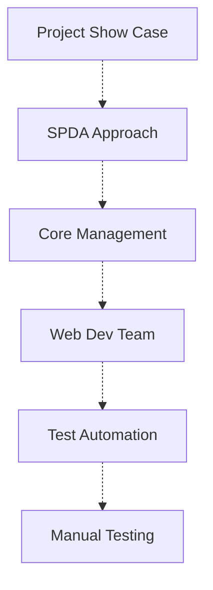

```mermaid

%%{init: {'theme': 'base', 'themeVariables': { 'primaryColor': '#ffcccc', 'edgeLabelBackground':'#ffffee', 'secondartColor': '#fbb0f0, 'tertiaryColor': '#fff0f0'}}}%%
graph TB
        Af[Project Show Case]-.->B1{ }
        B1[SPDA Approach]
        B1[SPDA Approach]-.->C1[Core Management]-.->C2[Web Dev Team]-.->C3[Test Automation]-.->C4[Manual Testing]

      

```
