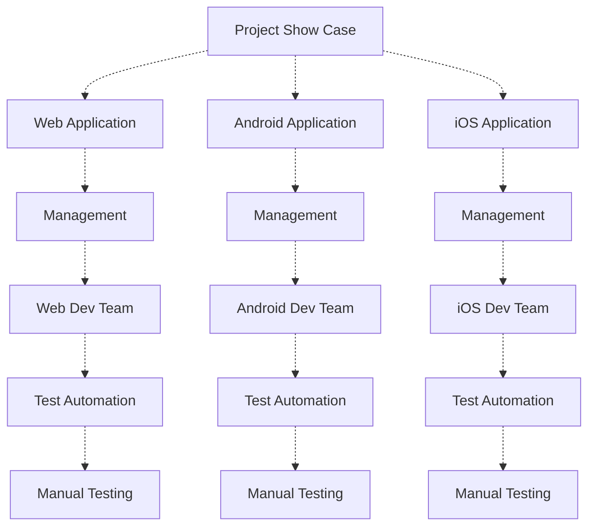

```mermaid

%%{init: {'theme': 'base', 'themeVariables': { 'primaryColor': '#ffcccc', 'edgeLabelBackground':'#ffffee', 'secondartColor': '#fbb0f0, 'tertiaryColor': '#fff0f0'}}}%%
graph TB
        Af[Project Show Case]-.->B1{ }
        Af[Project Show Case]-.->B2{ }
        Af[Project Show Case]-.->B3{ }

        B1[Web Application]
        B2[Android Application]
        B3[iOS Application]

        B1[Web Application]-.->C1[Management]-.->C2[Web Dev Team]-.->C3[Test Automation]-.->C4[Manual Testing]
        B2[Android Application]-.->D1[Management]-.->D2[Android Dev Team]-.->D3[Test Automation]-.->D4[Manual Testing]
        B3[iOS Application]-.->E1[Management]-.->E2[iOS Dev Team]-.->E3[Test Automation]-.->E4[Manual Testing]
      

```
