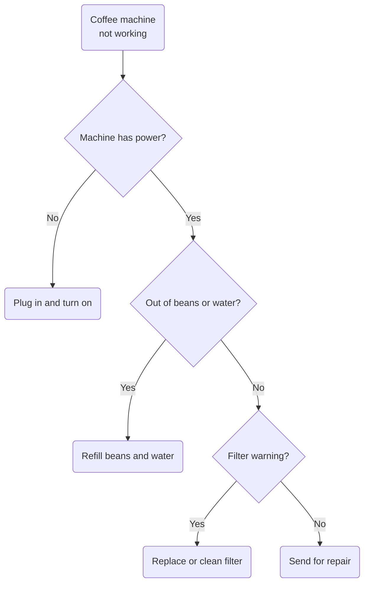

```mermaid
graph TD;
    A(Coffee machine <br>not working) --> B{Machine has power?};
    B -->|No| H(Plug in and turn on);
    B -->|Yes| C{Out of beans or water?} -->|Yes| G(Refill beans and water);
    C -->|No| D{Filter warning?} -->|Yes| I(Replace or clean filter);
    D -->|No| F(Send for repair);  
```
