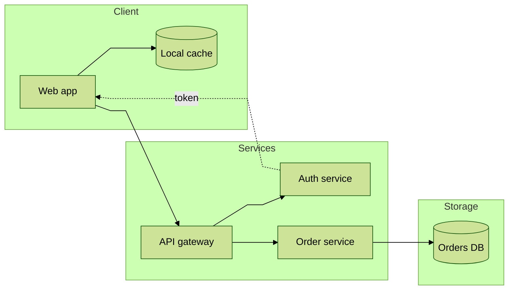
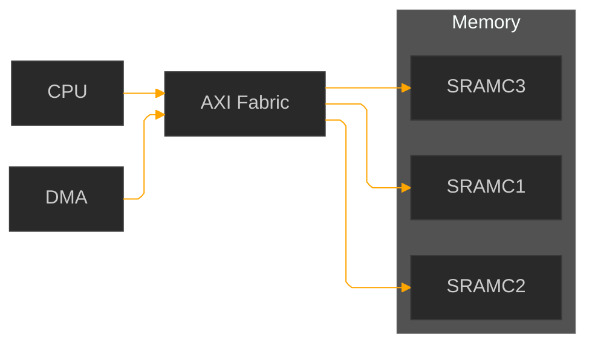
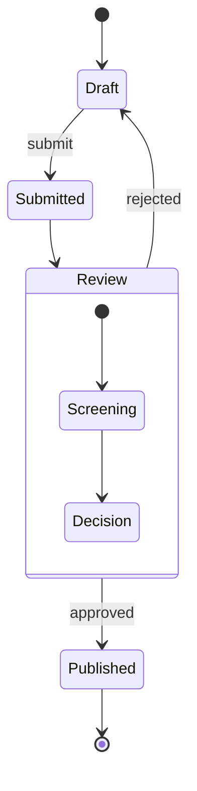
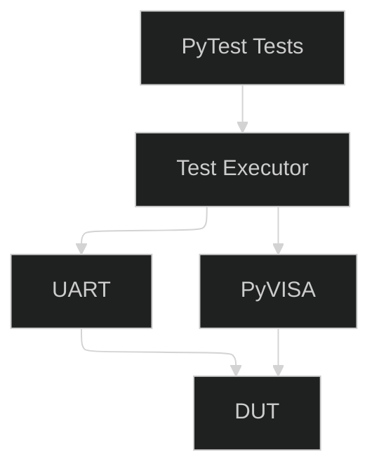
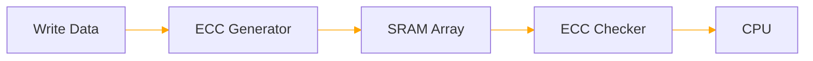
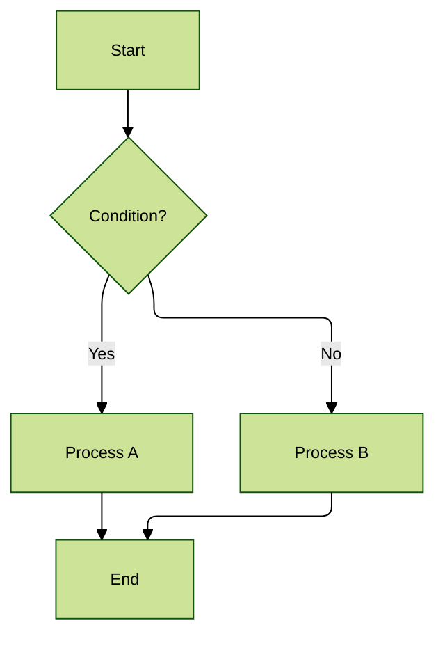

# Generate Mermaid graphs

## First graph

```mermaid
%%{init: {
    "theme": "forest", 
    "look": "classic",
    "layout": "dagre",
    "flowchart" : {
        "curve" : "linear" 
    } 
}}%%

flowchart LR

  subgraph Client
    UI[Web app]
    Cache[(Local cache)]
  end
  subgraph Services
    API[API gateway]
    Auth[Auth service]
    Orders[Order service]
  end
  subgraph Storage
    DB[(Orders DB)]
  end
  UI --> API
  UI --> Cache
  API --> Auth
  API --> Orders
  Orders --> DB
  Auth -. token .-> UI
```
   

## Second graph

```mermaid
%%{init: {
    "flowchart": {
        "defaultRenderer": "elk",
        "curve" : "linear",
        "nodeSpacing": 80,
        "rankSpacing": 80
    },
    "theme": "dark",
    "look": "classic",
    "themeCSS": ".cardinality text { fill: #ededed }",
    "themeVariables": {
        "primaryTextColor": "#ededed",
        "nodeBorder": "#393939",
        "mainBkg": "#292929",
        "lineColor": "orange"
    }
}}%%
flowchart LR
    CPU["CPU"]
    DMA["DMA"]
    AXI["AXI Fabric"]
     
    subgraph Memory
    SRAMC1["SRAMC1"]
    SRAMC2["SRAMC2"]
    SRAMC3["SRAMC3"]
    end
     
    CPU --> AXI
    DMA --> AXI
     
    AXI --> SRAMC1
    AXI --> SRAMC2
    AXI --> SRAMC3
```
   

## Third graph

```mermaid
---
config:
  theme: default
  look: classic
  layout: dagre
---
stateDiagram-v2
  [*] --> Draft
  Draft --> Submitted : submit
  state Review {
    [*] --> Screening
    Screening --> Decision
  }
  Submitted --> Review
  Review --> Published : approved
  Review --> Draft : rejected
  Published --> [*]

```

   

## Fourth graph

```mermaid
%%{init:{
  "theme":"dark",
  "flowchart":{
    "defaultRenderer":"elk"
  }
}}%%
flowchart TD

    TEST["PyTest Tests"]

    EXEC["Test Executor"]

    UART["UART"]
    VISA["PyVISA"]

    DUT["DUT"]

    TEST --> EXEC

    EXEC --> UART
    EXEC --> VISA

    UART --> DUT
    VISA --> DUT
```

   

## Fifth graph

```mermaid
%%{init:{
  "theme":"green",
  "themeVariables":{
    "lineColor":"orange"
  }
}}%%
flowchart LR

    DATA["Write Data"]
    ECCG["ECC Generator"]
    MEM["SRAM Array"]
    ECCC["ECC Checker"]
    CPU["CPU"]

    DATA --> ECCG
    ECCG --> MEM
    MEM --> ECCC
    ECCC --> CPU
```

   

## sixth graph

```mermaid
%% elk %%
%%{init: {
    "theme": "forest",
    "look": "classic",
    "flowchart": {
        "defaultRenderer": "elk",
        "curve": "rounded",
        "padding": 20,
        "htmlLabels": true
    },
    "elk": {
        "straightenEdges": true
    },
    "themeVariables": {
        "fontFamily": "Arial",
        "fontSize": "12px",
        "primaryColor": "#d5e6a5",
        "primaryTextColor": "#000000",
        "primaryBorderColor": "#315d20",
        "lineColor": "#000000",
        "secondaryColor": "#d5e6a5",
        "tertiaryColor": "#ffffff"
    }
}}%%

flowchart TD
    A[Start] --> B{Condition?}
    B -->|Yes| C[Process A]
    B -->|No| D[Process B]
    C --> E[End]
    D --> E
```