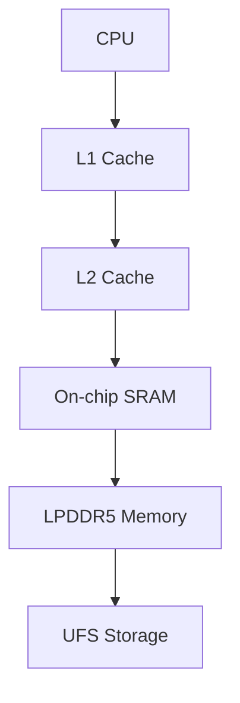

# Introduction

Modern System-on-Chips (SoCs) integrate multiple processing subsystems, memory hierarchies, and accelerators onto a single die.

::: {.callout-note}
This report demonstrates common Quarto features including code execution, cross references, figures, tables, and mathematical notation.
:::

# Memory Hierarchy

The memory hierarchy typically consists of:

1. Registers
2. L1 Cache
3. L2 Cache
4. L3 Cache (optional)
5. SRAM
6. LPDDR Memory
7. Storage

## Latency Comparison

| Memory Type | Typical Latency |
|-------------|----------------|
| Registers | <1 ns |
| L1 Cache | 1-2 ns |
| L2 Cache | 3-10 ns |
| SRAM | 5-20 ns |
| LPDDR5 | 50-100 ns |

: Typical memory latency values

# Mathematical Model

Cache hit ratio:

$$
H = \frac{N_{hits}}{N_{accesses}}
$$

Average memory access time (AMAT):

$$
AMAT = T_{hit} + MR \times T_{miss}
$$

where

- $MR$ = Miss Rate
- $T_{hit}$ = Cache hit latency
- $T_{miss}$ = Miss penalty

# Performance Simulation

## Generate Data

```
import pandas as pd
import numpy as np

np.random.seed(42)

df = pd.DataFrame({
    "Core": range(1, 9),
    "Cache_Hit_Ratio": np.random.uniform(0.85, 0.99, 8),
    "Power_W": np.random.uniform(0.8, 3.0, 8)
})

df
```

## Summary Statistics

```
df.describe()
```

# Visualization

```
#| label: fig-cache-hit
#| fig-cap: "Cache Hit Ratio by CPU Core"

import matplotlib.pyplot as plt

plt.figure(figsize=(8,4))
plt.bar(df["Core"], df["Cache_Hit_Ratio"])
plt.xlabel("CPU Core")
plt.ylabel("Hit Ratio")
plt.grid(True, alpha=0.3)
plt.tight_layout()
plt.show()
```

The performance distribution is shown in @fig-cache-hit.

# Multi-Column Layout

:::: {.columns}

::: {.column width="50%"}

## Advantages

- Lower latency
- Improved throughput
- Better user experience
- Reduced DRAM accesses

:::

::: {.column width="50%"}

## Challenges

- Area increase
- Leakage current
- Verification complexity
- Thermal constraints

:::

::::

# Key Findings

::: {.callout-important}
Increasing cache hit ratio from 90% to 95% can significantly reduce average memory access latency.
:::

# Interactive Data Table

```
#| tbl-cap: "Per-Core Statistics"

df.round(3)
```

# Architecture Diagram



# Conclusion

The analysis demonstrates:

- Memory hierarchy impacts performance.
- Cache efficiency is critical in modern SoCs.
- Power and performance require careful tradeoffs.
- Quarto supports integrated documentation and executable analysis.

# References

1. ARM Architecture Reference Manual
2. JEDEC LPDDR5 Standard
3. Computer Architecture: A Quantitative Approach
